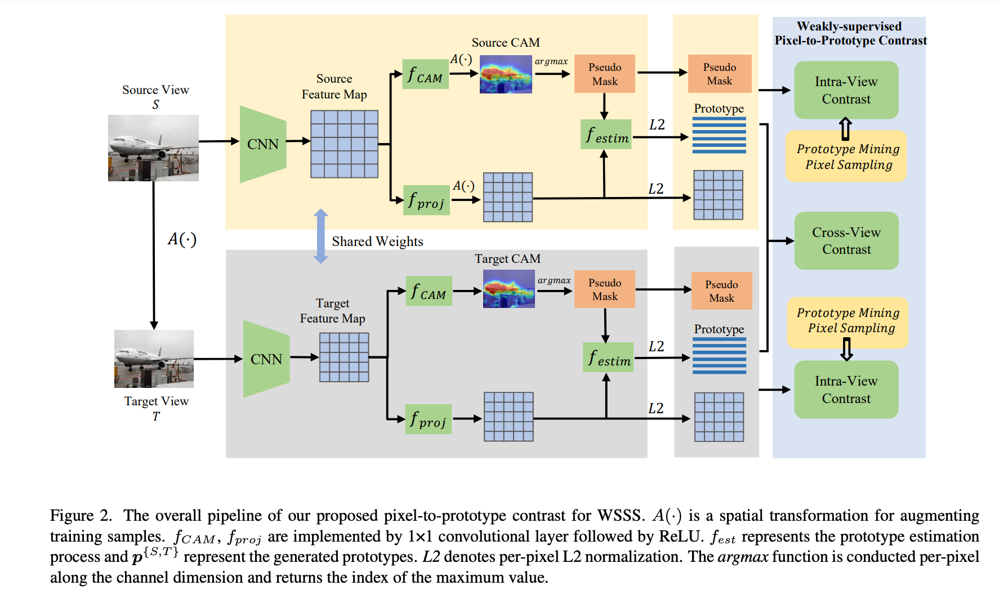
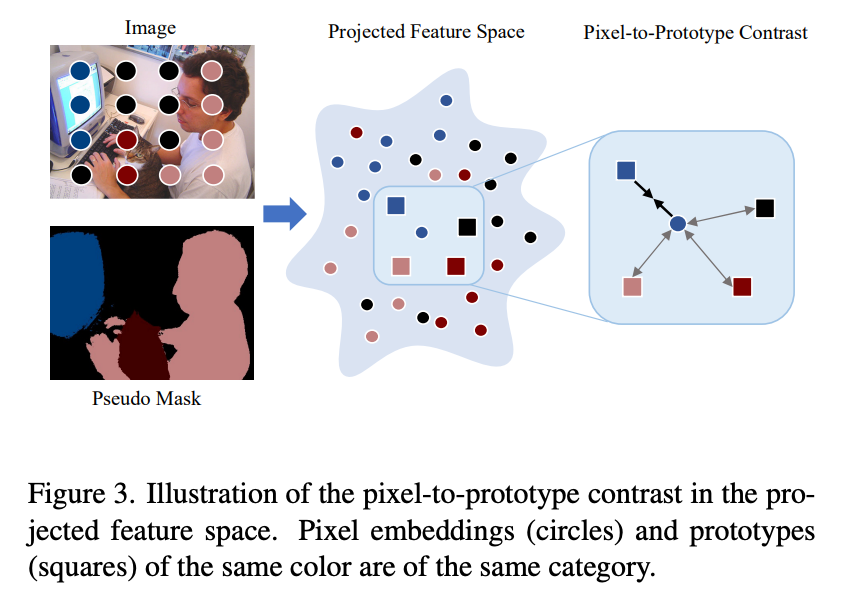

## Interpretability

##### [Weakly Supervised Semantic Segmentation by Pixel-to-Prototype Contrast](https://openaccess.thecvf.com/content/CVPR2022/papers/Du_Weakly_Supervised_Semantic_Segmentation_by_Pixel-to-Prototype_Contrast_CVPR_2022_paper.pdf)
Though image-level weakly supervised semantic segmentation (WSSS) has achieved great progress with Class
Activation Maps (CAMs) as the cornerstone, the large supervision gap between classification and segmentation still
hampers the model to generate more complete and precise pseudo masks for segmentation. In this study, we
propose weakly-supervised pixel-to-prototype contrast that
can provide pixel-level supervisory signals to narrow the
gap. Guided by two intuitive priors, our method is executed across different views and within per single view of an
image, aiming to impose cross-view feature semantic consistency regularization and facilitate intra(inter)-class compactness(dispersion) of the feature space. 

## Adversarial Attack

## Adversarial Defense

## Privacy
