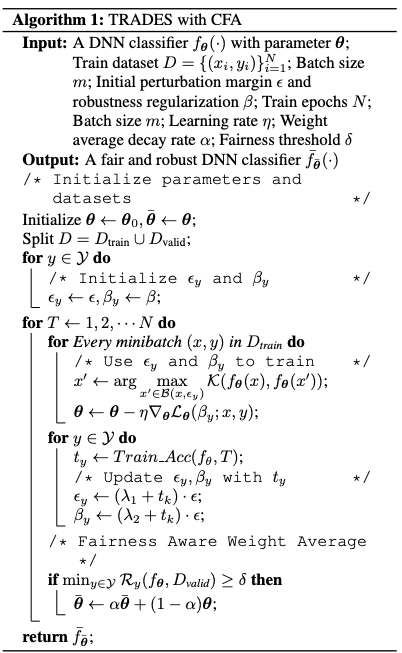
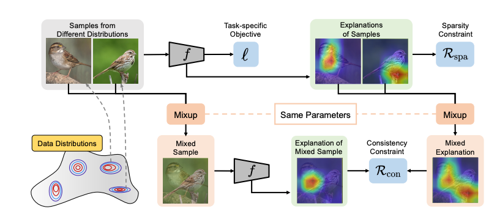
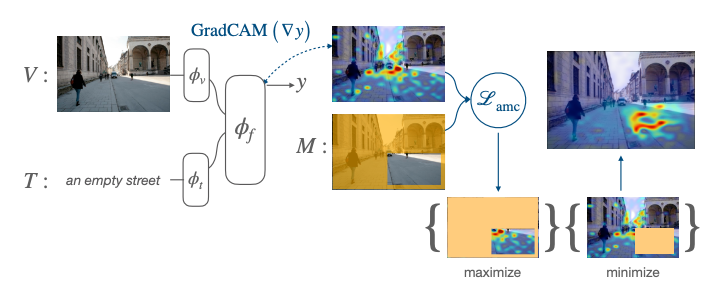

## Adversarial

### [Towards Compositional Adversarial Robustness: Generalizing Adversarial Training to Composite Semantic Perturbations](https://arxiv.org/pdf/2202.04235.pdf)

Scientific problem:  (a) How to generalize adversarial training from a single threat model to multiple?
(b) How to optimize the perturbation order from a set of semantic and ℓp-norm perturbations? (c) Can GAT outperform other adversarial training baselines against composite perturbations?

- composite adversarial attack (CAA): treat hue, saturation, brightness, contrast and rotation as attack types, 1） optimize by component-wise PGD; try to find the optimal attack order by solving combinatorial optimization via Sinkhorn normalization. 
- generalized adversarial training (GAT): adapt with min-max loss and trades loss with CAA

### [Revisiting Residual Networks for Adversarial Robustness](https://openaccess.thecvf.com/content/CVPR2023/papers/Huang_Revisiting_Residual_Networks_for_Adversarial_Robustness_CVPR_2023_paper.pdf)
1. Placing activation functions before convolutional layers (i.e., pre-activation) is, in general, more beneficial
with adversarial training, as opposed to post-activation
used in standard ERM training. And sometimes, it can
critically affect block structures such as the basic block
used in WRNs.
2. Bottleneck block improves adversarial robustness over
the de-facto basic block used in WRNs. In addition,
both aggregated and hierarchical convolutions derived
under standard ERM training lead to improvements
under adversarial training.
3. A straightforward application of SE [16] degrades adversarial robustness. Note that this is unlike in standard
ERM training, where SE consistently improves performance across most vision tasks when incorporated into
residual networks
4. Under the same FLOPs, deep and narrow residual networks are adversarially more robust than wide and
shallow networks. Specifically, the optimal ratio between depth and width is 7 : 3. (
5. The performance of smooth activation functions is critically dependent on adversarial training (AT) settings
and datasets. In particular, removing BN affine parameters from weight decay is crucial for the effectiveness
of smooth activation functions under AT.
6. In summary, the architectural design contributes significantly to adversarial robustness, particularly the block
topology and network scaling factors.

### [CFA: Class-Wise Calibrated Fair Adversarial Training](https://openaccess.thecvf.com/content/CVPR2023/papers/Wei_CFA_Class-Wise_Calibrated_Fair_Adversarial_Training_CVPR_2023_paper.pdf)
In this paper,
we are the first to theoretically and empirically investigate
the preference of different classes for adversarial configurations, including perturbation margin, regularization, and
weight averaging. Motivated by this, we further propose
a Class-wise calibrated Fair Adversarial training framework, named CFA, which customizes specific training configurations for each class automatically. 

Weakly Supervised Semantic Segmentation via Adversarial Learning of Classifier and Reconstructor

Jedi: Entropy-Based Localization and Removal of Adversarial Patches

Towards Effective Adversarial Textured 3D Meshes on Physical Face Recognition

Sibling-Attack: Rethinking Transferable Adversarial Attacks Against Face Recognition

Physically Adversarial Infrared Patches With Learnable Shapes and Locations

Physical-World Optical Adversarial Attacks on 3D Face Recognition

TWINS: A Fine-Tuning Framework for Improved Transferability of Adversarial Robustness and Generalization

SlowLiDAR: Increasing the Latency of LiDAR-Based Detection Using Adversarial Examples

Open-Set Semantic Segmentation for Point Clouds via Adversarial Prototype Framework

Adversarial Counterfactual Visual Explanations

Learning With Noisy Labels via Self-Supervised Adversarial Noisy Masking

RIATIG: Reliable and Imperceptible Adversarial Text-to-Image Generation With Natural Prompts

Proximal Splitting Adversarial Attack for Semantic Segmentation

The Enemy of My Enemy Is My Friend: Exploring Inverse Adversaries for Improving Adversarial Training

Towards Transferable Targeted Adversarial Examples

### [Boundary-Aware Backward-Compatible Representation via Adversarial Learning in Image Retrieval](https://openaccess.thecvf.com/content/CVPR2023/papers/Pan_Boundary-Aware_Backward-Compatible_Representation_via_Adversarial_Learning_in_Image_Retrieval_CVPR_2023_paper.pdf)
For traditional model upgrades, the old model will not be replaced by the new one until the embeddings of all the images in the database are re-computed by the new model,
which takes days or weeks for a large amount of data.
Recently, backward-compatible training (BCT) enables the
new model to be immediately deployed online by making the
new embeddings directly comparable to the old ones. For
BCT, improving the compatibility of two models with less
negative impact on retrieval performance is the key challenge. In this paper, we introduce AdvBCT, an Adversarial Backward-Compatible Training method with an elastic
boundary constraint that takes both compatibility and discrimination into consideration. We first employ adversarial
learning to minimize the distribution disparity between embeddings of the new model and the old model.

Demystifying Causal Features on Adversarial Examples and Causal Inoculation for Robust Network by Adversarial Instrumental Variable Regression

Discrete Point-Wise Attack Is Not Enough: Generalized Manifold Adversarial Attack for Face Recognition

Transferable Adversarial Attacks on Vision Transformers With Token Gradient Regularization

Bi-Directional Feature Fusion Generative Adversarial Network for Ultra-High Resolution Pathological Image Virtual Re-Staining

Robust Single Image Reflection Removal Against Adversarial Attacks

Privacy-Preserving Adversarial Facial Features

Exploring the Relationship Between Architectural Design and Adversarially Robust Generalization

Boosting Accuracy and Robustness of Student Models via Adaptive Adversarial Distillation

StyLess: Boosting the Transferability of Adversarial Examples

Adversarially Robust Neural Architecture Search for Graph Neural Networks

Dual-Bridging With Adversarial Noise Generation for Domain Adaptive rPPG Estimation

Improving the Transferability of Adversarial Samples by Path-Augmented Method

PEFAT: Boosting Semi-Supervised Medical Image Classification via Pseudo-Loss Estimation and Feature Adversarial Training

Randomized Adversarial Training via Taylor Expansion

Semi-Supervised Hand Appearance Recovery via Structure Disentanglement and Dual Adversarial Discrimination

FIANCEE: Faster Inference of Adversarial Networks via Conditional Early Exits

Black-Box Sparse Adversarial Attack via Multi-Objective Optimisation

Progressive Backdoor Erasing via Connecting Backdoor and Adversarial Attacks

Edges to Shapes to Concepts: Adversarial Augmentation for Robust Vision

Feature Separation and Recalibration for Adversarial Robustness

Towards Benchmarking and Assessing Visual Naturalness of Physical World Adversarial Attacks

CLIP2Protect: Protecting Facial Privacy Using Text-Guided Makeup via Adversarial Latent Search

BiasAdv: Bias-Adversarial Augmentation for Model Debiasing

Learning To Retain While Acquiring: Combating Distribution-Shift in Adversarial Data-Free Knowledge Distillation

Adversarial Robustness via Random Projection Filters

Masked Auto-Encoders Meet Generative Adversarial Networks and Beyond

The Best Defense Is a Good Offense: Adversarial Augmentation Against Adversarial Attacks

Adversarially Masking Synthetic To Mimic Real: Adaptive Noise Injection for Point Cloud Segmentation Adaptation

Seasoning Model Soups for Robustness to Adversarial and Natural Distribution Shifts

Introducing Competition To Boost the Transferability of Targeted Adversarial Examples Through Clean Feature Mixup

StyleAdv: Meta Style Adversarial Training for Cross-Domain Few-Shot Learning

Multi-View Adversarial Discriminator: Mine the Non-Causal Factors for Object Detection in Unseen Domains

AGAIN: Adversarial Training With Attribution Span Enlargement and Hybrid Feature Fusion

Adversarial Normalization: I Can Visualize Everything (ICE)

Evading DeepFake Detectors via Adversarial Statistical Consistency

Evading Forensic Classifiers With Attribute-Conditioned Adversarial Faces

TeSLA: Test-Time Self-Learning With Automatic Adversarial Augmentation

## interpretability

### [Initialization Noise in Image Gradients and Saliency Maps](https://openaccess.thecvf.com/content/CVPR2023/papers/Woerl_Initialization_Noise_in_Image_Gradients_and_Saliency_Maps_CVPR_2023_paper.pdf)
We further show that training noise artifacts can be removed by marginalization, which in practice can be implemented with simple stochastic integration: By averaging the results of tens of independently initialized and trained  networks, signal-to-noise-levels can be brought to acceptable levels. We also demonstrate that the same stochastic ensembling technique also improves the visual quality of feature visualization by optimization. While marginalization incurs non-trivial additional computational efforts, it can remove a significant source of uncertainty when explaining how data features are related to outcomes in previously unknown ways.

- Bayesian Marginalization (noise introduced from initialization and random training choices); remove initialization noise capture training randomness due to stochastic batch gradient descent
- Stochastic Integration
- Signal to Noise Ratio

### [Don't Lie to Me! Robust and Efficient Explainability With Verified Perturbation Analysis](https://arxiv.org/pdf/2202.07728.pdf)

The one uses a verification method to generate adversarial perturbation. (EVA)

### [Are Data-Driven Explanations Robust Against Out-of-Distribution Data?](https://arxiv.org/pdf/2303.16390.pdf)

A question naturally arises: Are data-driven explanations robust against out-of-distribution data? Our empirical results show that even though predict correctly, the model
might still yield unreliable explanations under distributional shifts. How to develop robust explanations against
out-of-distribution data? To address this problem, we
propose an end-to-end model-agnostic learning framework
Distributionally Robust Explanations (DRE). The key idea
is, inspired by self-supervised learning, to fully utilizes the
inter-distribution information to provide supervisory signals for the learning of explanations without human annotation. Can robust explanations benefit the model’s generalization capability? We conduct extensive experiments on a
wide range of tasks and data types, including classification
and regression on image and scientific tabular data. Our
results demonstrate that the proposed method significantly
improves the model’s performance in terms of explanation
and prediction robustness against distributional shifts.

Comments: Related to my idea, should be read carefully!!!!!!!!!

### [Improving Visual Grounding by Encouraging Consistent Gradient-Based Explanations](https://arxiv.org/pdf/2206.15462.pdf)
We propose a margin-based loss for tuning joint *vision-language* models so that their gradient-based explanations are consistent with region-level annotations provided by humans for relatively smaller grounding datasets. We refer to this objective as Attention Mask Consistency (AMC) and demonstrate that it produces superior visual grounding results than previous methods that rely on using vision-language models to score the outputs of object detectors.
Particularly, a model trained with AMC on top of standard vision-language modeling objectives obtain a state-of-the-art accuracy of 86.49% in the Flickr30k visual grounding benchmark, an absolute improvement of 5.38% when compared to the best previous model trained under the same level of supervision. 

comments: so intuitive, hard to believe no one did it before LOL

### [Language in a Bottle: Language Model Guided Concept Bottlenecks for Interpretable Image Classification](https://arxiv.org/pdf/2211.11158.pdf)
Our approach, Language Guided Bottlenecks
(LaBo), leverages a language model, GPT-3, to define a
large space of possible bottlenecks. Given a problem domain,
LaBo uses GPT-3 to produce factual sentences about categories to form candidate concepts. LaBo efficiently searches
possible bottlenecks through a novel submodular utility that
promotes the selection of discriminative and diverse information. Ultimately, GPT-3’s sentential concepts can be aligned
to images using CLIP, to form a bottleneck layer. Experiments demonstrate that LaBo is a highly effective prior for
concepts important to visual recognition.

comments: it is like a prototype model but learn the concepts with a language model.

### [Reliable and Interpretable Personalized Federated Learning](https://openaccess.thecvf.com/content/CVPR2023/papers/Qin_Reliable_and_Interpretable_Personalized_Federated_Learning_CVPR_2023_paper.pdf)
When there are large differences in data distribution among clients, it is crucial for federated learning
to design a reliable client selection strategy and an interpretable client communication framework to better utilize
group knowledge. Herein, a reliable personalized federated
learning approach, termed RIPFL, is proposed and fully interpreted from the perspective of social learning. RIPFL
reliably selects and divides the clients involved in training
such that each client can use different amounts of social
information and more effectively communicate with other
clients. Simultaneously, the method effectively integrates
personal information with the social information generated
by the global model from the perspective of Bayesian decision rules and evidence theory, enabling individuals to
grow better with the help of collective wisdom. An interpretable federated learning mind is well scalable, and the
experimental results indicate that the proposed method has
superior robustness and accuracy than other state-of-theart federated learning algorithms.

contribution:
- This paper proposes a reliable and interpretable personalized FL architecture from the perspective of social learning, which consists of interpretable local
training, reliable clients selection and division, and effective federated aggregation.
- To reliably select the required clients, this paper introduces evidence theory to the local training of clients,
thus quantifying the uncertainty of each client and providing interpretable training methods
-  A Bayesian-rule-based evidence fusion method is introduced by considering the global model as the prior
information of clients when there are differences in
the data distribution among clients. Consequently, the
knowledge of the global model is not forgotten by
clients in local training.

### [OCTET: Object-Aware Counterfactual Explanations](https://arxiv.org/pdf/2211.12380.pdf)
In this
work, we propose to tackle this issue with an object-centric
framework for counterfactual explanation generation. Our
method, inspired by recent generative modeling works, encodes the query image into a latent space that is structured
in a way to ease object-level manipulations. Doing so, it
provides the end-user with control over which search directions (e.g., spatial displacement of objects, style modification, etc.) are to be explored during the counterfactual generation.

Gradient-Based Uncertainty Attribution for Explainable Bayesian Deep Learning

Grounding Counterfactual Explanation of Image Classifiers to Textual Concept Space

S3C: Semi-Supervised VQA Natural Language Explanation via Self-Critical Learning

Toward Stable, Interpretable, and Lightweight Hyperspectral Super-Resolution

PIP-Net: Patch-Based Intuitive Prototypes for Interpretable Image Classification

CRAFT: Concept Recursive Activation FacTorization for Explainability

EVAL: Explainable Video Anomaly Localization

SketchXAI: A First Look at Explainability for Human Sketches

Spatial-Temporal Concept Based Explanation of 3D ConvNets

Interactive and Explainable Region-Guided Radiology Report Generation

A Loopback Network for Explainable Microvascular Invasion Classification

IDGI: A Framework To Eliminate Explanation Noise From Integrated Gradients

Explaining Image Classifiers With Multiscale Directional Image Representation

Bridging the Gap Between Model Explanations in Partially Annotated Multi-Label Classification

Affection: Learning Affective Explanations for Real-World Visual Data

Zero-Shot Everything Sketch-Based Image Retrieval, and in Explainable Style

Shortcomings of Top-Down Randomization-Based Sanity Checks for Evaluations of Deep Neural Network Explanations

Overlooked Factors in Concept-Based Explanations: Dataset Choice, Concept Learnability, and Human Capability

Global Vision Transformer Pruning With Hessian-Aware Saliency

TempSAL - Uncovering Temporal Information for Deep Saliency Prediction

Discriminative Co-Saliency and Background Mining Transformer for Co-Salient Object Detection

Sketch2Saliency: Learning To Detect Salient Objects From Human Drawings

Learning From Unique Perspectives: User-Aware Saliency Modeling

ASP-Net: Rethinking Video Saliency Prediction From an Audio-Visual Consistency Perceptual Perspective

Texture-Guided Saliency Distilling for Unsupervised Salient Object Detection

Realistic Saliency Guided Image Enhancement

Boosting Low-Data Instance Segmentation by Unsupervised Pre-Training With Saliency Prompt

## Ronan's list

### [Explaining Bayesian Neural Networks](https://arxiv.org/pdf/2108.10346.pdf)
In this work, we bring
together these two perspectives of transparency into a holistic
explanation framework for explaining BNNs. Within the Bayesian
framework, the network weights follow a probability distribution.
Hence, the standard (deterministic) prediction strategy of DNNs
extends in BNNs to a predictive distribution, and thus the
standard explanation extends to an explanation distribution.
Exploiting this view, we uncover that BNNs implicitly employ
multiple heterogeneous prediction strategies. While some of these
are inherited from standard DNNs, others are revealed to us by
considering the inherent uncertainty in BNNs.

contributions:
- provide theoretical justification along with a detailed practical explanation for usage of the mean explanation as most simplistic option to explain the decision making process of a BNN
- proposed UAI (Union and Intersection Explanation)
- investigate multi-modality
- Generality

comments:
The idea of UAI is interesting, it might useful for our work.

### [DORA: Exploring outlier representations in Deep Neural Networks](https://arxiv.org/pdf/2206.04530.pdf)
In this work, we introduce DORA (Data-agnOstic
Representation Analysis): the first data-agnostic framework for the analysis of the
representation space of DNNs. Our framework employs the proposed Extreme-Activation
(EA) distance measure between representations that utilizes self-explaining capabilities
within the network without accessing any data. We quantitatively validate the metric’s
correctness and alignment with human-defined semantic distances. The coherence
between the EA distance and human judgment enables us to identify representations
whose underlying concepts would be considered unnatural by humans by identifying
outliers in functional distance. Finally, we demonstrate the practical usefulness of
DORA by analyzing and identifying artifact representations in popular Computer Vision
models.

contributions:
- extreme-activation distance metric for representations: they assume the neural representation satisfies normal distrubution; 1) activation maximisation signals 2) representation activation vectors: mean activation of fb given the n-AMS of fa; extreme-activation distance is 1/sqrt(2)*sqrt(1-cos(rij,rji)), where rij,rji is thier pair-wise RAV
- DORA framework:
- quantitatively assess

comments:
It use the class of data as part of explanation, but really distance of representation is explanable?????

### [Quantus: An Explainable AI Toolkit for Responsible Evaluation of Neural Network Explanations and Beyond](https://www.jmlr.org/papers/volume24/22-0142/22-0142.pdf)

comments:
:) 

### [Saliency Cards: A Framework to Characterize and Compare Saliency Methods](https://dl.acm.org/doi/pdf/10.1145/3593013.3593997)
In response, we introduce saliency
cards: structured documentation of how saliency methods operate and their performance across a battery of evaluative metrics.
Through a review of 25 saliency method papers and 33 method
evaluations, we identify 10 attributes that users should account for
when choosing a method. We group these attributes into three categories that span the process of computing and interpreting saliency:
methodology, or how the saliency is calculated; sensitivity, or the
relationship between the saliency and the underlying model and
data; and, perceptibility, or how an end user ultimately interprets
the result. By collating this information, saliency cards allow users
to more holistically assess and compare the implications of different
methods. Through nine semi-structured interviews with users from
various backgrounds, including researchers, radiologists, and computational biologists, we find that saliency cards provide a detailed
vocabulary for discussing individual methods and allow for a more
systematic selection of task-appropriate methods

[code](https://github.com/mitvis/saliency-cards)

### [Beyond Expertise and Roles: A Framework to Characterize the Stakeholders of Interpretable Machine Learning and their Needs](https://dl.acm.org/doi/10.1145/3411764.3445088)

### [Benchmarking and survey of explanation methods for black box models](https://link.springer.com/article/10.1007/s10618-023-00933-9)
Unsurprisingly, the state-of-the-art exhibits currently a plethora of explainers providing many different types of explanations. With the aim of providing a compass for researchers and practitioners, this paper proposes a categorization of explanation methods from the perspective of the type of explanation they return, also considering the different input data formats. The paper accounts for the most representative explainers to date, also discussing similarities and discrepancies of returned explanations through their visual appearance. A companion website to the paper is provided as a continuous update to new explainers as they appear. Moreover, a subset of the most robust and widely adopted explainers, are benchmarked with respect to a repertoire of quantitative metrics.

### [Seg-XRes-CAM: Explaining Spatially Local Regions in Image Segmentation](https://openaccess.thecvf.com/content/CVPR2023W/XAI4CV/papers/Hasany_Seg-XRes-CAM_Explaining_Spatially_Local_Regions_in_Image_Segmentation_CVPRW_2023_paper.pdf)

- based on HiResCAM (element-wise grad-CAM), add pooling and upsampling

comments:
.............

### [Use HiResCAM instead of Grad-CAM for faithful explanations of convolutional neural networks](https://arxiv.org/pdf/2011.08891.pdf)

### [Shared Interest...Sometimes: Understanding the Alignment between Human Perception, Vision Architectures, and Saliency Map Techniques](https://xai4cv.github.io/assets/papers2023/P16_SharedInterestSometimes.pdf)

### [PIP-Net: Patch-Based Intuitive Prototypes for Interpretable Image Classification](https://openaccess.thecvf.com/content/CVPR2023/papers/Nauta_PIP-Net_Patch-Based_Intuitive_Prototypes_for_Interpretable_Image_Classification_CVPR_2023_paper.pdf)

### [A Living and Curated Collection of Explainable AI Methods](https://utwente-dmb.github.io/xai-papers/#/)

### [VISION DIFFMASK: Faithful Interpretation of Vision Transformers with Differentiable Patch Masking](https://arxiv.org/pdf/2304.06391.pdf)
To overcome this issue, we propose a post-hoc
interpretability method called VISION DIFFMASK, which
uses the activations of the model’s hidden layers to predict
the relevant parts of the input that contribute to its final predictions. Our approach uses a gating mechanism to identify
the minimal subset of the original input that preserves the
predicted distribution over classes

