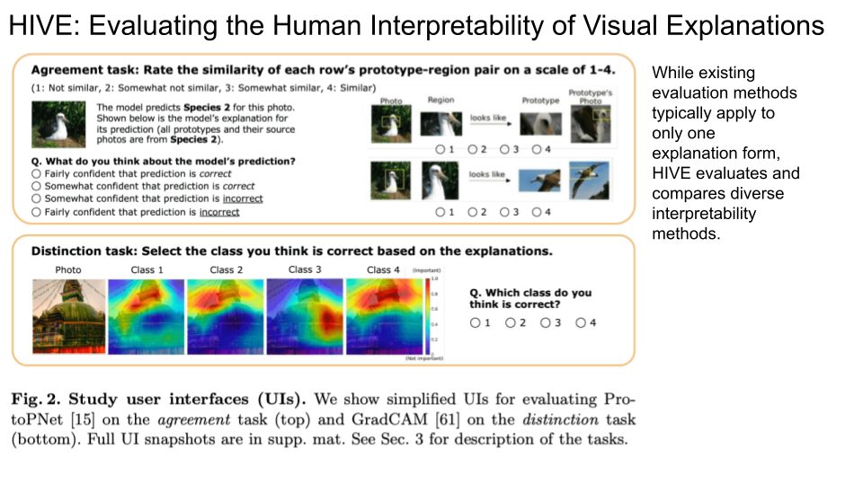

## Adversarial attack

### [Frequency Domain Model Augmentation for Adversarial Attack](https://www.ecva.net/papers/eccv_2022/papers_ECCV/html/974_ECCV_2022_paper.php)
- Spectrum saliency map
- [code](https://github.com/yuyang-long/SSA)
1. All of existing model augmentation methods investigate relationships of different models in spatial domain, which may overlook the essential differences between them.
2. To better uncover the differences among models, we introduce the spectrum saliency map (see Sec. 3.2) from a frequency domain perspective since representation of images in this domain have a fixed pattern, e.g., low-frequency components of an image correspond to its contour.
3. As illustrated in Figure 1 (d~g), spectrum saliency maps (See Sec. 3.2) of different models significantly vary from each other, which clearly reveals that each model has different interests in the same frequency component.

### [Exploring the Devil in Graph Spectral Domain for 3D Point Cloud Attacks](https://www.ecva.net/papers/eccv_2022/papers_ECCV/html/4378_ECCV_2022_paper.php)
- Graph Spectral Domain Attack (GSDA)
- [code](https://github.com/WoodwindHu/GSD)

LGV: Boosting Adversarial Example Transferability from Large Geometric Vicinity

### [Shape Matters: Deformable Patch Attack](https://www.ecva.net/papers/eccv_2022/papers_ECCV/papers/136640522.pdf)
- use bineary mask + triangle representation to construct different shape of patches
- Previous work always assumes patches to have fixed shapes, such as circles or rectangles, and it does not consider the shape of patches as a
factor in patch attacks. To explore this issue, we propose a novel Deformable Patch Representation (DPR) that can harness the geometric
structure of triangles to support the differentiable mapping between contour modeling and masks. Moreover, we introduce a joint optimization algorithm, named Deformable Adversarial Patch (DAPatch), which allows
simultaneous and efficient optimization of shape and texture to enhance
attack performance. We show that even with a small area, a particular shape can improve attack performance. Therefore, DAPatch achieves
state-of-the-art attack performance by deforming shapes on GTSRB and
ILSVRC2012 across various network architectures, and the generated
patches can be threatening in the real world. 

A Large-Scale Multiple-Objective Method for Black-Box Attack against Object Detection

RIBAC: Towards Robust and Imperceptible Backdoor Attack against Compact DNN

Boosting Transferability of Targeted Adversarial Examples via Hierarchical Generative Networks

Adaptive Image Transformations for Transfer-Based Adversarial Attack

AdvDO: Realistic Adversarial Attacks for Trajectory Prediction

Hardly Perceptible Trojan Attack against Neural Networks with Bit Flips

Triangle Attack: A Query-Efficient Decision-Based Adversarial Attack

Black-Box Dissector: Towards Erasing-Based Hard-Label Model Stealing Attack

Zero-Shot Attribute Attacks on Fine-Grained Recognition Models

An Invisible Black-Box Backdoor Attack through Frequency Domain

MFIM: Megapixel Facial Identity Manipulation

Physical Attack on Monocular Depth Estimation with Optimal Adversarial Patches

Exploiting the Local Parabolic Landscapes of Adversarial Losses to Accelerate Black-Box Adversarial Attack

GradAuto: Energy-Oriented Attack on Dynamic Neural Networks

TAFIM: Targeted Adversarial Attacks against Facial Image Manipulations

## Robustness

### [Improving Adversarial Robustness of 3D Point Cloud Classification Models]()

Prior-Guided Adversarial Initialization for Fast Adversarial Training

Adversarially-Aware Robust Object Detector

Enhanced Accuracy and Robustness via Multi-Teacher Adversarial Distillation

A Spectral View of Randomized Smoothing under Common Corruptions: Benchmarking and Improving Certified Robustness

Learning Extremely Lightweight and Robust Model with Differentiable Constraints on Sparsity and Condition Number

One Size Does NOT Fit All: Data-Adaptive Adversarial Training

UniCR: Universally Approximated Certified Robustness via Randomized Smoothing

Robust Network Architecture Search via Feature Distortion Restraining

Data-Free Backdoor Removal Based on Channel Lipschitzness

Learning Energy-Based Models with Adversarial Training

Revisiting Outer Optimization in Adversarial Training

Towards Effective and Robust Neural Trojan Defenses via Input Filtering

l∞-Robustness and Beyond: Unleashing Efficient Adversarial Training

Towards Efficient Adversarial Training on Vision Transformers

Watermark Vaccine: Adversarial Attacks to Prevent Watermark Removal

On the Robustness of Quality Measures for GANs

All You Need Is RAW: Defending against Adversarial Attacks with Camera Image Pipelines

Out-of-Distribution Detection with Boundary Aware Learning

Breadcrumbs: Adversarial Class-Balanced Sampling for Long-Tailed Recognition

VIP: Unified Certified Detection and Recovery for Patch Attack with Vision Transformers

On the Versatile Uses of Partial Distance Correlation in Deep Learning

Initialization and Alignment for Adversarial Texture Optimization

SegPGD: An Effective and Efficient Adversarial Attack for Evaluating and Boosting Segmentation Robustness

Scaling Adversarial Training to Large Perturbation Bounds

A Perturbation-Constrained Adversarial Attack for Evaluating the Robustness of Optical Flow

Latent Space Smoothing for Individually Fair Representations

Generative Multiplane Images: Making a 2D GAN 3D-Aware

Manifold Adversarial Learning for Cross-Domain 3D Shape Representation

NashAE: Disentangling Representations through Adversarial Covariance Minimization

Decoupled Adversarial Contrastive Learning for Self-Supervised Adversarial Robustness

## Privacy

SecretGen: Privacy Recovery on Pre-trained Models via Distribution Discrimination

PrivHAR: Recognizing Human Actions from Privacy-Preserving Lens

## Interpretability

### [HIVE: Evaluating the Human Interpretability of Visual Explanations](https://www.ecva.net/papers/eccv_2022/papers_ECCV/papers/136720277.pdf)
[code](https://github.com/princetonvisualai/HIVE)

Interpretable Open-Set Domain Adaptation via Angular Margin Separation

### [Interpretations Steered Network Pruning via Amortized Inferred Saliency Maps](https://www.ecva.net/papers/eccv_2022/papers_ECCV/papers/136810274.pdf)
Existing interpretation methods cannot get deployed
to achieve our goal as either they are inefficient for pruning or may predict non-coherent explanations. We tackle this challenge by introducing a
selector model that predicts real-time smooth saliency masks for pruned
models. We parameterize the distribution of explanatory masks by Radial Basis Function (RBF)-like functions to incorporate geometric prior
of natural images in our selector model’s inductive bias. Thus, we can
obtain compact representations of explanations to reduce the computational costs of our pruning method. We leverage our selector model to
steer the network pruning by maximizing the similarity of explanatory
representations for the pruned and original models.

Towards Interpretable Video Super-Resolution via Alternating Optimization

InAction: Interpretable Action Decision Making for Autonomous Driving

SC-wLS: Towards Interpretable Feed-Forward Camera Re-localization

### [Interpretable Image Classification with Differentiable Prototypes Assignment](https://www.ecva.net/papers/eccv_2022/papers_ECCV/papers/136720346.pdf)

[code](https://github.com/gmum/ProtoPool)

VecGAN: Image-to-Image Translation with Interpretable Latent Directions

### [Contributions of Shape, Texture, and Color in Visual Recognition](https://arxiv.org/pdf/2207.09510.pdf)

Understanding the Dynamics of DNNs Using Graph Modularity

### [Shap-CAM: Visual Explanations for Convolutional Neural Networks Based on Shapley Value](https://www.ecva.net/papers/eccv_2022/papers_ECCV/papers/136720455.pdf)

### [Are Vision Transformers Robust to Patch Perturbations?](https://openreview.net/pdf/aee5dd364aa6bb79eb782476f4dc7ceee00a5348.pdf)
- We discover that ViT is more robust to natural patch corruption than ResNet, whereas it is
more vulnerable to adversarial patch perturbation.
- Based on extensive analysis, we find that the self-attention mechanism, the core building
block of vision transformers, can effectively ignore natural corrupted patches to maintain a
correct prediction but be easily fooled to focus on adversarial patches to make a mistake.
- We show that ViT and ResNet exhibit different sensitivities against patch positions and
patch alignment of adversarial patch attacks due to their different architectural structures.

Editing Out-of-Domain GAN Inversion via Differential Activations

Explaining Deepfake Detection by Analysing Image Matching

Self-Regulated Feature Learning via Teacher-Free Feature Distillation

### [Learn from All: Erasing Attention Consistency for Noisy Label Facial Expression Recognition](https://www.ecva.net/papers/eccv_2022/papers_ECCV/papers/136860406.pdf)

WISE: Whitebox Image Stylization by Example-Based Learning

Factorizing Knowledge in Neural Networks

Latent Space Smoothing for Individually Fair Representations

Cartoon Explanations of Image Classifiers

Latent Discriminant Deterministic Uncertainty

A Dataset Generation Framework for Evaluating Megapixel Image Classifiers & Their Explanations

Revisiting a kNN-based Image Classification System with High-capacity Storage

Learning Local Implicit Fourier Representation for Image Warping

STEEX: Steering Counterfactual Explanations with Semantics

When Deep Classifiers Agree: Analyzing Correlations between Learning Order and Image Statistics

BayesCap: Bayesian Identity Cap for Calibrated Uncertainty in Frozen Neural Networks

Making Heads or Tails: Towards Semantically Consistent Visual Counterfactuals

### [SESS: Saliency Enhancing with Scaling and Sliding](https://arxiv.org/pdf/2207.01769.pdf)

Abstracting Sketches through Simple Primitives

No Token Left Behind: Explainability-Aided Image Classification and Generation

Discovering Transferable Forensic Features for CNN-Generated Images Detection

## Weakly Supervised Object Localization & Segmentation & Detection

### [Object Discovery via Contrastive Learning for Weakly Supervised Object Detection](https://www.ecva.net/papers/eccv_2022/papers_ECCV/html/5458_ECCV_2022_paper.php)
- we propose a novel multiple instance labeling method called object discovery. We further introduce a new contrastive loss under weak supervision where no instance-level information is available for sampling, called weakly supervised contrastive loss (WSCL). WSCL aims to construct a credible similarity threshold for object discovery by leveraging consistent features for embedding vectors in the same class.
- [code](https://github.com/jinhseo/OD-WSCL)

### [SQN: Weakly-Supervised Semantic Segmentation of Large-Scale 3D Point Clouds]()

Adversarial Erasing Framework via Triplet with Gated Pyramid Pooling Layer for Weakly Supervised Semantic Segmentation

Learning Unbiased Transferability for Domain Adaptation by Uncertainty Modeling

United Defocus Blur Detection and Deblurring via Adversarial Promoting Learning

Adversarial Partial Domain Adaptation by Cycle Inconsistency

### [Geodesic-Former: A Geodesic-Guided Few-Shot 3D Point Cloud Instance Segmenter]
