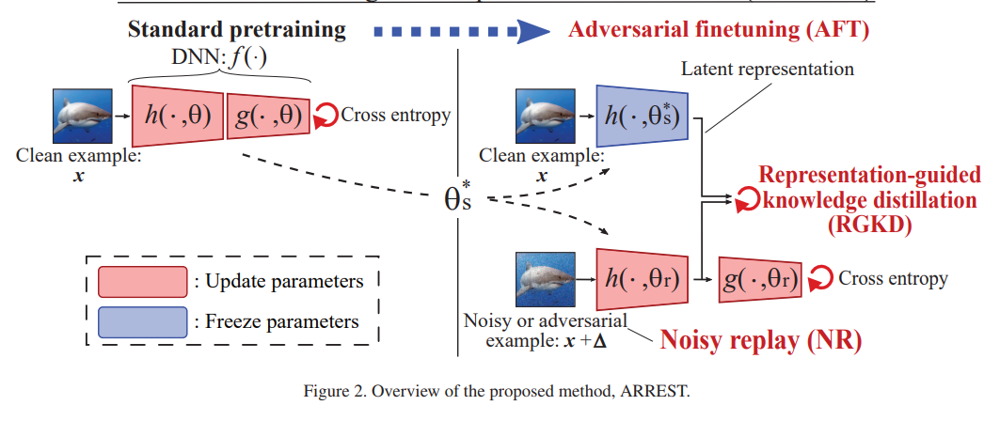

## Adversarial Attack

### [Hard No-Box Adversarial Attack on Skeleton-Based Human Action Recognition with Skeleton-Motion-Informed Gradient](https://openaccess.thecvf.com/content/ICCV2023/papers/Lu_Hard_No-Box_Adversarial_Attack_on_Skeleton-Based_Human_Action_Recognition_with_ICCV_2023_paper.pdf)

### [Downstream-agnostic Adversarial Examples](https://openaccess.thecvf.com/content/ICCV2023/papers/Zhou_Downstream-agnostic_Adversarial_Examples_ICCV_2023_paper.pdf)
In this paper, we propose AdvEncoder, the first framework for generating downstream-agnostic universal adversarial examples based on the pre-trained encoder. AdvEncoder aims to construct a universal adversarial perturbation or patch for a set of natural images that can fool all
the downstream tasks inheriting the victim's pre-trained encoder.
Our results show that an attacker can successfully attack downstream tasks without knowing either
the pre-training dataset or the downstream dataset.

- adv loss: the feature of original images is far away from the feature of adversarial images
- hfc loss: after high-frequency component filter, the adversarial images should be similar to the original one
- quantization loss: L2 norm distance between adv and ori images should be as small as possible

### [LEA2: A Lightweight Ensemble Adversarial Attack via Non-overlapping Vulnerable Frequency Regions](https://openaccess.thecvf.com/content/ICCV2023/papers/Qian_LEA2_A_Lightweight_Ensemble_Adversarial_Attack_via_Non-overlapping_Vulnerable_Frequency_ICCV_2023_paper.pdf)

In this work, they find three types of models with non-overlapping vulnerable frequency regions, which can cover a large enough vulnerable subspace. Based on it, they propose a lightweight ensemble adversarial attack named LEA1, integrated by standard, weakly robust, and robust models.

### [AdvDiffuser: Natural Adversarial Example Synthesis with Diffusion Models](https://openaccess.thecvf.com/content/ICCV2023/papers/Chen_AdvDiffuser_Natural_Adversarial_Example_Synthesis_with_Diffusion_Models_ICCV_2023_paper.pdf)

They use the diffusion model to generate natural adversarial examples. 

### [Tracing the Origin of Adversarial Attack for Forensic Investigation and Deterrence](https://openaccess.thecvf.com/content/ICCV2023/papers/Fang_Tracing_the_Origin_of_Adversarial_Attack_for_Forensic_Investigation_and_ICCV_2023_paper.pdf)

### [REAP: A Large-Scale Realistic Adversarial Patch Benchmark](https://openaccess.thecvf.com/content/ICCV2023/papers/Hingun_REAP_A_Large-Scale_Realistic_Adversarial_Patch_Benchmark_ICCV_2023_paper.pdf)

### [RFLA: A Stealthy Reflected Light Adversarial Attack in the Physical World](https://openaccess.thecvf.com/content/ICCV2023/papers/Wang_RFLA_A_Stealthy_Reflected_Light_Adversarial_Attack_in_the_Physical_ICCV_2023_paper.pdf)

### [Distracting Downpour: Adversarial Weather Attacks for Motion Estimation](https://openaccess.thecvf.com/content/ICCV2023/papers/Schmalfuss_Distracting_Downpour_Adversarial_Weather_Attacks_for_Motion_Estimation_ICCV_2023_paper.pdf)

### [TRM-UAP: Enhancing the Transferability of Data-Free Universal Adversarial Perturbation via Truncated Ratio Maximization](https://openaccess.thecvf.com/content/ICCV2023/papers/Liu_TRM-UAP_Enhancing_the_Transferability_of_Data-Free_Universal_Adversarial_Perturbation_via_ICCV_2023_paper.pdf)

### [Breaking Temporal Consistency: Generating Video Universal Adversarial Perturbations Using Image Models](https://openaccess.thecvf.com/content/ICCV2023/papers/Kim_Breaking_Temporal_Consistency_Generating_Video_Universal_Adversarial_Perturbations_Using_Image_ICCV_2023_paper.pdf)

### [Hiding Visual Information via Obfuscating Adversarial Perturbations](https://openaccess.thecvf.com/content/ICCV2023/papers/Su_Hiding_Visual_Information_via_Obfuscating_Adversarial_Perturbations_ICCV_2023_paper.pdf)

### [Backpropagation Path Search On Adversarial Transferability](https://openaccess.thecvf.com/content/ICCV2023/papers/Xu_Backpropagation_Path_Search_On_Adversarial_Transferability_ICCV_2023_paper.pdf)

### [Boosting Adversarial Transferability via Gradient Relevance Attack](https://openaccess.thecvf.com/content/ICCV2023/papers/Zhu_Boosting_Adversarial_Transferability_via_Gradient_Relevance_Attack_ICCV_2023_paper.pdf)

### [Unified Adversarial Patch for Cross-Modal Attacks in the Physical World](https://openaccess.thecvf.com/content/ICCV2023/papers/Wei_Unified_Adversarial_Patch_for_Cross-Modal_Attacks_in_the_Physical_World_ICCV_2023_paper.pdf)

### [Unsupervised Accuracy Estimation of Deep Visual Models using Domain-Adaptive Adversarial Perturbation without Source Samples](https://openaccess.thecvf.com/content/ICCV2023/papers/Lee_Unsupervised_Accuracy_Estimation_of_Deep_Visual_Models_using_Domain-Adaptive_Adversarial_ICCV_2023_paper.pdf)

### [SAGA: Spectral Adversarial Geometric Attack on 3D Meshes](https://openaccess.thecvf.com/content/ICCV2023/papers/Stolik_SAGA_Spectral_Adversarial_Geometric_Attack_on_3D_Meshes_ICCV_2023_paper.pdf)

### [Set-level Guidance Attack: Boosting Adversarial Transferability of Vision-Language Pre-training Models](https://openaccess.thecvf.com/content/ICCV2023/papers/Lu_Set-level_Guidance_Attack_Boosting_Adversarial_Transferability_of_Vision-Language_Pre-training_Models_ICCV_2023_paper.pdf)

### [Enhancing Generalization of Universal Adversarial Perturbation through Gradient Aggregation](https://openaccess.thecvf.com/content/ICCV2023/papers/Liu_Enhancing_Generalization_of_Universal_Adversarial_Perturbation_through_Gradient_Aggregation_ICCV_2023_paper.pdf)

### [F&F Attack: Adversarial Attack against Multiple Object Trackers by Inducing False Negatives and False Positives](https://openaccess.thecvf.com/content/ICCV2023/papers/Zhou_FF_Attack_Adversarial_Attack_against_Multiple_Object_Trackers_by_Inducing_ICCV_2023_paper.pdf)

### [Structure Invariant Transformation for better Adversarial Transferability](https://openaccess.thecvf.com/content/ICCV2023/papers/Wang_Structure_Invariant_Transformation_for_better_Adversarial_Transferability_ICCV_2023_paper.pdf)

### [Mitigating Adversarial Vulnerability through Causal Parameter Estimation by Adversarial Double Machine Learning](https://openaccess.thecvf.com/content/ICCV2023/papers/Lee_Mitigating_Adversarial_Vulnerability_through_Causal_Parameter_Estimation_by_Adversarial_Double_ICCV_2023_paper.pdf)

### [An Adaptive Model Ensemble Adversarial Attack for Boosting Adversarial Transferability](https://openaccess.thecvf.com/content/ICCV2023/papers/Chen_An_Adaptive_Model_Ensemble_Adversarial_Attack_for_Boosting_Adversarial_Transferability_ICCV_2023_paper.pdf)

They addressed the problem that transferable adversarial perturbations always fail to transfer from CNNs to ViTs. (Diversity of architectures) So they propose model ensemble adversarial attacks to fuse outputs from surrogate models with diverse architectures. They propose an adaptive ensemble attack to adaptively control the fusion of the outputs from each model via monitoring the discrepancy ratio of their contributions. 
- they found the gradients are closer when the model architectures are more similar.
- the idea is intuitive, but they use the softmax of probability to measure the model (hardness) and use the gradient distance to reduce the repeats

[code](https://github.com/CHENBIN99/AdaEA)

### [Does Physical Adversarial Example Really Matter to Autonomous Driving? Towards System-Level Effect of Adversarial Object Evasion Attack](https://openaccess.thecvf.com/content/ICCV2023/papers/Wang_Does_Physical_Adversarial_Example_Really_Matter_to_Autonomous_Driving_Towards_ICCV_2023_paper.pdf)

In this work, we conduct the first measurement
study on whether and how effectively the existing designs
can lead to system-level effects, especially for the STOP
sign-evasion attacks due to their popularity and severity.
Our evaluation results show that all the representative prior
works cannot achieve any system-level effects. We observe two design limitations in the prior works: 1) physical
model-inconsistent object size distribution in pixel sampling
and 2) lack of vehicle plant model and AD system model
consideration. Then, we propose SysAdv, a novel systemdriven attack design in the AD context and our evaluation
results show that the system-level effects can be significantly
improved, i.e., the violation rate increases by around 70%.

## Need to revise carefully!!!!!

### [Transferable Adversarial Attack for Both Vision Transformers and Convolutional Networks via Momentum Integrated Gradients](https://openaccess.thecvf.com/content/ICCV2023/papers/Ma_Transferable_Adversarial_Attack_for_Both_Vision_Transformers_and_Convolutional_Networks_ICCV_2023_paper.pdf)

Specifically, we use integrated gradients rather
than gradients to steer the generation of adversarial perturbations, inspired by the observation that integrated gradients of images demonstrate higher similarity across models in comparison to regular gradients. Then we acquire
the accumulated gradients by combining the integrated gradients from previous iterations with the current ones in a
momentum manner and use their sign to modify the perturbations iteratively.

- momentum + IG + ensemble

## Adversarial Defense

### [Advancing Example Exploitation Can Alleviate Critical Challenges in Adversarial Training](https://openaccess.thecvf.com/content/ICCV2023/papers/Ge_Advancing_Example_Exploitation_Can_Alleviate_Critical_Challenges_in_Adversarial_Training_ICCV_2023_paper.pdf)

- found examples that have a greater impact

[code](https://github.com/geyao1995/advancing-example-exploitation-in-adversarial-training)

### [Fast Adversarial Training with Smooth Convergence](https://openaccess.thecvf.com/content/ICCV2023/papers/Zhao_Fast_Adversarial_Training_with_Smooth_Convergence_ICCV_2023_paper.pdf)

### [Improving Generalization of Adversarial Training via Robust Critical Fine-Tuning](https://openaccess.thecvf.com/content/ICCV2023/papers/Zhu_Improving_Generalization_of_Adversarial_Training_via_Robust_Critical_Fine-Tuning_ICCV_2023_paper.pdf)

### [Benchmarking and Analyzing Robust Point Cloud Recognition: Bag of Tricks for Defending Adversarial Examples](https://openaccess.thecvf.com/content/ICCV2023/papers/Ji_Benchmarking_and_Analyzing_Robust_Point_Cloud_Recognition_Bag_of_Tricks_ICCV_2023_paper.pdf)

### [Improving Adversarial Robustness of Masked Autoencoders via Test-time Frequency-domain Prompting](https://openaccess.thecvf.com/content/ICCV2023/papers/Huang_Improving_Adversarial_Robustness_of_Masked_Autoencoders_via_Test-time_Frequency-domain_Prompting_ICCV_2023_paper.pdf)

### [Towards Viewpoint-Invariant Visual Recognition via Adversarial Training](https://openaccess.thecvf.com/content/ICCV2023/papers/Ruan_Towards_Viewpoint-Invariant_Visual_Recognition_via_Adversarial_Training_ICCV_2023_paper.pdf)

### [Semi-supervised Semantics-guided Adversarial Training for Robust Trajectory Prediction](https://openaccess.thecvf.com/content/ICCV2023/papers/Jiao_Semi-supervised_Semantics-guided_Adversarial_Training_for_Robust_Trajectory_Prediction_ICCV_2023_paper.pdf)

## Interpretability

### [Studying How to Efficiently and Effectively Guide Models with Explanations](https://openaccess.thecvf.com/content/ICCV2023/papers/Rao_Studying_How_to_Efficiently_and_Effectively_Guide_Models_with_Explanations_ICCV_2023_paper.pdf)

- We propose using the
Energy Pointing Game (EPG) score [67] as an alternative
to the IoU metric for evaluating the effectiveness of such
guidance and show that the EPG score constitutes a good
loss function for model guidance, particularly when using
bounding boxes.
- localization losses: l1 loss+ per-pixel cross entropy loss + RRR loss+ energy loss

### [Visual Explanations via Iterated Integrated Attributions](https://openaccess.thecvf.com/content/ICCV2023/papers/Barkan_Visual_Explanations_via_Iterated_Integrated_Attributions_ICCV_2023_paper.pdf)

This paper presents Iterated Integrated Attributions (IIA)
- a universal technique for explaining vision models, applicable to both CNN and ViT architectures. IIA employs iterative
integration across the input image, the internal representations generated by the model, and their gradients. Thereby,
IIA leverages information from the activation (or attention)
maps created by all network layers, including those from the
input image. We present comprehensive objective and subjective evaluations that demonstrate the effectiveness of IIA
in generating faithful explanations for both CNN and ViT
models. Our results show that IIA outperforms current stateof-the-art methods on various explanation and segmentation
tests across all datasets, model architectures, and metrics.
- recent studies have suggested that gradients derived from
internal activation maps can yield improved explanation
maps
- IIA employs an iterated integral across multiple intermediate representations (such as
activation or attention maps) generated during the network’s
forward pass. This enables the iterative accumulation of
gradients w.r.t. the representations of interest. Lastly, unlike
IG, IIA does not restrict the integrand to plain gradients, but
encompasses a function of the entire set of representations
produced by the network and their gradients.

[code](https://github.com/iia-iccv23/iia)

### [Corrupting Neuron Explanations of Deep Visual Features](https://openaccess.thecvf.com/content/ICCV2023/papers/Srivastava_Corrupting_Neuron_Explanations_of_Deep_Visual_Features_ICCV_2023_paper.pdf)

Considering the insufficient study on such complex causal questions, we make the first attempt to explain different causal
questions by contrastive explanations in a unified framework, i.e., Counterfactual Contrastive Explanation (CCE),
which visually and intuitively explains the aforementioned
questions via a novel positive-negative saliency-based explanation scheme. More specifically, we propose a contentaware counterfactual perturbing algorithm to stimulate
contrastive examples, from which a pair of positive and
negative saliency maps could be derived to contrastively
explain why P (positive class) rather than Q (negative
class).

They use a probing dataset to compute the activation threshold for neurons and generate an activation map, which is then used by similarity function to assign concepts.

### [Variational Causal Inference Network for Explanatory Visual Question Answering](https://openaccess.thecvf.com/content/ICCV2023/papers/Xue_Variational_Causal_Inference_Network_for_Explanatory_Visual_Question_Answering_ICCV_2023_paper.pdf)

### [Counterfactual-based Saliency Map: Towards Visual Contrastive Explanations for Neural Networks](https://openaccess.thecvf.com/content/ICCV2023/papers/Wang_Counterfactual-based_Saliency_Map_Towards_Visual_Contrastive_Explanations_for_Neural_Networks_ICCV_2023_paper.pdf)

### [X-VoE: Measuring eXplanatory Violation of Expectation in Physical Events](https://openaccess.thecvf.com/content/ICCV2023/papers/Dai_X-VoE_Measuring_eXplanatory_Violation_of_Expectation_in_Physical_Events_ICCV_2023_paper.pdf)

This study introduces X-VoE, a comprehensive benchmark dataset, to assess AI agents’ grasp
of intuitive physics. Built on the developmental psychologyrooted Violation of Expectation (VoE) paradigm, X-VoE
establishes a higher bar for the explanatory capacities of
intuitive physics models. Each VoE scenario within X-VoE
encompasses three distinct settings, probing models’ comprehension of events and their underlying explanations. Beyond
model evaluation, we present an explanation-based learning
system that captures physics dynamics and infers occluded
object states solely from visual sequences, without explicit occlusion labels. Experimental outcomes highlight our model’s
alignment with human commonsense when tested against
X-VoE. A remarkable feature is our model’s ability to visually expound VoE events by reconstructing concealed scenes.
Concluding, we discuss the findings’ implications and outline future research directions. Through X-VoE, we catalyze
the advancement of AI endowed with human-like intuitive
physics capabiliti

### [MAGI: Multi-Annotated Explanation-Guided Learning](https://openaccess.thecvf.com/content/ICCV2023/papers/Zhang_MAGI_Multi-Annotated_Explanation-Guided_Learning_ICCV_2023_paper.pdf)

how to use multiple
annotations to improve accuracy is particularly challenging
due to the following: 1) The noisiness of annotations from
different annotators; 2) The lack of pre-given information
about the corresponding relationship between annotations
and annotators; 3) Missing annotations since some images
are not labeled by all annotators. To solve these challenges,
we propose a Multi-annotated explanation-guided learning (MAGI) framework to do explanation supervision with
comprehensive and high-quality generated annotations. We
first propose a novel generative model to generate annotations from all annotators and infer them using a newly
proposed variational inference-based technique by learning
the characteristics of each annotator. 

### [Saliency Regularization for Self-Training with Partial Annotations](https://openaccess.thecvf.com/content/ICCV2023/papers/Wang_Saliency_Regularization_for_Self-Training_with_Partial_Annotations_ICCV_2023_paper.pdf)

### [SAFARI: Versatile and Efficient Evaluations for Robustness of Interpretability](https://openaccess.thecvf.com/content/ICCV2023/papers/Huang_SAFARI_Versatile_and_Efficient_Evaluations_for_Robustness_of_Interpretability_ICCV_2023_paper.pdf)

### [TIFA: Accurate and Interpretable Text-to-Image Faithfulness Evaluation with Question Answering](https://openaccess.thecvf.com/content/ICCV2023/papers/Hu_TIFA_Accurate_and_Interpretable_Text-to-Image_Faithfulness_Evaluation_with_Question_Answering_ICCV_2023_paper.pdf)

### [Learning Support and Trivial Prototypes for Interpretable Image Classification](https://openaccess.thecvf.com/content/ICCV2023/papers/Wang_Learning_Support_and_Trivial_Prototypes_for_Interpretable_Image_Classification_ICCV_2023_paper.pdf)

### [ICICLE: Interpretable Class Incremental Continual Learning](https://openaccess.thecvf.com/content/ICCV2023/papers/Rymarczyk_ICICLE_Interpretable_Class_Incremental_Continual_Learning_ICCV_2023_paper.pdf)

### [MoreauGrad: Sparse and Robust Interpretation of Neural Networks via Moreau Envelope](https://openaccess.thecvf.com/content/ICCV2023/papers/Zhang_MoreauGrad_Sparse_and_Robust_Interpretation_of_Neural_Networks_via_Moreau_ICCV_2023_paper.pdf)

### [Evaluation and Improvement of Interpretability for Self-Explainable Part-Prototype Networks](https://openaccess.thecvf.com/content/ICCV2023/papers/Huang_Evaluation_and_Improvement_of_Interpretability_for_Self-Explainable_Part-Prototype_Networks_ICCV_2023_paper.pdf)

## Robustness

### [Robust Evaluation of Diffusion-Based Adversarial Purification](https://openaccess.thecvf.com/content/ICCV2023/papers/Lee_Robust_Evaluation_of_Diffusion-Based_Adversarial_Purification_ICCV_2023_paper.pdf)

### [MUter: Machine Unlearning on Adversarially Trained Models](https://openaccess.thecvf.com/content/ICCV2023/papers/Liu_MUter_Machine_Unlearning_on_Adversarially_Trained_Models_ICCV_2023_paper.pdf)

### [Explaining Adversarial Robustness of Neural Networks from Clustering Effect Perspective](https://openaccess.thecvf.com/content/ICCV2023/papers/Jin_Explaining_Adversarial_Robustness_of_Neural_Networks_from_Clustering_Effect_Perspective_ICCV_2023_paper.pdf)

### [Enhancing Adversarial Robustness in Low-Label Regime via Adaptively Weighted Regularization and Knowledge Distillation](https://openaccess.thecvf.com/content/ICCV2023/papers/Yang_Enhancing_Adversarial_Robustness_in_Low-Label_Regime_via_Adaptively_Weighted_Regularization_ICCV_2023_paper.pdf)

### [Adversarial Finetuning with Latent Representation Constraint to Mitigate Accuracy-Robustness Tradeoff](https://openaccess.thecvf.com/content/ICCV2023/papers/Suzuki_Adversarial_Finetuning_with_Latent_Representation_Constraint_to_Mitigate_Accuracy-Robustness_Tradeoff_ICCV_2023_paper.pdf)
This paper addresses the tradeoff between standard accuracy on clean examples and robustness against adversarial examples in deep neural networks (DNNs). They propose a new AT named ARREST with 1) adversarial finetuning 2) representation-guided knowledge distillation 3) noisy reply

### [Among Us: Adversarially Robust Collaborative Perception by Consensus](https://openaccess.thecvf.com/content/ICCV2023/papers/Li_Among_Us_Adversarially_Robust_Collaborative_Perception_by_Consensus_ICCV_2023_paper.pdf)
Differently, we propose ROBOSAC, a novel samplingbased defense strategy generalizable to unseen attackers.
**Our key idea is that collaborative perception should lead to
consensus rather than dissensus in results compared to individual perception**. This leads to our hypothesize-and-verify
framework: perception results with and without collaboration from a random subset of teammates are compared until
reaching a consensus. In such a framework, more teammates in the sampled subset often entail better perception
performance but require longer sampling time to reject potential attackers. Thus, we derive how many sampling trials are needed to ensure the desired size of an attacker-free
subset, or equivalently, the maximum size of such a subset
that we can successfully sample within a given number of
trials. We validate our method on the task of collaborative
3D object detection in **autonomous driving scenarios**.

- 

### [Reinforce Data, Multiply Impact: Improved Model Accuracy and Robustness with Dataset Reinforcement](https://openaccess.thecvf.com/content/ICCV2023/papers/Faghri_Reinforce_Data_Multiply_Impact_Improved_Model_Accuracy_and_Robustness_with_ICCV_2023_paper.pdf)

### [Contrastive Model Adaptation for Cross-Condition Robustness in Semantic Segmentation](https://openaccess.thecvf.com/content/ICCV2023/papers/Bruggemann_Contrastive_Model_Adaptation_for_Cross-Condition_Robustness_in_Semantic_Segmentation_ICCV_2023_paper.pdf)

### [TrajPAC: Towards Robustness Verification of Pedestrian Trajectory Prediction Models](https://openaccess.thecvf.com/content/ICCV2023/papers/Zhang_TrajPAC_Towards_Robustness_Verification_of_Pedestrian_Trajectory_Prediction_Models_ICCV_2023_paper.pdf)

### [Towards Better Robustness against Common Corruptions for Unsupervised Domain Adaptation](https://openaccess.thecvf.com/content/ICCV2023/papers/Gao_Towards_Better_Robustness_against_Common_Corruptions_for_Unsupervised_Domain_Adaptation_ICCV_2023_paper.pdf)

### [On the Robustness of Open-World Test-Time Training: Self-Training with Dynamic Prototype Expansion](https://openaccess.thecvf.com/content/ICCV2023/papers/Li_On_the_Robustness_of_Open-World_Test-Time_Training_Self-Training_with_Dynamic_ICCV_2023_paper.pdf)

### [HybridAugment++: Unified Frequency Spectra Perturbations for Model Robustness](https://openaccess.thecvf.com/content/ICCV2023/papers/Yucel_HybridAugment_Unified_Frequency_Spectra_Perturbations_for_Model_Robustness_ICCV_2023_paper.pdf)

### [Towards Viewpoint Robustness in Bird's Eye View Segmentation](https://openaccess.thecvf.com/content/ICCV2023/papers/Klinghoffer_Towards_Viewpoint_Robustness_in_Birds_Eye_View_Segmentation_ICCV_2023_paper.pdf)

### [A Unified Framework for Robustness on Diverse Sampling Errors](https://openaccess.thecvf.com/content/ICCV2023/papers/Jeon_A_Unified_Framework_for_Robustness_on_Diverse_Sampling_Errors_ICCV_2023_paper.pdf)

### [Benchmarking Low-Shot Robustness to Natural Distribution Shifts](https://openaccess.thecvf.com/content/ICCV2023/papers/Singh_Benchmarking_Low-Shot_Robustness_to_Natural_Distribution_Shifts_ICCV_2023_paper.pdf)

### [On the Robustness of Normalizing Flows for Inverse Problems in Imaging](https://openaccess.thecvf.com/content/ICCV2023/papers/Hong_On_the_Robustness_of_Normalizing_Flows_for_Inverse_Problems_in_ICCV_2023_paper.pdf)

## Faireness

### [Towards Fairness-aware Adversarial Network Pruning](https://openaccess.thecvf.com/content/ICCV2023/papers/Zhang_Towards_Fairness-aware_Adversarial_Network_Pruning_ICCV_2023_paper.pdf)

