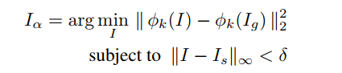

### ICLR 2016 :

### [Distributional Smoothing with Virtual Adversarial Training](https://arxiv.org/abs/1507.00677)
__Method__:
1. abstract:
We propose local distributional smoothness (LDS), a new notion of smoothness
for statistical model that can be used as a regularization term to promote the
smoothness of the model distribution. We named the LDS based regularization
as virtual adversarial training (VAT). The LDS of a model at an input datapoint is
defined as the KL-divergence based robustness of the model distribution against
local perturbation around the datapoint. VAT resembles adversarial training, but
distinguishes itself in that it determines the adversarial direction from the model
distribution alone without using the label information, making it applicable to
semi-supervised learning. The computational cost for VAT is relatively low. For
neural network, the approximated gradient of the LDS can be computed with
no more than three pairs of forward and back propagations. 

2. virtual adversarial examples:
It is computed, the evaluation of the LDS is simply the computation of the KL divergence
between the model distributions.

__Experiments__:

1. dataset&network&attack: 

MNIST, SVHN, NORB - SVM,EmbedNN,PEA,DG,Ladder network, NN - Virtual Attack

_______________

### [Adversarial Manipulation of Deep Representations](https://arxiv.org/abs/1511.05122)

__Method__:
1. abstract:
Here we instead concentrate on the internal layers of DNN representations,
to produce a new class of adversarial images that differs qualitatively from others.
While the adversary is perceptually similar to one image, its internal representation
appears remarkably similar to a different image, from a different class and
bearing little if any apparent similarity to the input. Further, they appear generic
and consistent with the space of natural images.

2. Adversarial Image Generation:
__First one used source and guide images to generate adversarial perturbation.__

__Experiments__:
1. data&network&attack:
ImageNet ILSVRC - CaffeNet,AlexNet,GoogleNet,VGG CNN S,Places205 AlexNet,Places205 Hybrid

2. Layer FC7, P5, C3
3. Euclidean Distance, Intersection and Average Distance to Nearest Neighbors, Manifold Tangent Space, Angular Consistency Measure
