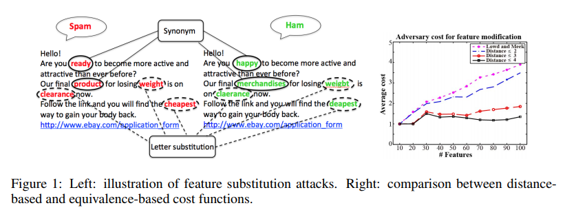

### NIPS 2014 :

### [Feature Cross-Substitution in Adversarial Classification](https://papers.nips.cc/paper/5510-feature-cross-substitution-in-adversarial-classification)

1. abstract:
We offer a simple heuristic method for making
learning more robust to feature cross-substitution attacks. We then present
a more general approach based on mixed-integer linear programming with constraint
generation, which implicitly trades off overfitting and feature selection in
an adversarial setting using a sparse regularizer along with an evasion model. Our
approach is the first method for combining an adversarial classification algorithm
with a very general class of models of adversarial classifier evasion.

