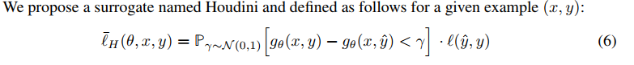
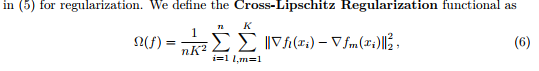

### NIPS 2017 :

### [Houdini: Fooling Deep Structured Visual and Speech Recognition Models with Adversarial Examples](https://papers.nips.cc/paper/7273-houdini-fooling-deep-structured-visual-and-speech-recognition-models-with-adversarial-examples)
1. abstract:
We introduce a novel flexible approach named Houdini for
generating adversarial examples specifically tailored for the final performance
measure of the task considered, be it combinatorial and non-decomposable. We
successfully apply Houdini to a range of applications such as speech recognition,
pose estimation and semantic segmentation. In all cases, the attacks based on
Houdini achieve higher success rate than those based on the traditional surrogates
used to train the models while using a less perceptible adversarial perturbation.

2. Houdini

In words, Houdini is a product of two terms. The first term is a stochastic margin, that is the
probability that the difference between the score of the actual target gθ(x, y) and that of the predicted
target gθ(x, yˆ) is smaller than γ ∼ N (0, 1). It reflects the confidence of the model in its predictions.
The second term is the task loss, which given two targets is independent of the model and corresponds
to what we are ultimately interested in maximizing. Houdini is a lower bound of the task loss.

### [Formal Guarantees on the Robustness of a Classifier against Adversarial Manipulation](https://papers.nips.cc/paper/6821-formal-guarantees-on-the-robustness-of-a-classifier-against-adversarial-manipulation.pdf)
1. abstract:
We show in this paper for the first time formal guarantees on the robustness
of a classifier by giving instance-specific lower bounds on the norm of the
input manipulation required to change the classifier decision. Based on
this analysis we propose the Cross-Lipschitz regularization functional. We
show that using this form of regularization in kernel methods resp. neural
networks improves the robustness of the classifier with no or small loss in
prediction performance.

2. Cross-Lipschitz

### [Lower bounds on the robustness to adversarial perturbations](https://papers.nips.cc/paper/6682-lower-bounds-on-the-robustness-to-adversarial-perturbations)

1. abstract:
Many hypotheses have
been proposed to explain the existence of these peculiar samples as well as several
methods to mitigate them, but a proven explanation remains elusive. In this work,
we take steps towards a formal characterization of adversarial perturbations by
deriving lower bounds on the magnitudes of perturbations necessary to change the
classification of neural networks. The proposed bounds can be computed efficiently,
requiring time at most linear in the number of parameters and hyperparameters
of the model for any given sample. This makes them suitable for use in model
selection, when one wishes to find out which of several proposed classifiers is
most robust to adversarial perturbations.