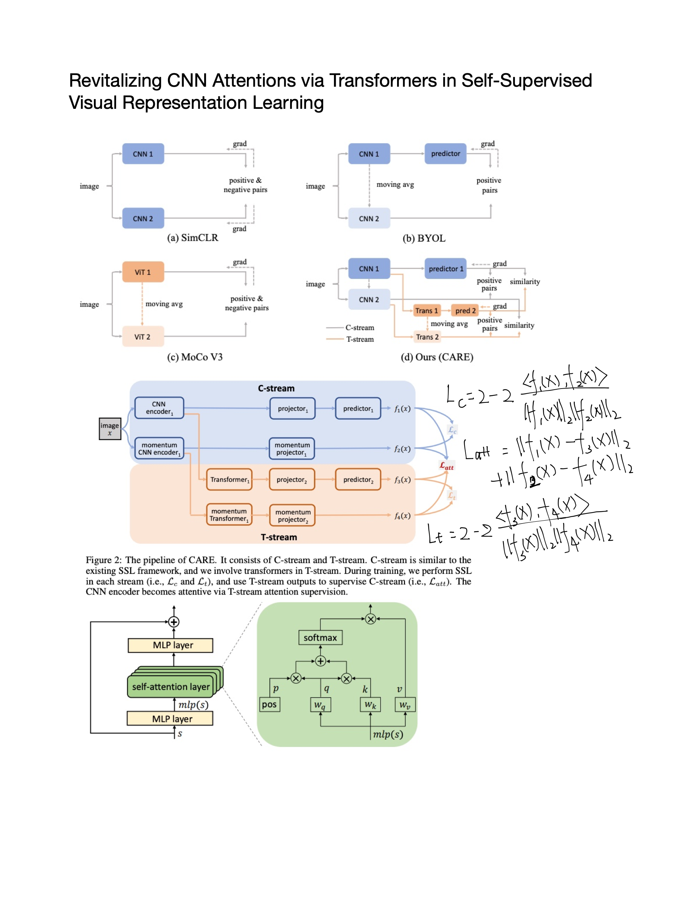

## Attention

### [Luna: Linear Unified Nested Attention](https://papers.nips.cc/paper/2021/file/14319d9cfc6123106878dc20b94fbaf3-Paper.pdf)

- abstract:  In
this paper, we propose Luna, a linear unified nested attention mechanism that
approximates softmax attention with two nested linear attention functions, yielding
only linear (as opposed to quadratic) time and space complexity. As compared to
a more traditional attention mechanism, Luna introduces an additional sequence
with a fixed length as input and an additional corresponding output, which allows
Luna to perform attention operation linearly, while also storing adequate contextual
information. We perform extensive evaluations on three benchmarks of sequence
modeling tasks: long-context sequence modeling, neural machine translation and
masked language modeling for large-scale pretraining. Competitive or even better
experimental results demonstrate both the effectiveness and efficiency of Luna
compared to a variety of strong baseline methods including the full-rank attention
and other efficient sparse and dense attention methods.

- [code](https://github.com/XuezheMax/fairseq-apollo)

### [Contextual Similarity Aggregation with Self-attention for Visual Re-ranking](https://papers.nips.cc/paper/2021/hash/18d10dc6e666eab6de9215ae5b3d54df-Abstract.html)

- abstract: In our approach, for each image in the top-K ranking list, we represent it into an affinity feature vector by comparing it with a set of anchor images. Then, the affinity features of the top-K images are refined by aggregating the contextual information with a transformer encoder. Finally, the affinity features are used to recalculate the similarity scores between the query and the top-K images for re-ranking of the latter. To further improve the robustness of our re-ranking model and enhance the performance of our method, a new data augmentation scheme is designed. Since our re-ranking model is not directly involved with the visual feature used in the initial retrieval, it is ready to be applied to retrieval result lists obtained from various retrieval algorithms. We conduct comprehensive experiments on four benchmark datasets to demonstrate the generality and effectiveness of our proposed visual re-ranking method.

### [Revitalizing CNN Attention via Transformers in Self-Supervised Visual Representation Learning](https://papers.nips.cc/paper/2021/hash/21be992eb8016e541a15953eee90760e-Abstract.html)

- abstract: Motivated by the transformers that explore visual attention effectively in recognition scenarios, we propose a CNN Attention REvitalization (CARE) framework to train attentive CNN encoders guided by transformers in SSL. The proposed CARE framework consists of a CNN stream (C-stream) and a transformer stream (T-stream), where each stream contains two branches. C-stream follows an existing SSL framework with two CNN encoders, two projectors, and a predictor. T-stream contains two transformers, two projectors, and a predictor. T-stream connects to CNN encoders and is in parallel to the remaining C-Stream. During training, we perform SSL in both streams simultaneously and use the T-stream output to supervise C-stream. The features from CNN encoders are modulated in T-stream for visual attention enhancement and become suitable for the SSL scenario. We use these modulated features to supervise C-stream for learning attentive CNN encoders. To this end, we revitalize CNN attention by using transformers as guidance. Experiments on several standard visual recognition benchmarks, including image classification, object detection, and semantic segmentation, show that the proposed CARE framework improves CNN encoder backbones to the state-of-the-art performance.

- [code](https://github.com/ChongjianGE/CARE)

### [Probabilistic Attention for Interactive Segmentation](https://papers.nips.cc/paper/2021/hash/23937b42f9273974570fb5a56a6652ee-Abstract.html)

- abstract: We provide a probabilistic interpretation of attention and show that the standard dot-product attention in transformers is a special case of Maximum A Posteriori (MAP) inference. The proposed approach suggests the use of Expectation Maximization algorithms for on-line adaptation of key and value model parameters. This approach is useful for cases in which external agents, e.g., annotators, provide inference-time information about the correct values of some tokens, e.g., the semantic category of some pixels, and we need for this new information to propagate to other tokens in a principled manner. We illustrate the approach on an interactive semantic segmentation task in which annotators and models collaborate online to improve annotation efficiency. Using standard benchmarks, we observe that key adaptation boosts model performance (∼10\% mIoU) in the low feedback regime and value propagation improves model responsiveness in the high feedback regime. 

- [code](https://github.com/apple/ml-probabilistic-attention)

### 

- abstract:

## Saliency 

## Interpretability

## Robustness

### [A Universal Law of Robustness via Isoperimetry](https://openreview.net/forum?id=z71OSKqTFh7)

- hypothese: (1) robust memorization is computationally hard; (2) Neural networks cannot memorize robustl; (3) robust memorization needs more data; (4) robust memorization requires large models.
