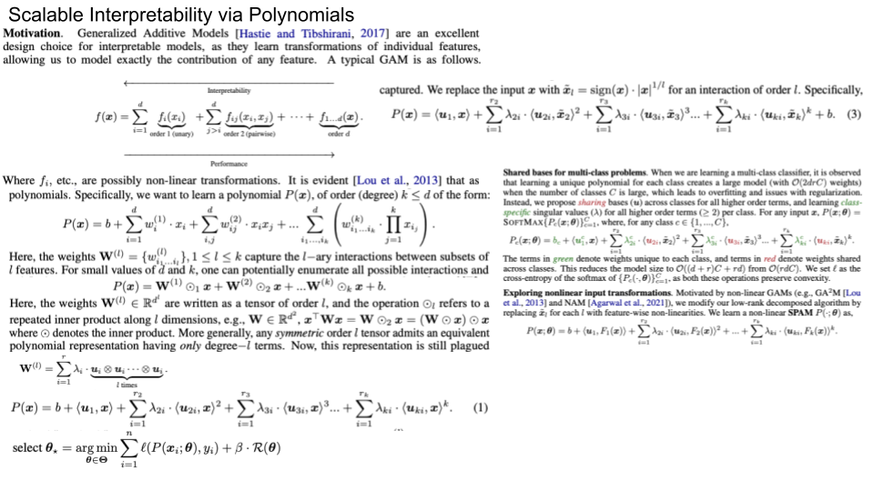
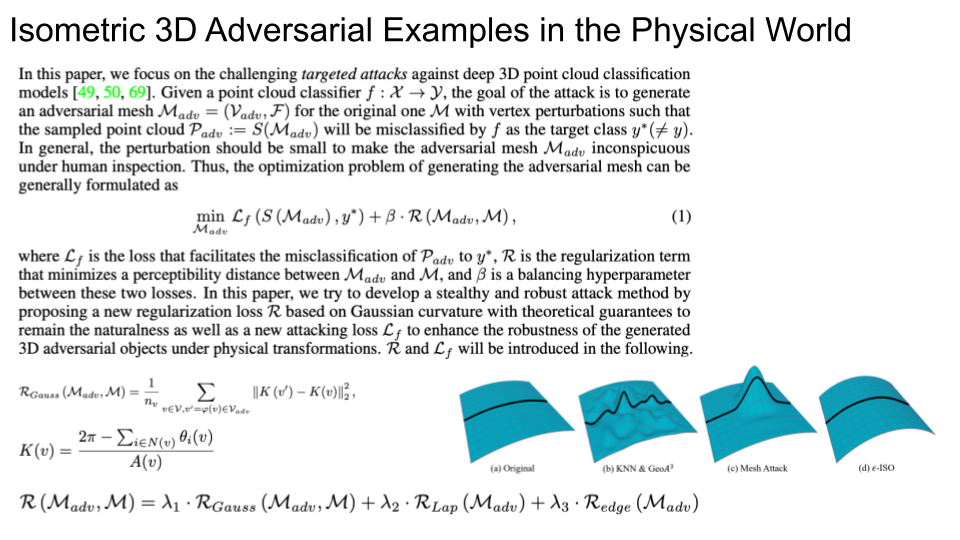

## Interpretability

### [Robust Feature-Level Adversaries are Interpretability Tools](https://openreview.net/pdf?id=lQ--doSB2o)
First, we observe that
feature-level attacks provide useful classes of inputs for studying representations
in models. Second, we show that these adversaries are versatile and highly robust.
We demonstrate that they can be used to produce targeted, universal, disguised,
physically-realizable, and black-box attacks at the ImageNet scale. Third, we show
how these adversarial images can be used as a practical interpretability tool for
identifying bugs in networks. 

### [Scalable Interpretability via Polynomials](https://openreview.net/pdf?id=TwuColwZAVj)
Generalized Additive Models (GAMs) have quickly become the leading choice for
interpretable machine learning. However, unlike uninterpretable methods such as
DNNs, they lack expressive power and easy scalability, and are hence not a feasible
alternative for real-world tasks. We present a new class of GAMs that use tensor
rank decompositions of polynomials to learn powerful, inherently-interpretable
models. Our approach, titled Scalable Polynomial Additive Models (SPAM) is
effortlessly scalable and models all higher-order feature interactions without a
combinatorial parameter explosion. SPAM outperforms all current interpretable
approaches, and matches DNN/XGBoost performance on a series of real-world
benchmarks with up to hundreds of thousands of features. We demonstrate by
human subject evaluations that SPAMs are demonstrably more interpretable in practice, and are hence an effortless replacement for DNNs for creating interpretable
and high-performance systems suitable for large-scale machine learning

### [On the Safety of Interpretable Machine Learning: A Maximum Deviation Approach](https://openreview.net/pdf?id=WPXRVQaP9Oq)
Interpretable and explainable machine learning has seen a recent surge of interest.
We focus on safety as a key motivation behind the surge and make the relationship
between interpretability and safety more quantitative. Toward assessing safety,
we introduce the concept of maximum deviation via an optimization problem
to find the largest deviation of a supervised learning model from a reference
model regarded as safe. We then show how interpretability facilitates this safety
assessment. For models including decision trees, generalized linear and additive
models, the maximum deviation can be computed exactly and efficiently. For
tree ensembles, which are not regarded as interpretable, discrete optimization
techniques can still provide informative bounds. For a broader class of piecewise
Lipschitz functions, we leverage the multi-armed bandit literature to show that
interpretability produces tighter (regret) bounds on the maximum deviation. We
present case studies, including one on mortgage approval, to illustrate our methods
and the insights about models that may be obtained from deviation maximization.

### [Neural Basis Models for Interpretability](https://openreview.net/pdf?id=fpfDusqKZF)
Generalized Additive Models (GAMs) are
an inherently interpretable class of models that address this limitation by learning a
non-linear shape function for each feature separately, followed by a linear model
on top. However, these models are typically difficult to train, require numerous
parameters, and are difficult to scale. We propose an entirely new subfamily of
GAMs that utilizes basis decomposition of shape functions. A small number of basis functions are shared among all features, and are learned jointly for a given task,
thus making our model scale much better to large-scale data with high-dimensional
features, especially when features are sparse. We propose an architecture denoted
as the Neural Basis Model (NBM) which uses a single neural network to learn
these bases. On a variety of tabular and image datasets, we demonstrate that for
interpretable machine learning, NBMs are the state-of-the-art in accuracy, model
size, and, throughput and can easily model all higher-order feature interactions.
Source code is available at github.com/facebookresearch/nbm-spam.

### [GlanceNets: Interpretable, Leak-proof Concept-based Models](https://openreview.net/pdf?id=J7zY9j75GoG)

### [Listen to Interpret: Post-hoc Interpretability for Audio Networks with NMF](https://openreview.net/pdf?id=FhuM-kk8Pbk)

### [Addressing Leakage in Concept Bottleneck Models](https://openreview.net/pdf?id=tglniD_fn9)

### [Explaining a Reinforcement Learning Agent via Prototyping](https://openreview.net/pdf?id=nyBJcnhjAoy)

### [SHAQ: Incorporating Shapley Value Theory into Multi-Agent Q-Learning](https://openreview.net/pdf?id=BjGawodFnOy)

### [Controlled Sparsity via Constrained Optimization or: How I Learned to Stop Tuning Penalties and Love Constraints](https://openreview.net/pdf?id=XUvSYc6TqDF)

### [Decision Trees with Short Explainable Rules](https://openreview.net/pdf?id=Lp-QFq2QRXA)

### [On the Interpretability of Regularisation for Neural Networks Through Model Gradient Similarity](https://openreview.net/pdf?id=eXggxYNbQi)

### [If Influence Functions are the Answer, Then What is the Question?](https://openreview.net/pdf?id=hzbguA9zMJ)

### [Linear TreeShap](https://openreview.net/pdf?id=OzbkiUo24g)

### [Look where you look! Saliency-guided Q-networks for generalization in visual Reinforcement Learning](https://openreview.net/pdf?id=-_I3i2orAV)

### [Causally motivated multi-shortcut identification & removal](https://openreview.net/pdf?id=-ZQOx6yaVa-)

### [Efficient Dataset Distillation using Random Feature Approximation](https://openreview.net/pdf?id=h8Bd7Gm3muB)

### [(De-)Randomized Smoothing for Decision Stump Ensembles](https://openreview.net/pdf?id=IbBHnPyjkco)

### [Is a Modular Architecture Enough?](https://openreview.net/pdf?id=3-3XMModtrx)

### [Self-explaining deep models with logic rule reasoning](https://openreview.net/pdf?id=8SY8ete3zu)

### [ProtoVAE: A Trustworthy Self-Explainable Prototypical Variational Model](https://openreview.net/pdf?id=L8pZq2eRWvX)

### [What I Cannot Predict, I Do Not Understand: A Human-Centered Evaluation Framework for Explainability Methods](https://openreview.net/pdf?id=59pMU2xFxG)

### [Learning to Scaffold: Optimizing Model Explanations for Teaching](https://openreview.net/pdf?id=V5rlSPsHpkf)

### [FasterRisk: Fast and Accurate Interpretable Risk Scores](https://openreview.net/pdf?id=xTYL1J6Xt-z)

### [Use-Case-Grounded Simulations for Explanation Evaluation](https://openreview.net/pdf?id=48Js-sP8wnv)

### [Learning Structure from the Ground up—Hierarchical Representation Learning by Chunking](https://openreview.net/pdf?id=LceHl9wKmoQ)

### [On the Symmetries of Deep Learning Models and their Internal Representations](https://openreview.net/pdf?id=8qugS9JqAxD)

### [Debiasing Graph Neural Networks via Learning Disentangled Causal Substructure](https://openreview.net/pdf?id=ex60CCi5GS)

### [Explaining Preferences with Shapley Values](https://openreview.net/pdf?id=-me36V0os8P)

### [Explainability Via Causal Self-Talk](https://openreview.net/pdf?id=bk8vkdQfBS)

### [Learn to Explain: Multimodal Reasoning via Thought Chains for Science Question Answering](https://openreview.net/pdf?id=HjwK-Tc_Bc)

### [New Definitions and Evaluations for Saliency Methods: Staying Intrinsic, Complete and Sound](https://openreview.net/pdf?id=opw858PBJl6)

### [SPD domain-specific batch normalization to crack interpretable unsupervised domain adaptation in EEG](https://openreview.net/pdf?id=pp7onaiM4VB)

### [Structuring Uncertainty for Fine-Grained Sampling in Stochastic Segmentation Networks](https://openreview.net/pdf?id=odOQU9PYrkD)

### [Concept Activation Regions: A Generalized Framework For Concept-Based Explanations](https://openreview.net/pdf?id=8AB7AXaLIX5)

### [Evaluation Beyond Task Performance: Analyzing Concepts in AlphaZero in Hex](https://openreview.net/pdf?id=dwKwB2Cd-Km)

### [Making Sense of Dependence: Efficient Black-box Explanations Using Dependence Measure](https://openreview.net/pdf?id=Vt3_mJNrjt)

### [Consistent Sufficient Explanations and Minimal Local Rules for explaining any classifier or regressor](https://openreview.net/pdf?id=kHNKDNLVp1E)

## Adversarial attack

### [Isometric 3D Adversarial Examples in the Physical World](https://openreview.net/pdf?id=HOG-G4arLnU)

### [Improving 3D-aware Image Synthesis with A Geometry-aware Discriminator](https://openreview.net/pdf?id=QRp6viwPRaX)

### [GET3D: A Generative Model of High Quality 3D Textured Shapes Learned from Images](https://openreview.net/pdf?id=GAUwreODU5L)

### [Towards Consistency in Adversarial Classification](https://openreview.net/pdf?id=2_AZxVpFlGP)

### [Adversarial Unlearning: Reducing Confidence Along Adversarial Directions](https://openreview.net/pdf?id=cJ006qBE8Uv)

### [Efficient and Effective Augmentation Strategy for Adversarial Training](https://openreview.net/pdf?id=ODkBI1d3phW)

### [Random Normalization Aggregation for Adversarial Defense](https://openreview.net/pdf?id=K4W92FUXSF9)
