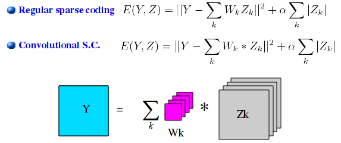
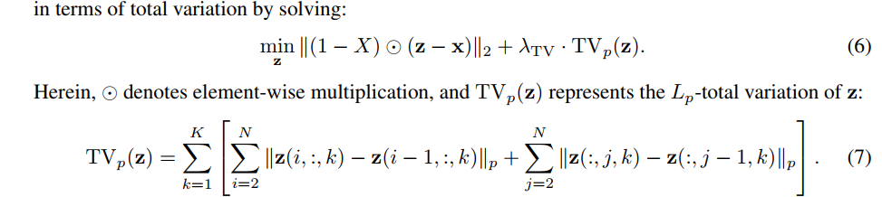
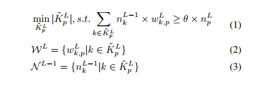
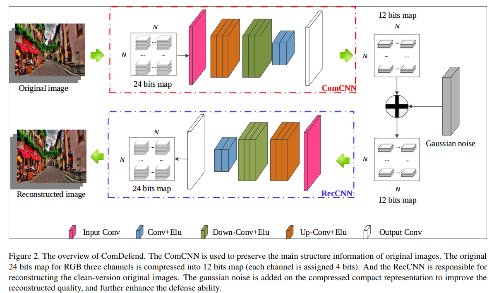
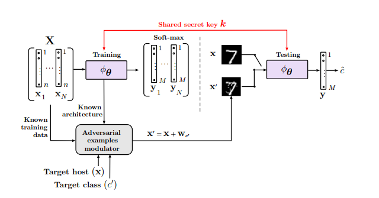

## Defense Based :

#### [Adversarial Defense by Stratified Convolutional Sparse Coding](https://arxiv.org/pdf/1812.00037.pdf)

这个方法是input－transformation based的方法。

这篇文章提出了一种叫做Sparse Transformation Layer（STL）的东西，这个东西介于输入层和和神经网络的第一层之间，用于把图片映射到他们提出的Quasi-natural图片空间。
他们的假设是，在原本的图片空间，所有数据在同一个manifold上面，而adversarial图片在这个manifold之外，所以在feature空间，adversarial图片跟其原图距离很远。
所以他们提出，可以建立一个新的映射，使得在映射到的新空间中，adversarial图片和其原图很近，并且对应的feature空间的点也很近。

这个quasi－natrual image space是一个低维空间，使用无监督的字典卷积方法学习而成。在找到这样一个映射之后，可以使用这个空间的数据作为输入重新训练神经网络。
这个空间满足两点:1.adversarial和原图映射到这个空间后放入分类器，分类结果跟正确的ground truth一致。2.在这个空间中，adversarial和原图的距离足够小。

STL的映射可以通过Convolutional Sparse Coding algorithm学习。

为了加速计算，他们在傅立叶空间使用ADMM学习字典（W），确定W之后，原问题变成Convolutional Basis Pursuit DeNoising（CBPDN），直接使用ADMM算法求解。

他们defensive算法的pipeline:首先有一个预训练好的denoising AutoEncoder，然后在这个autoencoder的隐空间聚类。之后根据选择的类选择相应的字典，并联合优化字典中的feature maps和filters。

实验中，他们在CIFAR10， imageNet，imageNet10上测试，并且选择FGSM，BIM，DeepFool，CW作为测试的攻击方法。

**Q**： 根据他们的描述，不是很清楚他们在训练STL的时候有没有用到adversarial image的数据。

##### Transformation-based defence
[__DCE__](https://arxiv.org/pdf/1412.5068.pdf): 这个方法是2015年的ICLR， 是第一篇用去噪方法去除adversarial噪声的。他们使用与训练的DAE对图片进行预去噪，然后发现如果attack知道系统中有DAE作为defence，攻击这个有defence的网络，新的adversarial图片甚至会有更小的distortion。为了解决这个问题，他们收到[contractive Autoencoder (CAE)](http://www.icml-2011.org/papers/455_icmlpaper.pdf)通过使用jacobian of encoder作为正则项有效的防止过拟合的启发，引入了一个smoothness penalty。这个smoothness penalty使用Jacobian of output作为正则项。

**Q**： 他们的实验中直接使用了DCE， 如果他们使用CAE，那么跟DCE相比，结果那一个会更好？一般来说，作者用DCE而不是CAE，一般来说DCE会跟好，但是为什么DCE会比CAE好？

[countering adv using input transformations](https://arxiv.org/pdf/1711.00117.pdf)： 这篇文章是用cropping和rescaling, bit－depth reduction，JPEG compression， total variance minimization和image quilting做图片的预处理，以期能够去除adversarial的噪声。他们的实验结果显示当网络在处理过的图片上训练时，variance minimization和image quilting结果很好。
Cropping－rescaling: 剪切和缩放可以改变adversarial图片的空间信息。而且剪切和缩放同时也是一种常见的data augmentation手段。在测试的时候，他们使用了random image crops。 
Bit-depth reduction: bit－depth就是使用多少位来定义一个像素点。bit-depth越大，可以表示的色彩越多。bit－depth reduction是一种简单的quantization方法，可以移除一些小的adversarial噪声。
JPEG compression：也属于quantization，他们compression at quality level 75 out of 100。
Total variance minimization： 这个方法主要是先选择一个小的pixel集，然后通过选择的pixels重建出一个最简单的图片。重建的图片将不会存在adversarial噪声，因为噪声太小太localized。

**Q**: X是伯努利分布的随机变量，应该是随机选择一些点的意思。但是奇怪的是，为什么只有在前面一项有X，正则项没有X呢？

Image Quilting：这是一个无参数方法。通过使用数据库里面的image patch来重新合成图片。这样重建出来的图片中，每一个小块都是来自原图，不存在adversarial perturbation。

**Q**： 如果不考虑在降噪过得数据上面重新训练网络的话，只看clean accuracy，数据是top1，0.76，那就是原本的网络也不怎么准确。理论上在降噪过后，效果应该会更好，但是不知道为什么数据同样都是0.76。不知道他们的实验细节是什麽。

[Pixel Deflection](https://arxiv.org/pdf/1801.08926.pdf):这个方法强制图片的统计特征满足自然图片的统计特征，然后用wavelet-based去噪方法进行corruption。

[__D3__](https://arxiv.org/abs/1802.06806): 这个方法主要是把图片分成多个重叠的patches，然后分别用non－differentiable的方法给每一个patch去噪。
________

#### [Feature Denoising for Improving Adversarial Robustness](https://arxiv.org/abs/1812.03411)

这篇文章观察到adversarial perturbation在features space也引入了噪声，因此，他们提出如果可以在特征空间去噪，那么神经网络就会更加的鲁棒。具体方法是，他们在神经网络中加入了去噪单元，并辅以adversarial training（PGD）。

通过实验，他们发现使用non－local means进行features去噪效果最好，而且这样的网络也会让模型具有某些self－attention和non－local networks的特质。同时他们也发现使用mean filter， median filter， bilateral filter来做features去噪也会有一定的效果。non－local mean是选择spatial locations， bilateral filter是选择local region，选定点周围的neighborhood。

**Q**:non－local mean中spatial locations范围怎么计算的？

在实验中，以resnet－101／152为例，他们加入4个去噪单元，而且added after the last residual block of res2， res3，res4，res5。
这个方法是帮助network在clean image上面表现更好的。能提高0.17。在adversarial setting下面，不管是黑盒（6.4%）还是白盒(3.4%)，都能提高网络的鲁棒性。
_________

#### [Parametric Noise Injection: Trainable Randomness to Improve Deep Neural Network Robustness Against Adversarial Attack](https://arxiv.org/abs/1811.09310)

这篇文章受到利用高斯噪声作为正则项，提高模型鲁棒性的启发，提出一种Parametric Noise Injection（PNI）方法，在每一层网络的activation或者weights上加入可训练的高斯噪声。这个噪声的参数可以当作模型参数训练，并且配合adversarial training（PGD）训练。

最后的试验结果，跟原来的网络比起来，在clean data上的accuracy下降了8%，但是比起不使用PNI的adversarial training， accuracy提高了13%，在adversarial数据上，准确率提高了45%－30%。同时也对比了黑盒attack，比其他defence的效果都要好很多。

**Q**:这个方法相当于在原来的网络里面加上一个能控制容错比的单元，然后再使用adversarial training重新训练，确定这个参数。使用gaussian的好处在于可以完美兼容到网络的训练上，但是adversarial perturbation并不是gaussian的，有没有别的更好的机制呢？而且这个guassian的噪声是加到网络权重上的，这样的方法为什么可以提高网络的鲁棒性？？？？？
_______________

#### [Feature Distillation: DNN-Oriented JPEG Compression Against Adversarial Examples](http://openaccess.thecvf.com/content_CVPR_2019/papers/Liu_Feature_Distillation_DNN-Oriented_JPEG_Compression_Against_Adversarial_Examples_CVPR_2019_paper.pdf)

这篇文章主要是使用基于JPEG的压缩方法，旨在提高模型鲁棒性的同时，为此原来模型的准确率。这个算法框架主要分为两步，第一步是使用semi－analytical的方法是用JPEG压缩实现在频域上的离散化。进而最大化过滤adversarial perturbation导致的恶意特征。第二步则是在此基础上减少离散化对好的特征的影响。

JPEG是一种根据人类视觉特征压缩图片的方法，通常来说，人类对低频比对高频更为敏感。所以JPEG主要包括discrete cosine transformation（DCT），离散化，zig－zag reordering和entropy encoding等。

通过实验，他们发现，直接使用JPEG方法，效果并不理想。他们提出了one pass process和two pass process。One pass process主要是把人工压缩的图片解压，然后模拟尽量还原成高质量图片，而two pass process直接把从传感器传来的图片先压缩，再解压。在这个过程中，实现先压缩去除噪声，在尽量还原，使得图片不会因为丢失细节而使得神经网络无法识别。他们认为通过这样对图片的transformation，可以去除adversarial perturbation的影响。

实验包括对黑盒、白盒、灰盒的比较，对比的方法主要是bit－depth，quilting，TVM，JPEG等。结果显示，正常数据上accuracy下降2%但是adversarial数据上，准确率替身42%。他们使用的是BPDA方法作为攻击，目测是PGD，I－FGSM类似的算法。

_________________

#### [Adversarial Defense Through Network Profiling Based Path Extraction](https://arxiv.org/abs/1904.08089)

这篇文章提出一种叫做profiling－based的方法将DNN网络分成不同的functional block，从而发现一个更有效率的路径，作为新的探索神经网络内部结构的方法。通过实验，他们发现adversarial图片激活的路径跟正常的数据不同，从而使用一种基于相似度的方法，detect adversarial样本。

[Critial data routing path（CDRP）](https://ieeexplore.ieee.org/stamp/stamp.jsp?tp=&arnumber=8579026)：这个方法是针对某个输入图片，计算一个channel－wise control gates。对于某些图片来说，某些层是没有用的，这样不同的图片就会生成不同的路径。从而根据这些路径可以做一个分类器。但是这个方法有两个缺点：（1）计算channel－wise control gates需要给每一层插入control gates，并需要原网络的超参进行重新训练。（2）这些路径的表达是一个高维的特征，这会使得其可解释性及对不同attack方法的泛化能力降低。

对于一张图片，计算最小的一个权重集合：

对于多张图片，先对每个类求并集，然后再对整体求并集。

__Effective Path Visualization__：图片看起来跟Grad_CAM的图片很类似。两个类之间的相似度可以根据Jaccard coefficient of their synapse set计算（交集除并集）。他们尝试了使用不同的model（线性，非线性）的来做detector，结果比CDRP好。
_______________

#### [Detection Based Defense Against Adversarial Examples From the Steganalysis Point of View](http://openaccess.thecvf.com/content_CVPR_2019/papers/Liu_Detection_Based_Defense_Against_Adversarial_Examples_From_the_Steganalysis_Point_CVPR_2019_paper.pdf)

In this paper, we point out that steganalysis can be applied to adversarial examples detection, and propose a method to enhance steganalysis features by estimating the probability of modifications caused by adversarial attacks. 

**Features Extraction**: 
1. SPAM: First, we calculate the transition probabilities between pixels in eight directions in the spatial domain. We always compute the differences and the transition probability along the same direction. Second, we use a Markov chain between pairs of differences (first order chain) or triplets (second order chain) to model pixel dependence along the eight directions.
2. Spatial Rich Model: Spatial Rich Model (SRM) can be viewed as an extended version of SPAM by extracting residuals from images. We use a pixel predictor from the pixel’s immediate neighborhood to obtain a residual which is an estimate of the image noise component. SRM uses 45 different pixel predictors. The pixel predictor is linear or non-linear. Each linear predictor is a shift-invariant finite-impulse response filter which is described by a kernel matrix K(pred). 

**Features Enhancement**:
We propose to enhance steganalysis features by estimating the probability of modifications caused by adversarial attacks. We take advantage of the gradient amplitude to estimate the modification probability because the pixels with larger gradient amplitude have larger probability to be modified.
1. Enhanced SPAM: The difference between SPAM and ESPAM is that we construct a new Markov transition probability based on MPM.
2. Enhanced SRM: The difference is that ESRM modifies the process of forming the co-occurrence matrices to consider the impact of MPM.

##### Detection Based Defense:
* [Early methods for detecting adversarial images](https://arxiv.org/abs/1608.00530) leverage PCA to detect adversarial examples, finding that adversarial examples place a higher weight on the larger principal components than normal images. However, Carlini and Wagner prove that Hendrycks’s defense is **only effective on MNIST**.

* [Adversarial Examples Detection in Deep Networks with Convolutional Filter Statistics](https://arxiv.org/abs/1612.07767) apply PCA to the values after inner convolutional layers of the neural network, and use a cascade classifier to detect adversarial examples. Specifically, they propose building a cascade classifier that accepts the input as normal only if all classifiers accept the input, but rejects it if any do. However, Carlini and Wagner perform experiments to prove that Li’s defense **fails against the C&W attack**.

* [On the (statistical) detection of adversarial examples](https://arxiv.org/abs/1702.06280) propose a variant on adversarial retraining. Instead of attempting to classify the adversarial examples correctly, they introduce an additional class, solely for adversarial examples, and retrain the network to classify adversarial examples as the new class. 
[Adversarial and clean data are not twins](https://arxiv.org/abs/1704.04960) propose a very similar defense method. However, Carlini and Wagner re-implement these two defenses and find that they are **only effective on MNIST**.

* [Dimensionality reduction as a defense against evasion attacks on machine learning classifiers](https://www.semanticscholar.org/paper/Dimensionality-Reduction-as-a-Defense-against-on-Bhagoji-Cullina/10bd926253cbf5829ee92e927127641b69546e65) leverage PCA to reduce the dimensionality of the images. Then instead of training on the original images, they train a classifier on images which have been processed with dimensionality reduction. However, this defense is **only effective on MNIST**.

* [Detecting Adversarial Samples from Artifacts](https://arxiv.org/abs/1703.00410) utilize a Gaussian Mixture Model to model outputs from the final hidden layer of a neural network, and claim that adversarial examples belong to a different
distribution than that of normal images. However, Carlini and Wagner prove that Feinman’s defense is **only effective on MNIST**.

* [On detecting adversarial perturbations](https://arxiv.org/abs/1702.04267) detect adversarial examples by looking at the inner convolutional layers of the network. They augment the classification neural network with a detection neural network that takes its input from various intermediate layers of the classification network. However, this defense is **only effective on CIFAR-10**.

* [Safetynet: Detecting and rejecting adversarial examples robustly](https://arxiv.org/abs/1704.00103) hypothesize that adversarial examples produce different patterns of ReLU activations in networks than what is produced by normal images. Based on this hypothesis, they propose the Radial Basis Function SVM (RBFSVM) classifier which takes advantage of discrete codes computed by the late stage ReLUs of the network to detect adversarial examples on **CIFAR-10 and ImageNet**.

* [Feature squeezing: Detecting adversarial examples in deep neural networks](https://arxiv.org/abs/1704.01155) propose a method, called Feature Squeezing (FS), to detect adversarial examples. They reduce the color bit depth of each pixel and smooth it by a spatial filter to squeeze the features of an image. Then the adversarial examples are identified by measuring the disagreement among the prediction vectors of the original and squeezed examples.

* [Detecting adversarial image examples in deep neural networks with adaptive noise reduction](https://arxiv.org/abs/1705.08378) regard the adversarial perturbation as a kind of noise and use scalar quantization and smoothing spatial filter to reduce its adversarial effect. Then the adversarial example can be detected by comparing the classification results of the input and its denoised version. We refer to this method as Noise Reduction (NR).

##### [Steganalysis](https://www.sciencedirect.com/science/article/pii/S2214212617300777)
The goal of steganalysis is to identify suspected packages, determine whether or not they have a payload encoded into them, and, if possible, recover that payload.
* visual steganalysis: The most common form of a visual attack concerns Least Significant Bit(LSB) steganography.
* signature or specific steganalysis: Another steganalytic technique is to observe any repetitive pat- terns (signatures) of a steganography software. These techniques search for signature patterns to determine the presence of a hidden message.
* statistical steganalysis:  Statistical steganalysis concerns those techniques developed by analyzing the embedding procedure and determining certain statistics that get modified as a result of the embedding pro- cess. Therefore, an in depth understanding of embedding process is needed in order to achieve maximum steganalytic accuracy. In spatial domain, the steganographic algorithm is applied directly on the pixels of the image. One of the earliest techniques is the so called Least Significant Bit Substitution (LSB) technique. Two dif- ferent LSB approaches were introduced i.e. LSB replacement and LSB matching.
* spread spectrum steganalysis: Spread Spectrum Image Steganography (SSIS) was first described by Marvel et al.. SSIS embeds the hidden information within noise, which is then added to the digital image. This noise if kept at low levels, is not distinguishable to the human eye.
* transform domain steganalysis: As more attacks on various steganographic schemes were presented by steganalysts, there was the need of finding steganographic methods more robust to attacks such as compression, filtering etc. Various transform domains techniques were utilized such as Discrete Cosine Transform (DCT), Discrete Wavelet Transform (DWT) and Fast Fourier Transform (FFT) in order to hide information in transform coefficients of the cover images.
* universal or blind steganalysis: Universal steganalysis tries to detect the embedded messages regardless the steganographic technique applied to cover image. The main difficulty is to find relevant features which are characteristic for stego images. Afterwards machine learning techniques are used to build a detection model from the experimental data.
______________

#### [ComDefend: An Efficient Image Compression Model to Defend Adversarial Examples](https://arxiv.org/abs/1811.12673)

In this paper, we propose an end-to-end image compression model to defend adversarial examples: ComDefend. The proposed model consists of a compression convolutional neural network (ComCNN) and a reconstruction convolutional neural network (RecCNN). The ComCNN is used to maintain the structure information of the original image and purify adversarial perturbations. And the RecCNN is used to reconstruct the original image with high quality. In other words, ComDefend can transform the adversarial image to its clean version, which is then fed to the trained classifier. Our method is a pre-processing module, and does not modify the classifier’s structure during the whole process.

本质上这个方法还是去噪。

#### [Barrage of Random Transforms for Adversarially Robust Defense](http://openaccess.thecvf.com/content_CVPR_2019/papers/Raff_Barrage_of_Random_Transforms_for_Adversarially_Robust_Defense_CVPR_2019_paper.pdf)

In this paper, we explore the idea of stochastically combining a large number of individually weak defenses into a single barrage of randomized transformations to build a strong defense against adversarial attacks. We show that, even after accounting for obfuscated gradients, the Barrage of Random Transforms (BaRT) is a resilient defense against even the most difficult attacks, such as PGD.

在预处理阶段随机变换input。 这篇文章还提出了攻击这种随机变换defense的方法，Expectation over Transformation。

_____________________
#### [Defending Against Adversarial Attacks by Randomized Diversification](https://arxiv.org/abs/1904.00689)

The defender processes an input in multiple channels. Each channel introduces its own randomization in a special transform domain based on a secret key shared between the training and testing stages. Such a transform based randomization with a shared key preserves the gradients in key-defined sub-spaces for the defender but it prevents gradient back propagation and the creation of various bypass systems for the attacker. An additional benefit of multi-channel randomization is the aggregation that fuses soft-outputs from all channels, thus increasing the reliability of the final score. The sharing of a secret key creates an information advantage to the defender. 

* pre-processing: 首先将输入映射到一个新的domain，映射方法可以是DFT，DCT或者DWT，权重是可以训练的，并且可以防止泄漏密钥。
* Data independent processing： 对于输入，随机sampling，permutation， sign flipping in the sub－block（key－based）。
* Classification blck
* Aggregation block

这个文章的idea是一个混合idea，首先是通过有密钥的randomness方法，把图片加密，把图片加密之后，再使用多个classifier进行分类，把所有分类器的分类结果放在一起，才算是最后的分类结果。
____________________

#### [A Kernelized Manifold Mapping to Diminish the Effect of Adversarial Perturbations](https://arxiv.org/abs/1903.01015)

To tackle this problem, we propose a non-linear radial basis convolutional feature mapping by learning a Mahalanobis-like distance function. Our method then maps the convolutional features onto a linearly well-separated manifold, which prevents small adversarial perturbations from forcing a sample to cross the decision boundary.

通过在使用RBF把feature映射到一个线性可分的空间，增加生成adversarial attack的难度。
__________________

#### [ShieldNets: Defending Against Adversarial Attacks Using Probabilistic Adversarial Robustness](http://openaccess.thecvf.com/content_CVPR_2019/papers/Theagarajan_ShieldNets_Defending_Against_Adversarial_Attacks_Using_Probabilistic_Adversarial_Robustness_CVPR_2019_paper.pdf)

Probabilistic adversarial robustness (PAR), as a theoretical framework, is introduced to neutralize adversarial attacks by concentrating sample probability to adversarial-free zones. Distinct to most of the existing defense mechanisms that require modifying the architecture/training of the target classifier which is not feasible in the real-world scenario, e.g., when a model has already been deployed, PAR is designed in the first place to provide proactive protection to an existing fixed model.

The approach of PAR is to seek a random function via a probabilistic model to transform the AA samples to the adversarial-free regions. In the following subsections, we establish the theory of PAR, and provide a demonstration of PAR implementation via PixelCNN.
_______________________
________________________

## Attack Based:

Trust Region Based Adversarial Attack on Neural Networks

Curls & Whey: Boosting Black-Box Adversarial Attacks

Evading Defenses to Transferable Adversarial Examples by Translation-Invariant Attacks

SparseFool: a few pixels make a big difference.

Catastrophic Child's Play: Easy to Perform, Hard to Defend Adversarial Attacks

Decoupling Direction and Norm for Efficient Gradient-Based L2 Adversarial Attacks and Defenses

Feature Space Perturbations Yield More Transferable Adversarial Examples

## Attack on different tasks:

AIRD: Adversarial Learning Framework for Image Repurposing Detection

Defense Against Adversarial Images using Web-Scale Nearest-Neighbor Search

Efficient Decision-based Black-box Adversarial Attacks on Face Recognition

Fooling automated surveillance cameras: adversarial patches to attack person detection

Exact Adversarial Attack to Image Captioning via Structured Output Learning with Latent Variables

Retrieval-Augmented Convolutional Neural Networks Against Adversarial Examples

## Attacking 3D data:

Adversarial Attacks Beyond the Image Space

Generating 3D Adversarial Point Clouds

Realistic Adversarial Examples in 3D Meshes

MeshAdv: Adversarial Meshes for Visual Recognition

Robustness of 3D Deep Learning in an Adversarial Setting

Strike (With) a Pose: Neural Networks Are Easily Fooled by Strange Poses of Familiar Objects

## On Explaining Adversarial A&D:

What Does It Mean to Learn in Deep Networks? And, How Does One Detect Adversarial Attacks?

Disentangling Adversarial Robustness and Generalization

Robustness via Curvature Regularization, and Vice Versa
