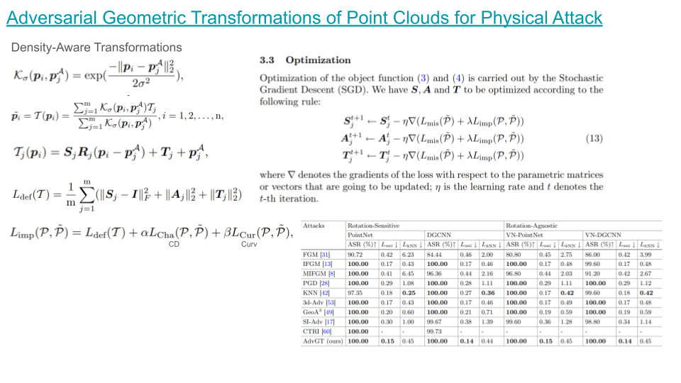
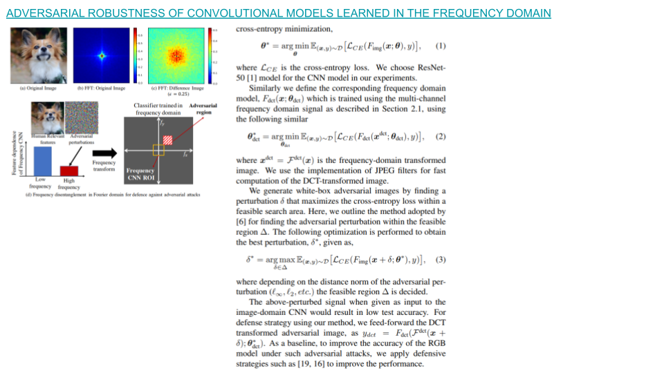
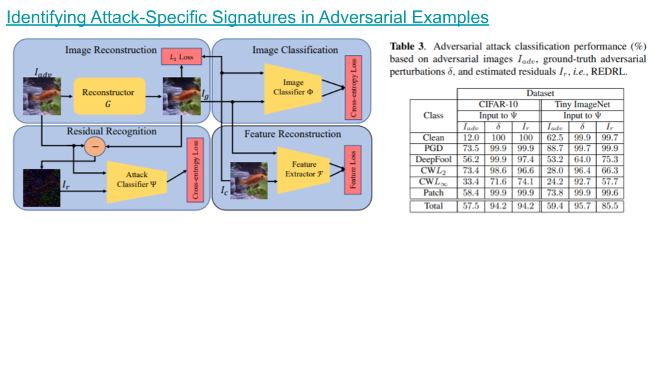

### [Adversarial Geometric Transformations of Point Clouds for Physical Attack](https://link.springer.com/chapter/10.1007/978-981-97-2095-8_8)

### [Adversarial Robustness of Convolutional Models Learned in the Frequency Domain](https://ieeexplore.ieee.org/stamp/stamp.jsp?arnumber=10445961)

### [Identifying Attack-Specific Signatures in Adversarial Examples](https://ieeexplore.ieee.org/stamp/stamp.jsp?arnumber=10446989)

