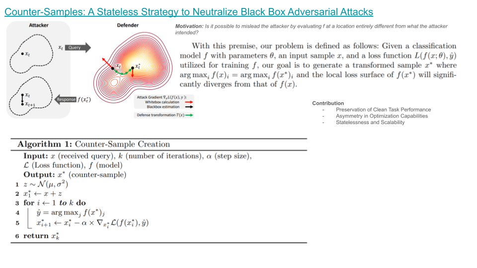

### [Causal Interpretability for Machine Learning - Problems, Methods and Evaluation](https://dl.acm.org/doi/pdf/10.1145/3400051.3400058)

### [As Firm As Their Foundations Can Open-Sourced Foundation Models be Used to Create Adversarial Examples for Downstream Tasks?](https://arxiv.org/pdf/2403.12693.pdf)

### [Counter-Samples: A Stateless Strategy to Neutralize Black Box Adversarial Attacks](https://arxiv.org/pdf/2403.10562.pdf)

