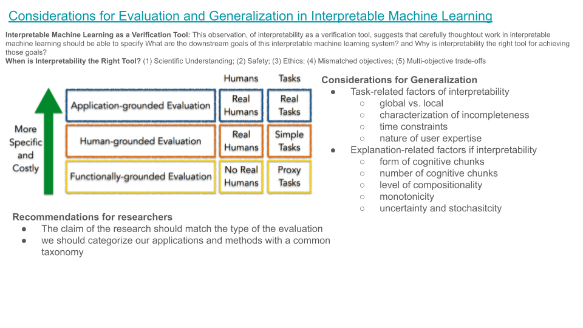
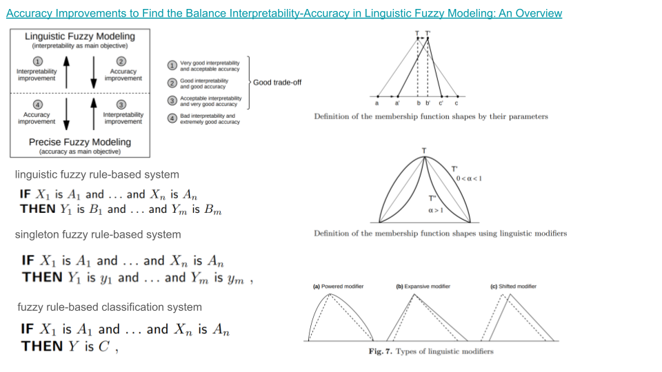

### [Considerations for Evaluation and Generalization in Interpretable Machine Learning](https://finale.seas.harvard.edu/files/finale/files/chapter-considerations_for_evaluation_and_generalization_in_interpretable_ml.pdf)

### [Accuracy Improvements to Find the Balance Interpretability-Accuracy in Linguistic Fuzzy Modeling: An Overview](https://d1wqtxts1xzle7.cloudfront.net/30784941/10.1.1.102.9995-libre.pdf?1392098719=&response-content-disposition=inline%3B+filename%3DAccuracy_improvements_to_find_the_balanc.pdf&Expires=1711509838&Signature=GQy1SNBINOXOrKvLz-k9keLAqqCjz-C~wMGSmBIyY2bmAy9HcWdUqyApTSggnVc46XBfkQMG2VAl2Oh2Wl-dYT-3z5N3mAIRn7XTKSjtriNw9KtS8dQZqaXNCngHJYSxA2lZptq36iaVtYhPymeENiCio1ZweKy~IEIwD~OpcZqLNL7ZHX1fU4kiL0A~fu7dNx5vB6RJqoKhKLBx9L90hChNtahg1HQ~eMspqR~p567-52rpokJbi6Po4AqXzKL42pEcppyDfm5JLrY1HUfSK4KkpynIlUQdbRdJd5IvWLO2PJSbzViCFUol0~Kh-dxokCRqSmQ3mwE2D5h5HWmxkw__&Key-Pair-Id=APKAJLOHF5GGSLRBV4ZA)

