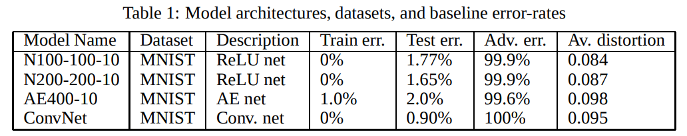
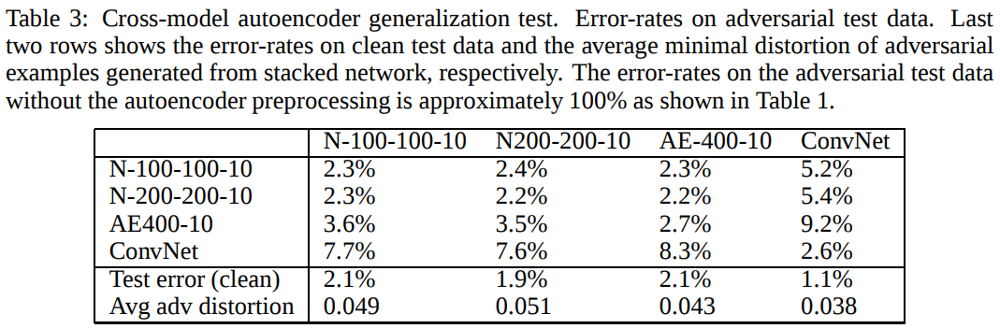
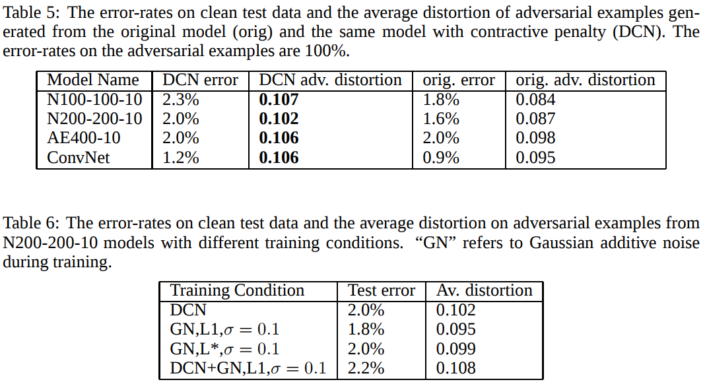

### ICLR 2015 :

### [Explaining and Harnessing Adversarial Examples](https://arxiv.org/abs/1412.6572)

1. Adversarial examples cannot be explained by nonlinearity or overfitting. Simple linear model HAVE adversarial examples, if its input has sufficient dimensionality.
2. Cheap, analytical perturbations of a linear model should also demage neural networks.
3. Proposed ¨Fast gradient sign method¨.
4. Generative training cannot tell ¨real¨ data from ¨fake¨ data, only trained on ¨real¨ data.
5. Adversarial examples can be explained as a property if high-dimensional dot products. They are result of models being too linear.
6. The generalization of adversarial examples across different models can be explained as a result of adversarial perturbations being highly aligned with the weight vectors of a model and different models learning similar functions when trained to perform the same task.
7. The direction of perturbation matters most.
8. Space is not full of pockets of adversarial examples that finely tile the reals like the rational numbers.
9. Adversarial perturbations generalize across different clean examples.
10. It is demonstrated that experiments that adversarial training can result in regularization.
11. Control experiments failed to reproduce this effect with simpler but less efficient regularizers including L1 weight decay and adding noise.
12. Models that are easy to optimize are easy to perturb.
13. Linear models, ensembles, and Models trained to model the input distribution are not resistant to adversarial examples.
14. RBF networks and structures with a hidden layer should be trained to resist adversarial perturbation.
15. Rubbish class examples are ubiquitous and easily generated.
16. Shallow linear models are not resistant to rubbish class examples.
17. RBF networks are resistant to rubbish class examples.

#### Generate the adversarial examples
__FGSM__:Fast Gradient Sign Method
* Hypothesis: The Gradient can be computed
* Just use the sign and a parameter to control how much the adversarial noises add to the image

__The classifier model used to attack__

* GoogleLeNet
* Shallow softmax classifier
* maxout network
* convolutional maxout network CIFAR-10
* logistic regression
* Deep neural network with 1600 units per layer 

###[Towards Deep Neural Network Architectures Robust to Adversarial Examples](https://arxiv.org/abs/1412.5068)

__Method__:
1. abstract:  We perform various experiments to assess the removability of adversarial examples by corrupting with additional noise and pre-processing with denoising autoencoders (DAEs). We find that DAEs can remove substantial amounts of the adversarial noise. However, when stacking the DAE with the original DNN, the resulting network can again be attacked by new adversarial examples with even smaller distortion. As a solution, we propose Deep Contractive Network, a model with a new end-to-end training procedure that includes a smoothness penalty inspired by the contractive autoencoder (CAE). This increases the network robustness to adversarial examples, without a significant performance penalty.

__Experiments__:

1. Network&Dataset&Attack: MNIST - ConvNet - L-BFGS

2. Experimental results:

3. Code: NO