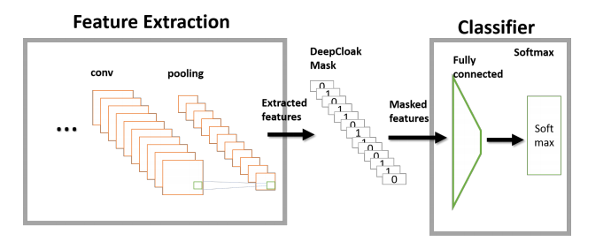
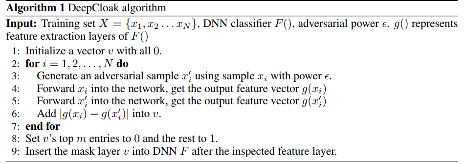
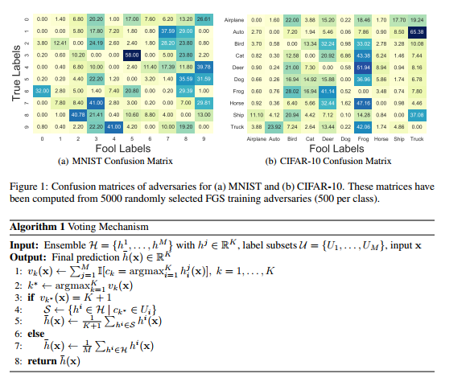

## ICLR 2017

## Attacks

### [Tactics of Adversarial Attack on Deep Reinforcement Learning Agents](https://www.ijcai.org/proceedings/2017/0525.pdf)

1. In the strategically-timed attack, the adversary
aims at minimizing the agent’s reward by
only attacking the agent at a small subset of time
steps in an episode. Limiting the attack activity
to this subset helps prevent detection of the attack
by the agent. We propose a novel method
to determine when an adversarial example should
be crafted and applied.

2.  In the enchanting attack,
the adversary aims at luring the agent to a designated
target state. This is achieved by combining a
generative model and a planning algorithm: while
the generative model predicts the future states, the
planning algorithm generates a preferred sequence
of actions for luring the agent.

_______________

## Defences

### [Adversarial Machine Learning at Scale](https://arxiv.org/pdf/1611.01236.pdf)

__attack__:
1. I-FGSM paper
2. one-step target class method
3. basic iterative method
4. iterative least-likely class method

__analysis__:
* label leaking
* transferability
* 
____________________

## [DeepCloak: Masking Deep Neural Network Models for Robustness Against Adversarial Samples](https://arxiv.org/abs/1702.06763)

1. abstract
To overcome this problem, we introduce a defensive mechanism called DeepCloak. By identifying and removing unnecessary features in a DNN model, DeepCloak limits the capacity an attacker can use generating adversarial samples and therefore increase the robustness against such inputs. Comparing with other defensive approaches, DeepCloak is easy to implement and computationally efficient.

2. experiments

dataset: cifar-10

model:resnet

attack: FGSM

__________________

### [Adversarial Training Methods for Semi-Supervised Text Classification](https://arxiv.org/abs/1605.07725)
Adversarial training provides a means of regularizing supervised learning algorithms while virtual adversarial training is able to extend supervised learning algorithms to the semi-supervised setting. However, both methods require making small perturbations to numerous entries of the input vector, which is inappropriate for sparse high-dimensional inputs such as one-hot word representations. __We extend adversarial and virtual adversarial training to the text domain by applying perturbations to the word embeddings in a recurrent neural network rather than to the original input itself.__ The proposed method achieves state of the art results on multiple benchmark semi-supervised and purely supervised tasks. We provide visualizations and analysis showing that the learned word embeddings have improved in quality and that while training, the model is less prone to overfitting.

___________________

### [Early Methods for Detecting Adversarial Images](https://arxiv.org/abs/1608.00530)

1. abstract:
We deploy three methods to detect adversarial images. Adversaries trying to bypass
our detectors must make the adversarial image less pathological or they will fail
trying. Our best detection method reveals that __adversarial images place abnormal__
__emphasis on the lower-ranked principal components from PCA__.

2. experiments:
dataset: Tiny-imageNet, cifar10, mnist

attack: FGSM, IFGSM

_________________

### [Robustness to Adversarial Examples through an Ensemble of Specialists](https://arxiv.org/abs/1702.06856)

1. abstract: 
We are proposing to use an ensemble of diverse specialists, where speciality is defined according to the confusion matrix. Indeed, we observed that for adversarial instances originating from a given class, labeling tend to be done into a small subset of (incorrect) classes. Therefore, we argue that an ensemble of specialists should be better able to identify and reject fooling instances, with a high entropy (i.e., disagreement) over the decisions in the presence of adversaries. Experimental results obtained confirm that interpretation, opening a way to make the system more robust to adversarial examples through a rejection mechanism, rather than trying to classify them properly at any cost.

2. Ensemble construction: Considering a classification problem of K classes (C =
{c1, c2, . . . , cK}), each row of the confusion matrix is used to identify two subsets of classes: 1)
the confusing target subset for class ci (subset Ui), which is built by adding classes sequentially in
decreasing ci-related confusion values order until at least 80 % of confusions are covered, and 2) the
remaining classes with lower confusion, formed as subset Ui+K = C \Ui
. Duplicate subsets should
be ignored, although we encountered none of them for MNIST and CIFAR-10.

3. Voting mechanism Using the generalist to activate the related specialists is not possible as it is
usually being fooled by adversaries.

__comments__:
It is similar to Teddy's idea of configuration. The things is, at that time, they could only consider FGSM on MNIST and Cifar10. 
We test the same idea, it works on FGSM, IFGSM, but very poor for CW on Cifar10.

________________________

## Analysis

### [Delving into adversarial attacks on deep policies](https://arxiv.org/abs/1705.06452)

1. abstract: 
In this paper we present a novel study into adversarial attacks on deep reinforcement learning polices. 
We compare the effectiveness of the attacks using adversarial examples vs. random noise. 
We present a novel method for reducing the number of times adversarial examples need to be injected for a successful attack, based on the value function. We further explore how re-training on random noise and FGSM perturbations affects the resilience against adversarial examples.

 
