## ICLR 2018 :

## Attacks

### [Decision-Based Adversarial Attacks: Reliable Attacks Against Black-Box Machine Learning Models](https://arxiv.org/abs/1712.04248)

1. abstract:
Here we introduce
the Boundary Attack, a decision-based attack that starts from a large adversarial
perturbation and then seeks to reduce the perturbation while staying adversarial.
The attack is conceptually simple, requires close to no hyperparameter tuning,
does not rely on substitute models and is competitive with the best gradient-based
attacks in standard computer vision tasks like ImageNet.

2. Boundary Attack:

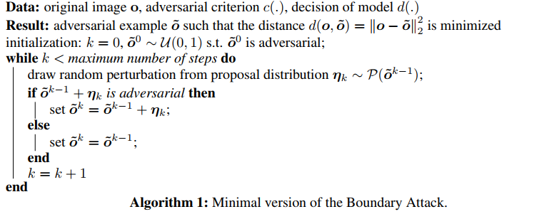
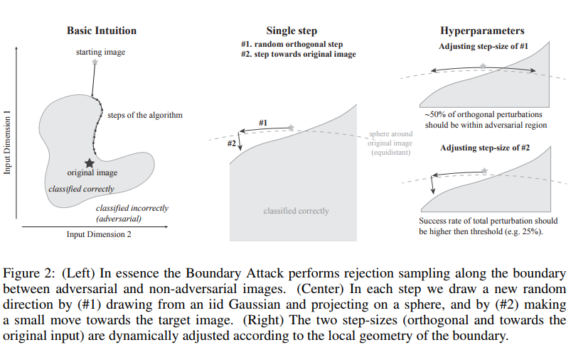

__Comment__: The idea of Boundary Attack is similar to our BP paper. 
The difference is:
* BA is black box setting while BP is white box setting. 
* BP get the direction from gradient, while BA get the direction from performing rejection sampling with a proposal distribution.

3. experiments:

dataset: MNIST, cifar10, ImageNet(250 images)

netowrk: VGG19, ResNet-50, Inception-v3

attack: FGSM, deepFool, CW

________________

### [Generating Natural Adversarial Examples](https://arxiv.org/abs/1710.11342)

1. abstract: 
In this paper, we propose a framework to
generate natural and legible adversarial examples that lie on the data manifold, by
searching in semantic space of dense and continuous data representation, utilizing
the recent advances in generative adversarial networks. We present generated
adversaries to demonstrate the potential of the proposed approach for black-box
classifiers for a wide range of applications such as image classification, textual
entailment, and machine translation.

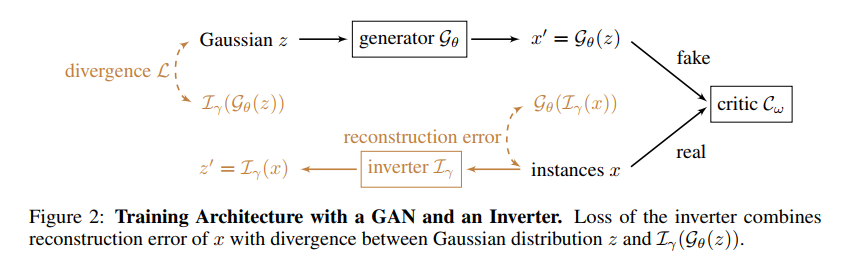

* Wasserstein GAN achieves improvement in the stability of learning and provides useful learning curves.
* We separately train a matching inverter Iγ to map data instances to corresponding dense representations.

2. Search Algrithms:
* In iterative stochastic search (Algorithm 1), we incrementally increase the search range (by ∆r)
within which the perturbations z˜ are randomly sampled (N samples for each iteration), until we have
generated samples xˇ that change the prediction. Among these samples xˇ, we choose the one which
has the closest z∗ to the original z0 as an adversarial example x∗.

* To improve the efficiency beyond
this naive search, we propose a coarse-to-fine strategy we call hybrid shrinking search (Algorithm 2).

3. experiments:

dataset: MNIST, entailment(text dataset)

models: Random forest, LeNet, LSTM, TreeLSTM

Has Human Evaluation to prove it is natural, grammatical...

______________

### [Spatially Transformed Adversarial Examples](https://arxiv.org/abs/1801.02612)

1. abstract:
We will instead focus on a different type of perturbation, namely spatial transformation,
as opposed to manipulating the pixel values directly as in prior works.
Perturbations generated through spatial transformation could result in large Lp
distance measures, but our extensive experiments show that such spatially transformed
adversarial examples are perceptually realistic and more difficult to defend
against with existing defense systems. This potentially provides a new direction
in adversarial example generation and the design of corresponding defenses. We
visualize the spatial transformation based perturbation for different examples and
show that our technique can produce realistic adversarial examples with smooth
image deformation.

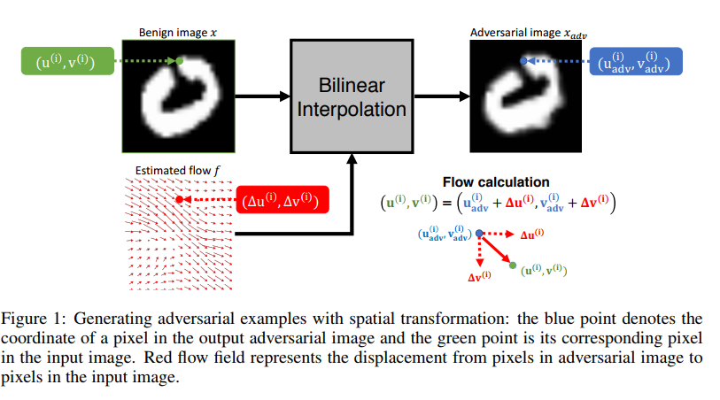

_____________________________________

## Defences

### [Towards Deep Learning Models Resistant to Adversarial Attacks](https://arxiv.org/abs/1706.06083)

1. abstract:(__Madry paper__)
To address this problem, we
study the adversarial robustness of neural networks through the lens of robust optimization.
This approach provides us with a broad and unifying view on much of the prior work on this
topic. Its principled nature also enables us to identify methods for both training and attacking
neural networks that are reliable and, in a certain sense, universal. In particular, they specify
a concrete security guarantee that would protect against any adversary. These methods let us
train networks with significantly improved resistance to a wide range of adversarial attacks.
They also suggest the notion of security against a first-order adversary as a natural and broad
security guarantee. We believe that robustness against such well-defined classes of adversaries
is an important stepping stone towards fully resistant deep learning models.

2. PGD attack

3. code: [MNIST](https://github.com/MadryLab/mnist_challenge),[Cifar10](https://github.com/MadryLab/cifar10_challenge) 

__________________________________________

### [Countering Adversarial Images using Input Transformations](https://arxiv.org/abs/1711.00117)

__Method__:
1. abstract:This paper investigates strategies that defend against adversarial-example attacks
on image-classification systems by transforming the inputs before feeding them
to the system. Specifically, we study applying image transformations such as
bit-depth reduction, JPEG compression, total variance minimization, and image
quilting before feeding the image to a convolutional network classifier.

__Experiments__:

1. Network&Dataset&Attack:
ImageNet-ResNet-50, ResNet-101, DenseNet-169,Inception-V4 - FGSM,I-FGSM,DeepFool,CW
2. Experimental results:

3.Code:NO

____________________________________________

### [PixelDefend: Leveraging Generative Models to Understand and Defend against Adversarial Examples](https://arxiv.org/abs/1710.10766)

__Method__:

1. abstract:
In this paper, we show
empirically that adversarial examples mainly lie in the low probability regions
of the training distribution, regardless of attack types and targeted models. Using
statistical hypothesis testing, we find that modern neural density models are
surprisingly good at detecting imperceptible image perturbations. Based on this
discovery, we devised PixelDefend, a new approach that purifies a maliciously
perturbed image by moving it back towards the distribution seen in the training
data. The purified image is then run through an unmodified classifier, making
our method agnostic to both the classifier and the attacking method.

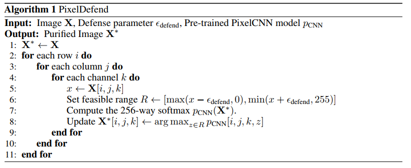

__Comment__: PixelDefend is easily confused with PixelDeflection. Both of them are trying to purify input images with the knowledge of the statistics. 
The difference is:
* __PixelDefend__: They use statistical hypothesis testing to check if the input image is from the same distribution of training images. 
Given a range, they generate images via PixelCNN, and replace the original image with the one with is most close to the distribution of training images.
* __PixelDeflection__: They try to force the distribution of the pixels of the input images to fit the natural image statistics. 
* They first use robust activation map to find the pixel with doesn't match the natual image statistics, correct them and use the wavelet denoising.

__Experiments__:

1. dataset&model&attack:
Fashion MNIST,cifar10 - ResNet,VGG - RAND,FGSM,IFGSM,DeepFool,CW

2. The experiments results are presented in a very weird way.

_______________

### [Stochastic Activation Pruning for Robust Adversarial Defense](https://arxiv.org/abs/1803.01442)

1. abstract:
In this light, we propose Stochastic
Activation Pruning (SAP), a mixed strategy for adversarial defense. SAP prunes
a random subset of activations (preferentially pruning those with smaller magnitude)
and scales up the survivors to compensate. We can apply SAP to pretrained
networks, including adversarially trained models, without fine-tuning, providing robustness
against adversarial examples.

2. stochastic activation pruning:
Consider the defense problem from a game-theoretic perspective (Osborne & Rubinstein, 1994). The
adversary designs a policy in order to maximize the defender’s loss, while knowing the defenders
policy. At the same time defender aims to come up with a strategy to minimize the maximized loss.

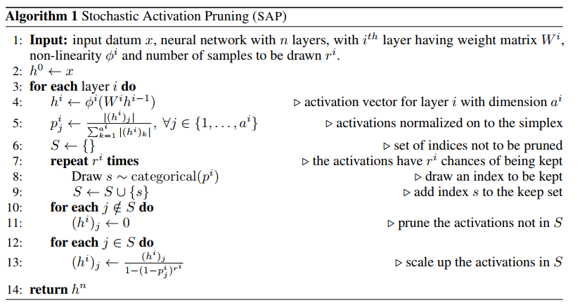

__Dropout__: They compare the SAP with Dropout.

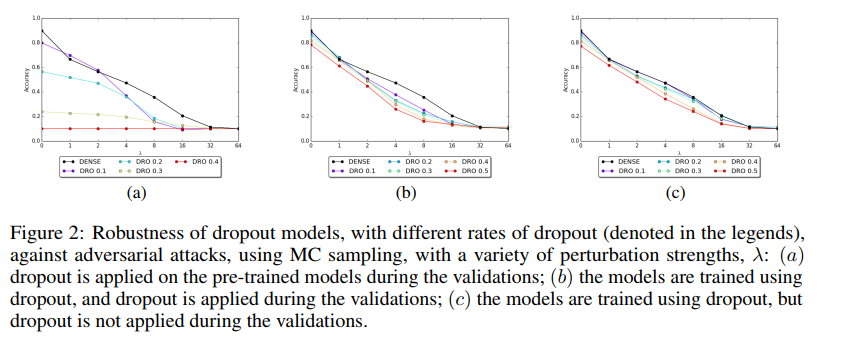

3. [code](https://github.com/Guneet-Dhillon/Stochastic-Activation-Pruning)

4. Experiments: most shown in pictures, need to check carefully. dataset is cifar10. They only compare with FGSM, IFGSM.
_________________________________________________________________

### [Thermometer Encoding: One Hot Way To Resist Adversarial Examples](https://openreview.net/forum?id=S18Su--CW)

1. abstract:
We propose a simple modification to standard neural network architectures,
thermometer encoding, which significantly increases the robustness
of the network to adversarial examples.

They encoded the images into quantized one-hot vector, and they also modified the network, the input of the network is no more image, but the one-hot vectors.
So it needs fine-tuning.

2. dataset : MNIST, cifar10, cifar100, svhn

______________________

### [Certified Defenses against Adversarial Examples](https://arxiv.org/abs/1801.09344)

1. abstract:
In this work,
we study this problem for neural networks with one hidden layer. We first propose
a method based on a semidefinite relaxation that outputs a certificate that for
a given network and test input, no attack can force the error to exceed a certain
value. Second, as this certificate is differentiable, we jointly optimize it with the
network parameters, providing an adaptive regularizer that encourages robustness
against all attacks.

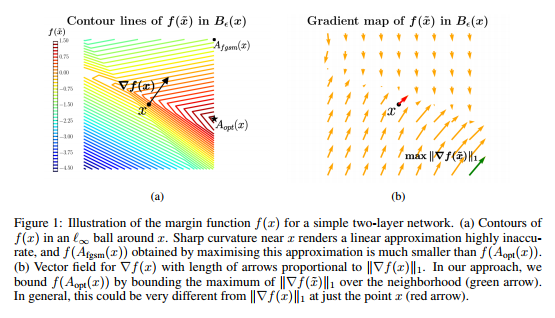

Too much math... Don't really understand... Only talked about MNIST.

_______________________

### [Defense-GAN: Protecting Classifiers Against Adversarial Attacks Using Generative Models](https://arxiv.org/abs/1805.06605)

1. abstract:
We propose Defense-GAN, a new
framework leveraging the expressive capability of generative models to defend
deep neural networks against such attacks. Defense-GAN is trained to model the
distribution of unperturbed images. At inference time, it finds a close output to a
given image which does not contain the adversarial changes. This output is then
fed to the classifier. Our proposed method can be used with any classification
model and does not modify the classifier structure or training procedure. It can
also be used as a defense against any attack as it does not assume knowledge of
the process for generating the adversarial examples.

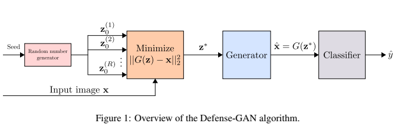

2. the analysis of L steps of Gradient Decent is interesting.

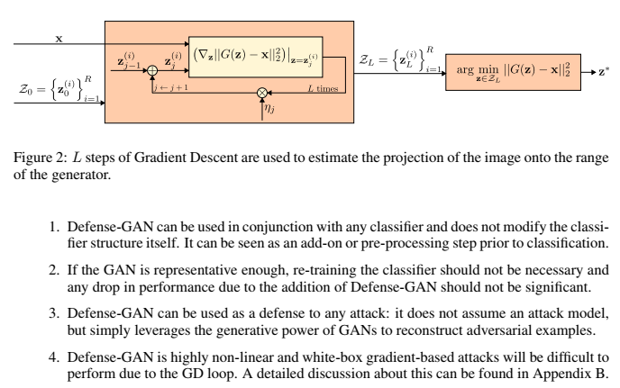

3. Experiments:
dataset: MNIST, FMNIST
attack: FGSM, CW, Rand+FGSM

________________________________

### [Ensemble Adversarial Training: Attacks and Defenses](https://arxiv.org/abs/1705.07204)

1. abstract: 
We show that this form of adversarial training converges to a degenerate global
minimum, wherein small curvature artifacts near the data points obfuscate a linear
approximation of the loss. The model thus learns to generate weak perturbations,
rather than defend against strong ones. As a result, we find that adversarial
training remains vulnerable to black-box attacks, where we transfer perturbations
computed on undefended models, as well as to a powerful novel single-step attack
that escapes the non-smooth vicinity of the input data via a small random step.
We further introduce Ensemble Adversarial Training, a technique that augments
training data with perturbations transferred from other models.

2. Ensemble adversarial training:
We now evaluate our Ensemble Adversarial Training strategy described in Section 3.4. We recall
our intuition: by augmenting training data with adversarial examples crafted from static pre-trained
models, we decouple the generation of adversarial examples from the model being trained, so as to
avoid the degenerate minimum described.

_______________________________

#### [Mitigating adversarial effects through randomization](https://arxiv.org/abs/1711.01991) 
__Method__:
1. abstract:
In this paper, we propose to utilize randomization
at inference time to mitigate adversarial effects. Specifically, we use two randomization
operations: random resizing, which resizes the input images to a random
size, and random padding, which pads zeros around the input images in a random
manner. 

2. Very few computations are required by adding the two randomization layers, thus there is
nearly no run time increase. Randomization layers are compatible to different network structures and adversarial defense
methods, which can serve as a basic network module for adversarial defense.

__Experiments__:
1. Network&Dataset&Attack:
5000 images from the ImageNet - Inception V3, ResNet-v2, Inception-ResNet-v2, ens-adv-Inception-ResNet-v2 - FGSM,DeppFool,CW

2. Experimental results:

Vanilla Attack: The attackers do not know the existence of the randomization layers and
the target model is just the original network.

Single-pattern Attack: For the single-pattern attack scenario, the attackers are aware of the existence of randomization
layers and also the parameters of the random resizing and random padding (i.e., from 299 × 299
to 331 × 331), but they do not know the specific randomization patterns utilized by the defense
models (even the defense models themselves do not know these specific randomization patterns
since they are randomly instantiated at test time). In order to generate adversarial examples, the
attackers choose the target models as the original networks + randomization layers but with only
one specific pattern to compute the gradient.

Ensemble-pattern Attack: For the ensemble-pattern attack scenario, similar to single-pattern attack scenario, the attackers are aware of the randomization layers and the parameters of the random resizing and random padding
(i.e., starting from 299×299 to 331×331), but they do not know the specific patterns utilized by the
defense models at test time.
The target models thus are constructed in a more representative way:
let randomization layers choose an ensemble of predefined patterns, and the goal of the attackers is
to let all chosen patterns fail on classification. 

One pixel Padding： For the random padding, there are only 4 patterns when padding the input images from 330×330×3
to 331×331×3. In order to construct a stronger attack, we follow the experiment setup in section 4.5
where 3 chosen patterns are ensembled.

One pixel resizing: For the random resizing, there is only 1 pattern that exists when the input images are resized from
330 × 330 × 3 to 331 × 331 × 3.

3. Code: [Yes](https://github.com/cihangxie/NIPS2017_adv_challenge_defense)
___________________________ 

### [Certifying Some Distributional Robustness with Principled Adversarial Training](https://arxiv.org/abs/1710.10571)

1. abstract:
We address this problem through the principled lens
of distributionally robust optimization, which guarantees performance under adversarial input
perturbations. By considering a Lagrangian penalty formulation of perturbing the underlying
data distribution in a Wasserstein ball, we provide a training procedure that augments model
parameter updates with worst-case perturbations of training data. For smooth losses, our procedure
provably achieves moderate levels of robustness with little computational or statistical
cost relative to empirical risk minimization. Furthermore, our statistical guarantees allow us
to efficiently certify robustness for the population loss. For imperceptible perturbations, our
method matches or outperforms heuristic approaches.

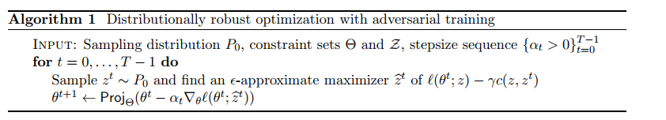
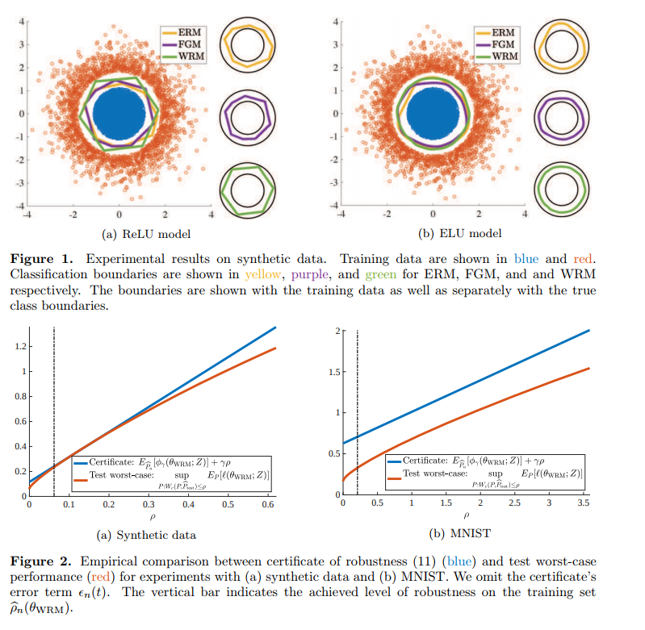

Again, too much math... 

_____________

## Analysis

### [Decision Boundary Analysis of Adversarial Examples](https://openreview.net/forum?id=BkpiPMbA-)
### [Characterizing Adversarial Subspaces Using Local Intrinsic Dimensionality](https://arxiv.org/abs/1801.02613)