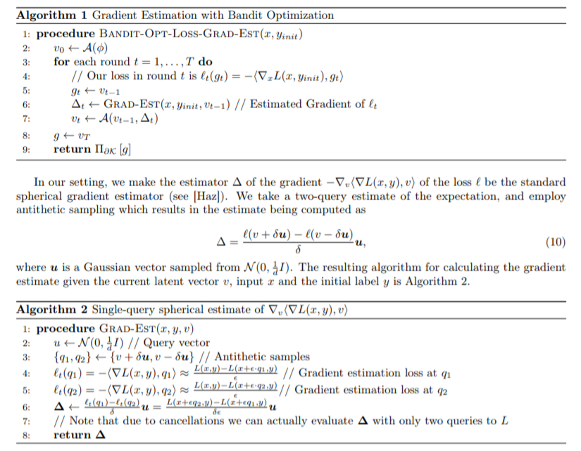
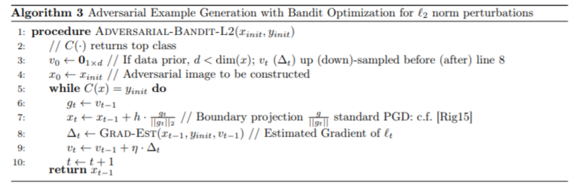
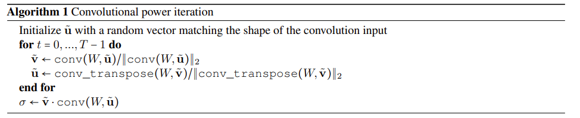

### ICLR 2019 :

#### Attacks

### [Adversarial Attacks on Graph Neural Networks via Meta Learning](https://arxiv.org/pdf/1902.08412.pdf)
1. abstract:

We investigate
training time attacks on graph neural networks for node classification that perturb
the discrete graph structure. Our core principle is to use __meta-gradients__ to solve
the bilevel problem __underlying training-time attacks__, essentially treating the graph
as a hyperparameter to optimize. Our experiments show that small graph perturbations consistently lead to a strong decrease in performance for graph convolutional
networks, and even transfer to unsupervised embeddings. Remarkably, the perturbations created by our algorithm can misguide the graph neural networks such that
they perform worse than a simple baseline that ignores all relational information.
Our attacks do not assume any knowledge about or access to the target classifiers.

2. methods

- The key idea of this work is to use meta-learning for the opposite: modifying the training data to worsen the performance after training.
- GRAPH STRUCTURE POISONING VIA META-LEARNIN
？？？修改图结构不跟修改网络参数差不多，感觉这就是超级无敌作弊法。。。我网络都不对，其他怎么可能对。。。。可能是我缺少基于图的深度学习的知识。。。。

3. experiments

4. [code](https://www.in.tum.de/daml/gnn-meta-attack/)

### [Prior Convictions: Black-box Adversarial Attacks with Bandits and Priors](https://arxiv.org/pdf/1807.07978.pdf)
1. abstract:

We introduce a framework that __conceptually unifies__ much of the
existing work on black-box attacks, and we demonstrate that the current state-of-the-art methods are
optimal in a natural sense. Despite this optimality, we show how to improve black-box attacks by bringing
a new element into the problem: __gradient priors__. We give a __bandit optimization-based algorithm__ that
allows us to seamlessly integrate any such priors, and we explicitly identify and incorporate two examples.
The resulting methods use two to four times fewer queries and fail two to five times less often than the
current state-of-the-art.

2. methods

- We formalize the gradient estimation problem as the central problem in the context of query-efficient
black-box attacks. We then show how the resulting framework unifies the previous attack methodology.
We prove that the least squares method, a classic primitive in signal processing, not only constitutes an
optimal solution to the general gradient estimation problem but also is essentially equivalent to the
current-best black-box attack methods.
- We demonstrate that, despite this seeming optimality of these methods, we can still improve upon them
by exploiting an aspect of the problem that has been not considered previously: the priors we have on
the distribution of the gradient. We identify two example classes of such priors, and show that they
indeed lead to better predictors of the gradient.
- Finally, we develop a bandit optimization framework for generating black-box adversarial examples
which allows for the seamless integration of priors. To demonstrate its effectiveness, we show that
leveraging the two aforementioned priors yields black-box attacks that are 2-5 times more query efficient
and less failure-prone than the state of the art. 

3. experiments
实验结果也太草率了吧。。。。什么鬼，就三个图，跟NES比，哦，，更多结果在附录。。。
4. [code](https://github.com/MadryLab/blackbox-bandits)

Beyond Pixel Norm-Balls: Parametric Adversaries using an Analytically Differentiable Renderer

ADef: an Iterative Algorithm to Construct Adversarial Deformations

Structured Adversarial Attack: Towards General Implementation and Better Interpretability

##### [The Limitations of Adversarial Training and the Blind-Spot Attack](https://arxiv.org/pdf/1901.04684.pdf)

CAMOU: Learning Physical Vehicle Camouflages to Adversarially Attack Detectors in the Wild

#### Defences

### [Generalizable Adversarial Training via Spectral Normalization](Generalizable Adversarial Training via Spectral Normalization)
1. abstract：
In this work, we extend the notion of margin loss to adversarial settings and bound the
generalization error for DNNs trained under several well-known gradient-based attack schemes, motivating an
effective regularization scheme based on spectral normalization of the DNN’s weight matrices. We also provide
a computationally-efficient method for normalizing the spectral norm of convolutional layers with arbitrary stride
and padding schemes in deep convolutional networks. We evaluate the power of spectral normalization extensively
on combinations of datasets, network architectures, and adversarial training schemes.

2. main method
- spectral normalization: a novel weight normalization technique called spectral normalization to stabilize the training of the discriminator.

The spectral norm σ(W) that we use to regularize each layer of the discriminator is the largest singular value of W. If we naively apply singular value decomposition
to compute the σ(W) at each round of the algorithm, the algorithm can become computationally
heavy. Instead, we can use the power iteration method to estimate σ(W) (Golub & Van der Vorst,
2000; Yoshida & Miyato, 2017). With power iteration method, we can estimate the spectral norm
with very small additional computational time relative to the full computational cost of the vanilla
GAN

- Wasserstein Risk Minimization (WRM)
- Margin-based adversarial Generalization bounds

3. experiment
AlexNet 
CIFAR10

4. [code](https://github.com/jessemzhang/dl_spectral_normalization)

Towards the first adversarially robust neural network model on MNIST

PeerNets: Exploiting Peer Wisdom Against Adversarial Attacks

Characterizing Audio Adversarial Examples Using Temporal Dependency

Improving the Generalization of Adversarial Training with Domain Adaptation

Adv-BNN: Improved Adversarial Defense through Robust Bayesian Neural Network

Adversarial Reprogramming of Neural Networks

Defensive Quantization: When Efficiency Meets Robustness

#### Verification

Rigorous Agent Evaluation: An Adversarial Approach to Uncover Catastrophic Failures

Training for Faster Adversarial Robustness Verification via Inducing ReLU Stability

Benchmarking Neural Network Robustness to Common Corruptions and Perturbations

Evaluating Robustness of Neural Networks with Mixed Integer Programming

A Statistical Approach to Assessing Neural Network Robustness

Robustness Certification with Refinement

#### Analysis

Excessive Invariance Causes Adversarial Vulnerability

On the Sensitivity of Adversarial Robustness to Input Data Distributions

Robustness May Be at Odds with Accuracy

Are adversarial examples inevitable?