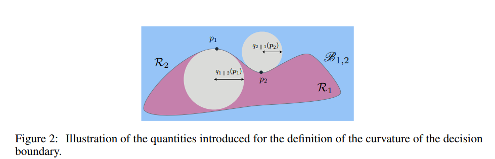

### NIPS 2016 :

### [Robustness of classifiers: from adversarial to random noise](https://arxiv.org/abs/1608.08967)

1. abstract: 
In this paper, we propose to study a semi-random noise regime
that generalizes both the random and worst-case noise regimes. We propose
the first quantitative analysis of the robustness of nonlinear classifiers in this
general noise regime. We establish precise theoretical bounds on the robustness of
classifiers in this general regime, which depend on the curvature of the classifier’s
decision boundary. Our bounds confirm and quantify the empirical observations that
classifiers satisfying curvature constraints are robust to random noise. Moreover,
we quantify the robustness of classifiers in terms of the subspace dimension in
the semi-random noise regime, and show that our bounds remarkably interpolate
between the worst-case and random noise regimes.

### [Measuring Neural Net Robustness with Constraints](https://arxiv.org/abs/1605.07262)

1. abstract:
We propose metrics for measuring the robustness of a neural net and
devise a novel algorithm for approximating these metrics based on an encoding of
robustness as a linear program. We show how our metrics can be used to evaluate
the robustness of deep neural nets with experiments on the MNIST and CIFAR-10
datasets. Our algorithm generates more informative estimates of robustness metrics
compared to estimates based on existing algorithms. Furthermore, we show how
existing approaches to improving robustness “overfit” to adversarial examples
generated using a specific algorithm. Finally, we show that our techniques can be
used to additionally improve neural net robustness both according to the metrics
that we propose, but also according to previously proposed metrics.