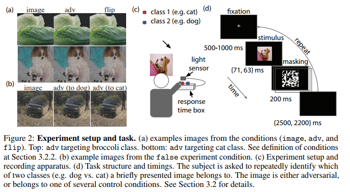

## NIPS 2018 :

## Attacks

### [Adversarial Examples that Fool both Computer Vision and Time-Limited Humans](https://arxiv.org/abs/1802.08195)

1. abstract:
Here, we address this question by leveraging recent
techniques that transfer adversarial examples from computer vision models with
known parameters and architecture to other models with unknown parameters and
architecture, and by matching the initial processing of the human visual system.
We find that adversarial examples that strongly transfer across computer vision
models influence the classifications made by time-limited human observers. 

2. Evaluation of human

### [Adversarial Attacks on Stochastic Bandits](https://arxiv.org/pdf/1810.12188.pdf)
1. abstract:
We propose the first
attack against two popular bandit algorithms: -greedy and UCB, without knowledge
of the mean rewards. The attacker is able to spend only logarithmic effort,
multiplied by a problem-specific parameter that becomes smaller as the bandit
problem gets easier to attack. The result means the attacker can easily hijack the
behavior of the bandit algorithm to promote or obstruct certain actions, say, a particular
medical treatment. As bandits are seeing increasingly wide use in practice,
our study exposes a significant security threat.

### [Constructing Unrestricted Adversarial Examples with Generative Models](https://arxiv.org/abs/1805.07894)

1. abstract:
Specifically, we first train an Auxiliary Classifier Generative
Adversarial Network (AC-GAN) to model the class-conditional distribution over
data samples. Then, conditioned on a desired class, we search over the AC-GAN
latent space to find images that are likely under the generative model and are
misclassified by a target classifier.

## Defences

Deep Defense: Training DNNs with Improved Adversarial Robustness

Scaling provable adversarial defenses

Thwarting Adversarial Examples: An L_0-Robust Sparse Fourier Transform

Bayesian Adversarial Learning

Towards Robust Detection of Adversarial Examples

Attacks Meet Interpretability: Attribute-steered Detection of Adversarial Samples

Robust Detection of Adversarial Attacks by Modeling the Intrinsic Properties of Deep Neural Networks

A Simple Unified Framework for Detecting Out-of-Distribution Samples and Adversarial Attacks

## Verification

Semidefinite relaxations for certifying robustness to adversarial examples

## Analysis

Adversarially Robust Generalization Requires More Data

A Spectral View of Adversarially Robust Features

Adversarial vulnerability for any classifier

Adversarial Risk and Robustness: General Definitions and Implications for the Uniform Distribution