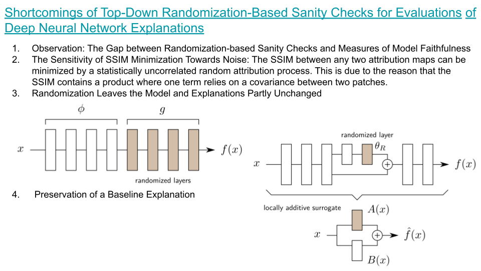
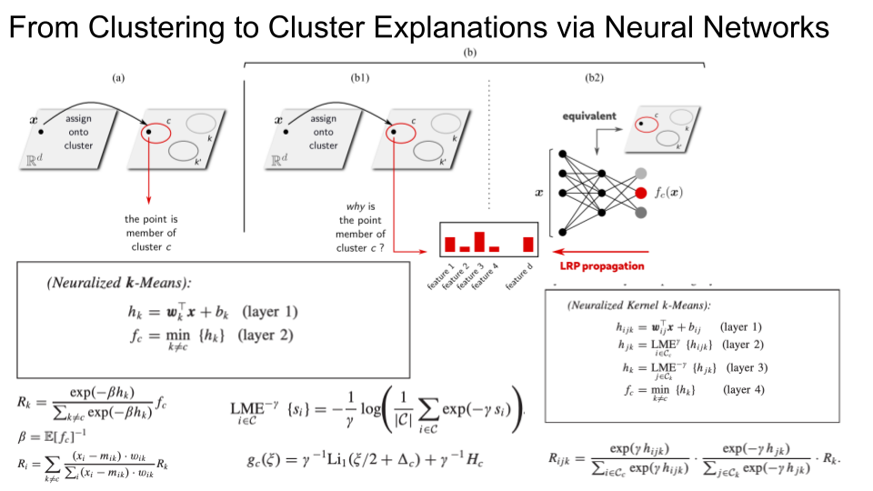
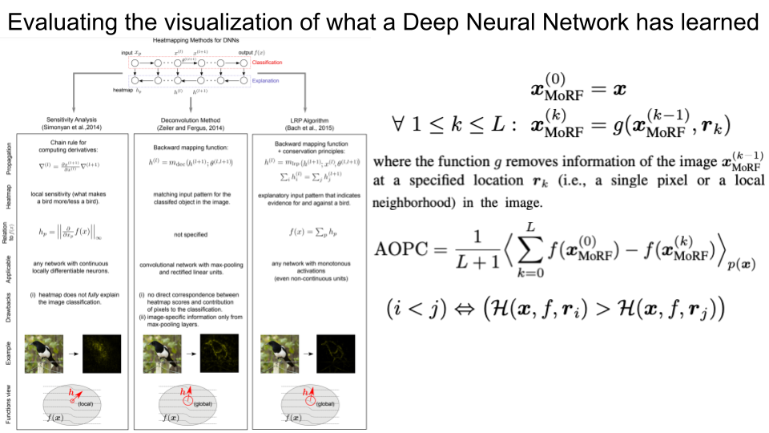

### [Shortcomings of Top-Down Randomization-Based Sanity Checks for Evaluations of Deep Neural Network Explanations](https://arxiv.org/pdf/2211.12486.pdf)
- 2022

### [XAI for Transformers: Better Explanations through Conservative Propagation](https://arxiv.org/pdf/2202.07304.pdf)
- 2022 conference on Machine Learning

### [From Clustering to Cluster Explanations via Neural Networks](https://arxiv.org/pdf/2202.07304.pdf)
- 2022 IEEE TNNLS

### [Explaining the Predictions of Unsupervised Learning Models](https://link.springer.com/chapter/10.1007/978-3-031-04083-2_7)
- 2022 International Workshop on Extending Explainable AI Beyond Deep Models and Classifiers
- NEON: first converts (without retraining) the unsupervised model into a functionally equivalent neural network so that, in a second step, supervised XAI techniques such as layer-wise relevance propagation (LRP) can be used.

### [Methods for interpreting and understanding deep neural networks](https://www.sciencedirect.com/science/article/pii/S1051200417302385)
- 2018 Digital Signal Processing
- This paper provides an entry point to the problem of interpreting a deep neural network model and explaining its predictions. It is based on a tutorial given at ICASSP 2017. As a tutorial paper, the set of methods covered here is not exhaustive, but sufficiently representative to discuss a number of questions in interpretability, technical challenges, and possible applications. The second part of the tutorial focuses on the recently proposed layer-wise relevance propagation (LRP) technique, for which we provide theory, recommendations, and tricks, to make most efficient use of it on real data.

### [On pixel-wise explanations for non-linear classifier decisions by layer-wise relevance propagation](https://journals.plos.org/plosone/article?id=10.1371/journal.pone.0130140)
- 2015 PloS one
- We introduce a methodology that allows to visualize the contributions of single pixels to predictions for kernel-based classifiers over Bag of Words features and for multilayered neural networks. These pixel contributions can be visualized as heatmaps and are provided to a human expert who can intuitively not only verify the validity of the classification decision, but also focus further analysis on regions of potential interest.

### [Explaining nonlinear classification decisions with deep taylor decomposition](https://www.sciencedirect.com/science/article/pii/S0031320316303582)
- 2017 Pattern recognition
- In this paper we introduce a novel methodology for interpreting generic multilayer neural networks by decomposing the network classification decision into contributions of its input elements. Although our focus is on image classification, the method is applicable to a broad set of input data, learning tasks and network architectures. Our method called deep Taylor decomposition efficiently utilizes the structure of the network by backpropagating the explanations from the output to the input layer.

### [Evaluating the visualization of what a deep neural network has learned](https://arxiv.org/pdf/1509.06321.pdf)
- 2016 IEEE TNNLS

### [Explaining deep neural networks and beyond: a review of methods and applications](https://ieeexplore.ieee.org/iel7/5/9369414/09369420.pdf)
- 2021 Proceedings of the IEEE
- In this work, we aim to: 1) provide a timely overview of this active emerging field, with a focus on “post hoc” explanations, and explain its theoretical foundations; 2) put interpretability algorithms to a test both from a theory and comparative evaluation perspective using extensive simulations; 3) outline best practice aspects, i.e., how to best include interpretation methods into the standard usage of ML; and 4) demonstrate successful usage of XAI in a representative selection of application scenarios.
