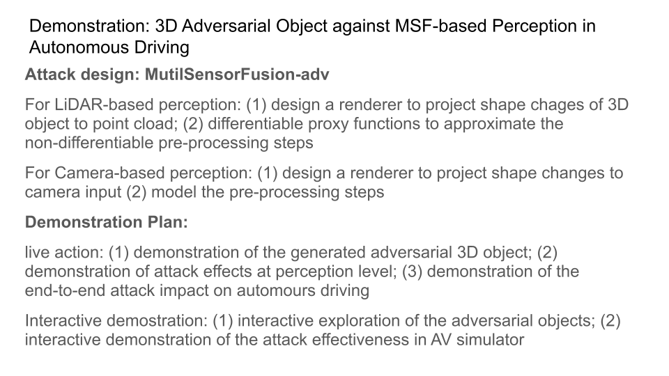
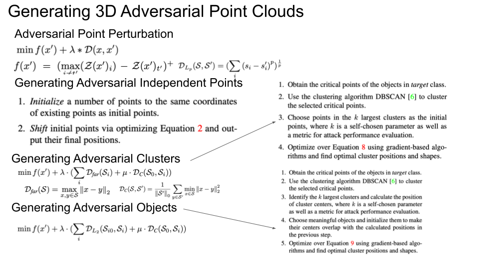
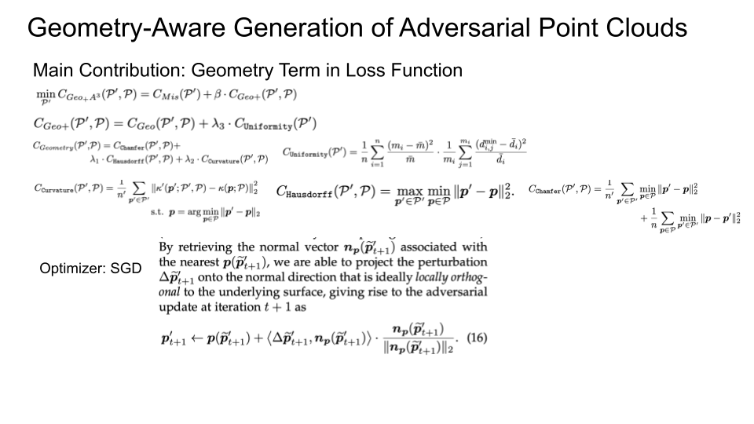
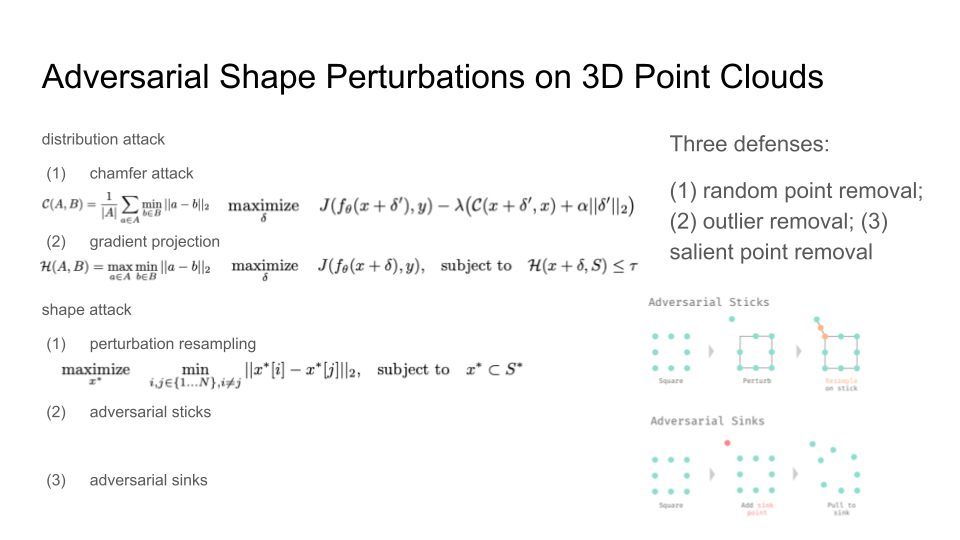
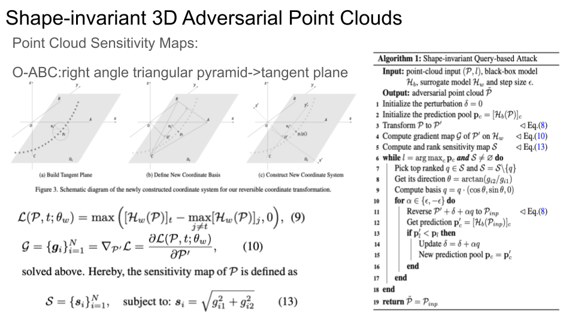
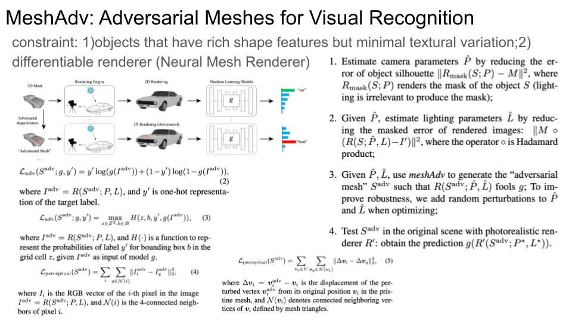

## Self-driving attack

### [Remote attacks on automated vehicles sensors: Experiments on camera and lidar](https://www.blackhat.com/docs/eu-15/materials/eu-15-Petit-Self-Driving-And-Connected-Cars-Fooling-Sensors-And-Tracking-Drivers-wp1.pdf)
- 2015 Black Hat Europe

### [Deepxplore: Automated Whitebox Testing of Deep Learning Systems](https://arxiv.org/abs/1705.06640)
- 2017 SOSP

### [Illusion and dazzle: Adversarial optical channel exploits against lidars for automotive applications](https://link.springer.com/chapter/10.1007/978-3-319-66787-4_22)
- 2017 ICCHES

### [Deeptest: Automated Testing of Deep-Neural-Network-Driven Autonomous Cars](https://arxiv.org/abs/1708.08559)
- 2018 ICSE 

### [DARTS: Deceiving Autonomous Cars with Toxic Signs](https://arxiv.org/pdf/1802.06430)
- 2018 ACM CCS
- [code](https://github.com/inspire-group/advml-traffic-sign)

### [Adversarial objects against lidar-based autonomous driving systems](https://arxiv.org/abs/1907.05418)
-2019

### [Adversarial Camera Stickers: A Physical Camera-based Attack on Deep Learning Systems](https://arxiv.org/abs/1904.00759)
- 2019 ICML
- [code](https://github.com/yoheikikuta/adversarial-camera-stickers)

### [Fooling Automated Surveillance Cameras: Adversarial Patches to Attack Person Detection](https://openaccess.thecvf.com/content_CVPRW_2019/papers/CV-COPS/Thys_Fooling_Automated_Surveillance_Cameras_Adversarial_Patches_to_Attack_Person_Detection_CVPRW_2019_paper.pdf)
- 2019 CVPR

### [Adversarial sensor attack on lidar-based perception in autonomous driving](https://arxiv.org/pdf/1907.06826.pdf)
- 2019 ACM SIGSAC CCS

### [CAMOU: Learning A Vehicle Camouflage For Physical Adversarial Attack On Object Detections In The Wild](https://www.semanticscholar.org/paper/CAMOU%3A-Learning-Physical-Vehicle-Camouflages-to-in-Zhang-Foroosh/2ee77a5fa75717118b62833f4cf111cfd0293aec)
- 2019 ICLR

### [Physically Realizable Adversarial Examples for LiDAR Object Detection](https://openaccess.thecvf.com/content_CVPR_2020/html/Tu_Physically_Realizable_Adversarial_Examples_for_LiDAR_Object_Detection_CVPR_2020_paper.html)
- 2020 CVPR
- [code](https://github.com/cuge1995/awesome-3D-point-cloud-attacks)

### [Towards Robust LiDAR-based Perception in Autonomous Driving: General Black-box Adversarial Sensor Attack and Countermeasures](https://www.usenix.org/system/files/sec20-sun.pdf)
- 2020 Usenix Security

### [3D adversarial object against msf-based perception in autonomous driving](https://me.ningfei.org/paper/MLsys_demo.pdf)
- 2020 CMLS

### [Invisible for both Camera and LiDAR: Security of Multi-Sensor Fusion based Perception in Autonomous Driving Under Physical-World Attacks](https://arxiv.org/abs/2106.09249)
- 2021 IEEE SP

### [Adversarial Attacks on Camera-LiDAR Models for 3D Car Detection](https://arxiv.org/abs/2103.09448)
- 2021

### [Crafting Adversarial Examples on 3D Object Detection Sensor Fusion Models](https://arxiv.org/pdf/2109.06363.pdf)
- 2021

### [Robust Roadside Physical Adversarial Attack Against Deep Learning in Lidar Perception Modules](https://dl.acm.org/doi/abs/10.1145/3433210.3453106?casa_token=IT8ydN-V2j8AAAAA:qrp8t4lcnvl9ErVB1qK8dswYqcUMBJWW1Q2vl61yeWJynuwM287VDZ19Nx9RBoqKw7qO-9PbOodYAQ)
- 2021 ACM ACCCS

### [Towards Universal Physical Attacks On Cascaded Camera-Lidar 3D Object Detection Models](https://ieeexplore.ieee.org/stamp/stamp.jsp?arnumber=9506016)
- 2021 ICIP

### [Multi-view Correlation based Black-box Adversarial Attack for 3D Object Detection](https://dl.acm.org/doi/abs/10.1145/3447548.3467432?casa_token=25USgCzKRjMAAAAA:6wMaImk3bPoj5fD9hTUZ7BsmiKT_q8BMI25EUjUTZctjXJBAHGn3ZBis2B8qGjn4vAKJs0X_izDRjA)
- 2021 ACM SIGKDD

### [Evaluating Adversarial Attacks on Driving Safety in Vision-Based Autonomous Vehicles](https://arxiv.org/abs/2108.02940)
- 2022 IEEE ITJ
- [code](https://github.com/DexterJZ/eval_driving_safety)

### [Adversarial point cloud perturbations against 3D object detection in autonomous driving systems](https://www.sciencedirect.com/science/article/abs/pii/S0925231221013850)
- 2021 Neurocomputing

### [Adversarial Attacks Beyond the Image Space](https://openaccess.thecvf.com/content_CVPR_2019/html/Zeng_Adversarial_Attacks_Beyond_the_Image_Space_CVPR_2019_paper.html)
- 2019 CVPR

## 3D object attack

### [A deeper look at 3D shape classifiers](http://openaccess.thecvf.com/content_ECCVW_2018/papers/11131/Su_A_Deeper_Look_at_3D_Shape_Classifiers_ECCVW_2018_paper.pdf)
- 2018 ECCV

### [Adversarial attack and defense on point sets](https://arxiv.org/abs/1902.10899)
- 2019

### [Extending adversarial attacks and defenses to deep 3d point cloud classifiers](https://arxiv.org/abs/1901.03006)
- 2019 ICIP

### [PointCloud Saliency Maps](https://arxiv.org/abs/1812.01687)
- 2019 ICCV
- [code](https://github.com/tianzheng4/PointCloud-Saliency-Maps)

### [Robustness of 3d deep learning in an adversarial setting](https://openaccess.thecvf.com/content_CVPR_2019/html/Wicker_Robustness_of_3D_Deep_Learning_in_an_Adversarial_Setting_CVPR_2019_paper.html)
- 2019 CVPR

### [Adversarial point perturbations on 3d objects](https://ui.adsabs.harvard.edu/abs/2019arXiv190806062L/abstract)
- 2019

### [Generating 3d adversarial point clouds](https://arxiv.org/abs/1809.07016)
- 2019 CVPR
- [code](https://github.com/xiangchong1/3d-adv-pc)

### [Geometry-Aware Generation of Adversarial Point Clouds](https://arxiv.org/abs/1912.11171)
－ 2020 IEEE TPARI
－ [code](https://github.com/Yuxin-Wen/GeoA3)

### [Transferable adversarial perturbations on 3D point clouds](https://arxiv.org/abs/1912.00461)
- 2020 ECCV
- [code](https://github.com/ajhamdi/AdvPC)

### [Nudge attacks on point-cloud dnns](https://arxiv.org/abs/2011.11637)
- 2020

### [adversarial shape perturbations on 3d point clouds](https://dl.acm.org/doi/abs/10.1007/978-3-030-66415-2_6)
- [code](https://github.com/Daniel-Liu-c0deb0t/Adversarial-point-perturbations-on-3D-objects)

### [Lg-gan: Label guided adversarial network for flexible targeted attack of point cloud based deep networks](https://arxiv.org/pdf/2104.12146.pdf)
- 2020 CVPR
- [code](https://github.com/RyanHangZhou/tensorflow-LG-GAN)

### [Adversarial point cloud perturbations to attack deep object detection models](https://ieeexplore.ieee.org/abstract/document/9407842/)
- 2020 IEEE DSS

### [Adversarial Example Attacks in the Physical World](https://link.springer.com/chapter/10.1007/978-3-030-62460-6_51)
- 2020 ICMCS

### [Efficient Joint Gradient Based Attack Against SOR Defense for 3D Point Cloud Classification](https://dl.acm.org/doi/10.1145/3394171.3413875)
- 2020 ACM MM
- [code](https://github.com/machengcheng2016/JGBA-pointcloud-attack)

### [Robust Adversarial Objects against Deep Learning Models](https://ojs.aaai.org/index.php/AAAI/article/view/5443)
- 2020 AAAI
- against PointNet++
- KNN

### [3D Adversarial Attacks Beyond Point Cloud](https://arxiv.org/pdf/2104.12146.pdf)
- 2021
- [code](https://github.com/cuge1995/Mesh-Attack)

### [Object removal attacks on lidar-based 3d object detectors](https://arxiv.org/abs/2102.03722)
- 2021

### [Fooling lidar perception via adversarial trajectory perturbation](https://arxiv.org/abs/2103.15326)
- 2021

### [Generating Adversarial Point Clouds on Multi-modal Fusion Based 3D Object Detection Model](https://link.springer.com/chapter/10.1007/978-3-030-86890-1_11)
- 2021 ICICS

### [Shadow-catcher: Looking into shadows to detect ghost objects in autonomous vehicle 3d sensing](https://arxiv.org/abs/2008.12008)
- 2021

### [Shape-invariant 3D Adversarial Point Clouds](https://arxiv.org/abs/2203.04041)
- 2022 CVPR
- [code](https://github.com/shikiw/SI-Adv)

### [Adversarial Attacks Beyond the Image Space]

### [Realistic Adversarial Examples in 3D Meshes]

### [MeshAdv: Adversarial Meshes for Visual Recognition](https://arxiv.org/abs/1810.05206)
- 2019 CVPR

### [Strike (With) a Pose: Neural Networks Are Easily Fooled by Strange Poses of Familiar Objects]

### [Optical Adversarial Attack](https://openaccess.thecvf.com/content/ICCV2021W/AROW/html/Gnanasambandam_Optical_Adversarial_Attack_ICCVW_2021_paper.html)
- 2021 ICCV

### [Boosting 3D Adversarial Attacks with Attacking On Frequency](https://www.researchgate.net/publication/358142659_Boosting_3D_Adversarial_Attacks_with_Attacking_On_Frequency)
- 2022

### [Local Aggressive Adversarial Attacks on 3D Point Cloud](https://proceedings.mlr.press/v157/sun21a/sun21a.pdf)
- 2021 ACML

### [Minimal Adversarial Examples for Deep Learning on 3D Point Clouds](https://openaccess.thecvf.com/content/ICCV2021/papers/Kim_Minimal_Adversarial_Examples_for_Deep_Learning_on_3D_Point_Clouds_ICCV_2021_paper.pdf)
- 2021 ICCV

### [Camdar‐adv: Generating adversarial patcheson 3D object](https://onlinelibrary.wiley.com/doi/epdf/10.1002/int.22349)
- 2020 

## Real world attack

### [Adversarial Patches](https://arxiv.org/abs/1712.09665)
- 2017

### [Synthesizing Robust Adversarial Examples](https://arxiv.org/abs/1707.07397)
- 2018 ICML

### [Shapeshifter:Robust Physical Adversarial Attack on Faster R-CNN Object Detector](https://link.springer.com/chapter/10.1007/978-3-030-10925-7_4)
- 2018 ECML-PKDD
- [code](https://github.com/shangtse/robust-physical-attack)

### [Seeing isn’t Believing: Practical Adversarial Attack Against Object Detectors](https://arxiv.org/abs/1812.10217)
- 2019 ACM SIGSAC

## Security of Autonomous Systems

### [Security of Autonomous Systems Employing Embedded Computing and Sensors](http://ieeexplore.ieee.org/document/6504448/)
- 2013 IEEE Micro

### [The Security of Autonomous Driving: Threats, Defenses, and Future Directions](https://ieeexplore.ieee.org/document/8890622)
- 2019 IEEE

### [Making an Invisibility Cloak: Real World Adversarial Attacks on Object Detectors](https://arxiv.org/pdf/1910.14667.pdf)
- 2020
