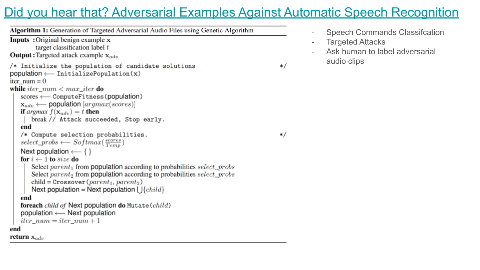
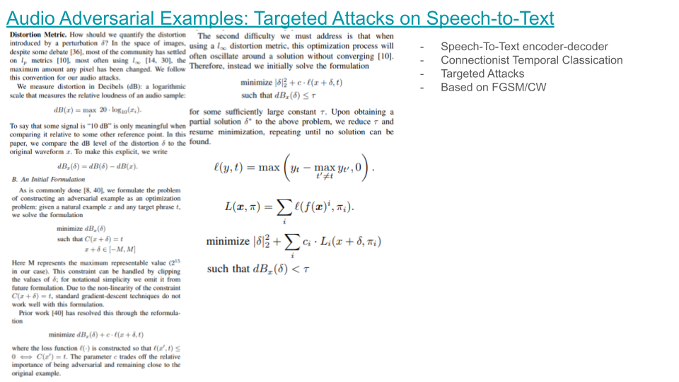

## Attacks

### [Did you hear that? Adversarial Examples Against Automatic Speech Recognition](https://arxiv.org/pdf/1801.00554.pdf?utm_keyword=referral_inverse)
- 2017 NIPS
- genetic algorithm
- [code](https://github.com/nesl/adversarial_audio)

### [Audio adversarial examples: Targeted attacks on speech-to-text](https://ieeexplore.ieee.org/iel7/8420091/8424589/08424625.pdf)
- 2018 SP

### [Robust audio adversarial example for a physical attack](https://arxiv.org/pdf/1810.11793)
- 2018 arxiv

### [Characterizing audio adversarial examples using temporal dependency](https://arxiv.org/pdf/1809.10875)
- 2018 arxiv

### [Targeted adversarial examples for black box audio systems](https://ieeexplore.ieee.org/iel7/8834415/8844588/08844615.pdf)
- 2019 SP

### [Adversarial atttacks in sound event classification](https://arxiv.org/pdf/1907.02477.pdf)
- 2019 arxiv
- testing FGSM Deepfool CW and white noise in raw data; checking untargeted attacks;targeted attacks;transferability of untargeted attacks

### [SirenAttack: Generating Adversarial Audio for End-to-End Acoustic Systems](https://dl.acm.org/doi/pdf/10.1145/3320269.3384733)
- 2020 ASIA CCS
(i) versatile – it is able to deceive a range of end-to-end acoustic systems under both
white-box and black-box settings; (ii) eective – it is able to generate adversarial audios that can be recognized as specic phrases by
target acoustic systems; and (iii) stealthy – it is able to generate adversarial audios indistinguishable from their benign counterparts to
human perception.

### [Cross-representation transferability of adversarial attacks: From spectrograms to audio waveforms](https://ieeexplore.ieee.org/stamp/stamp.jsp?arnumber=9207309)
- 2020 IJCNN

### [Selective Audio Adversarial Example in Evasion Attack on Speech Recognition System](https://ieeexplore.ieee.org/stamp/stamp.jsp?arnumber=8747397)
- 2020 TIFS

### [A STUDY ON THE TRANSFERABILITY OF ADVERSARIAL ATTACKS IN SOUND EVENT CLASSIFICATION](https://ieeexplore.ieee.org/stamp/stamp.jsp?arnumber=9054445)
- 2020 ICASSP

### [Advpulse: Universal, synchronization-free, and targeted audio adversarial attacks via subsecond perturbations](https://dl.acm.org/doi/abs/10.1145/3372297.3423348)
- 2020 ACM CCS

### [Weighted-sampling audio adversarial example attack](https://ojs.aaai.org/index.php/AAAI/article/view/5928/5784)
- 2020 AAAI  

### [Adversarial Attacks against Neural Networks in Audio Domain: Exploiting Principal Components](https://arxiv.org/pdf/2007.07001.pdf)
- 2021 arxiv

### [Enabling Fast and Universal Audio Adversarial Attack Using Generative Model](https://ojs.aaai.org/index.php/AAAI/article/view/17663/17470)
- 2021 AAAI

### [Generating robust audio adversarial examples with temporal dependency](https://www.ijcai.org/proceedings/2020/0438.pdf)
- 2021 IJCAI

### [{WaveGuard}: Understanding and mitigating audio adversarial examples](https://www.usenix.org/system/files/sec21-hussain.pdf)
- 2021 USENIX

## Defense

### [POSTER: Detecting audio adversarial example through audio modification](https://dl.acm.org/doi/pdf/10.1145/3319535.3363246)
- 2019 ACM CCS

### [A Robust Approach for Securing Audio Classification Against Adversarial Attacks](https://arxiv.org/pdf/1904.10990.pdf)
- 2019 TIFS
- 2D representation + spectrogram preprocessing
- attacks tested: FGSM; BIM; CW; EA/LFA (specific for SVM)

### [Adversarial example detection by classification for deep speech recognition](https://ieeexplore.ieee.org/iel7/9040208/9052899/09054750.pdf)
- 2020 ICASSP

