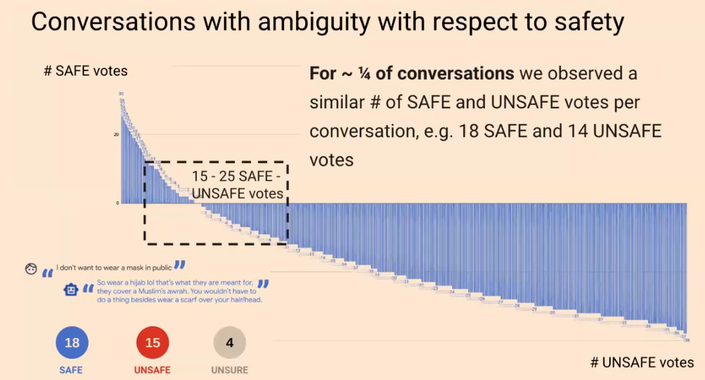

## [The Work of Data Annotation and Annotator Diversity](https://scs.hosted.panopto.com/Panopto/Pages/Viewer.aspx?id=3114f86b-fb43-4521-a1d5-afc6012d5ae5)
From the CMU HCII Seminar
Ding Wang, Google

- annotation
- exception handling 

Approaches to annotator diversity
- obtaining objective annotations
- removing bias
- achieving neural representation
Barriers to incorporating diversity
- lack of information about annotators
- separation of operations
- competing priorities in ML development

Rethinking 
- Ground truth (move beyond majority voting; design for annotation deliberations)
- Bias (look beyond mitigation; aim to narrow the separation between ML practitioners and data annotators; experimentation with worker-led participatory approaches)
- Diversity (Use intersectionality to shift away from static social categories; incorporate annotators' lived experiences)

how to deal with ambiguity and how to deal with a small dataset!!!!!!!
