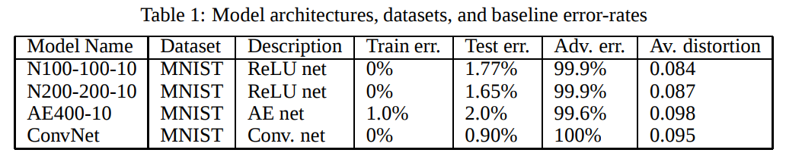
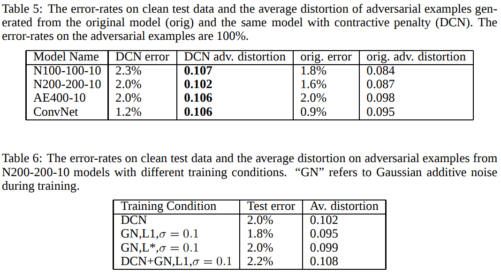
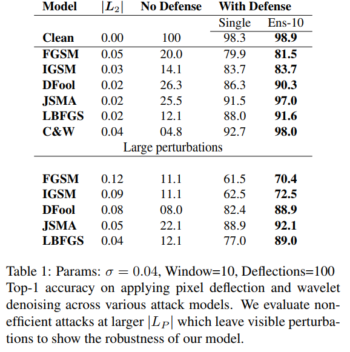

### [Towards Deep Neural Network Architectures Robust to Adversarial Examples](https://arxiv.org/pdf/1412.5068.pdf)

__Method__:
1. abstract:  We perform various experiments to assess the removability of adversarial examples by corrupting with additional noise and pre-processing with denoising autoencoders (DAEs). We find that DAEs can remove substantial amounts of the adversarial noise. However, when stacking the DAE with the original DNN, the resulting network can again be attacked by new adversarial examples with even smaller distortion. As a solution, we propose Deep Contractive Network, a model with a new end-to-end training procedure that includes a smoothness penalty inspired by the contractive autoencoder (CAE). This increases the network robustness to adversarial examples, without a significant performance penalty.

__Experiments__:

1. Network&Dataset&Attack: MNIST - ConvNet - L-BFGS

2. Experimental results:

3. Code: NO

### [Deflecting Adversarial Attacks with Pixel Deflection](https://arxiv.org/pdf/1801.08926.pdf)

__Method__:
1. abstract: Image classifiers tend to be robust to natural noise, and adversarial attacks tend to be agnostic to object location. These observations motivate our strategy, which leverages model robustness to defend against adversarial perturbations by forcing the image to match natural image statistics. Our algorithm locally corrupts the image by redistributing pixel values via a process we term pixel deflection. A subsequent wavelet-based denoising operation softens this corruption, as well as some of the adversarial changes.

2.Pixel deflection transform:
We randomly sample a pixel from an image, and replace it with another randomly selected pixel from within a small square neighborhood. We also experimented with other neighborhood types, including sampling from a Gaussian centered on the pixel, but these alternatives were less effective.

3.Target Pixel Deflection:
First, it requires ground-truth object coordinates and it
is, therefore, difficult to apply to unlabeled inputs at inference
time.
Second, completely masking out the background deteriorates
classification of classes for which the model has
come to rely on the co-occurrence of non-class objects.
* Robust Activation Map:
To obtain a map which is robust to fluctuations
of the most likely class, we take an exponentially weighted
average of the maps of the top-k classes.
* Wavelet denoising:
Wavelet denoising uses
wavelet coefficients obtained using Discrete Wavelet Transform
[3]. The wavelet transform represents the signal
as a linear combination of orthonormal wavelets.
* hard&soft thresholding: The process of performing a wavelet transform and its
inverse is lossless and thus does not provide any noise reduction.
In order to reduce adversarial noise, we need to
apply thresholding to the wavelet coefficients before inverting
the transform.
* adaptive thresholding: Determining the proper threshold is very important, and
the efficacy of our method relies on the ability to pick a
threshold in an adaptive, image specific manner. The standard
technique for determining the threshold for wavelet denoising
is to use a universal threshold formula called VisuShrink.

__Experiments__:

1. Network&Dataset&Attack:
ImageNet - ResNet50,VGG,inceptionV3- FGSM,IFGSM,DeepFool,JSMA,LBFGS,CW

2. Experimental results:

Due to the stochastic nature of our model, we benefit from
taking the majority prediction over ten runs; this is reported
in Table 1 as Ens-10.

3. Code: [Yes](github.com/iamaaditya/pixel-deflection)

#### [Feature squeezing: Detecting adversarial examples in deep neural networks](https://arxiv.org/abs/1704.01155)
__Method__:
1. abstract:
We propose a new strategy, feature
squeezing, that can be used to harden DNN models by detecting
adversarial examples. Feature squeezing reduces the search space
available to an adversary by coalescing samples that correspond
to many different feature vectors in the original space into a single
sample. By comparing a DNN model’s prediction on the original
input with that on squeezed inputs, feature squeezing detects
adversarial examples with high accuracy and few false positives.
This paper explores two feature squeezing methods: reducing the
color bit depth of each pixel and spatial smoothing.

2. Feature squeezing:

__Experiments__:
1. Network&Dataset&Attack:
MNIST - 7 layers CNN - FGSM, IFGSM,CW,Deepfool, JSMA

Cifar10 - DenseNet- FGSM, IFGSM,CW,Deepfool, JSMA

ImageNet - MobileNet- FGSM, IFGSM,CW,Deepfool

2. Experimental results:

3. Code: No, but there is descirption.

#### [Mitigating adversarial effects through randomization](https://arxiv.org/abs/1711.01991) 
__Method__:
1. abstruct:
In this paper, we propose to utilize randomization
at inference time to mitigate adversarial effects. Specifically, we use two randomization
operations: random resizing, which resizes the input images to a random
size, and random padding, which pads zeros around the input images in a random
manner. 

2. Very few computations are required by adding the two randomization layers, thus there is
nearly no run time increase. Randomization layers are compatible to different network structures and adversarial defense
methods, which can serve as a basic network module for adversarial defense.

__Experiments__:
1. Network&Dataset&Attack:
5000 images from the ImageNet - Inception V3, ResNet-v2, Inception-ResNet-v2, ens-adv-Inception-ResNet-v2 - FGSM,DeppFool,CW

2. Experimental results:

Vanilla Attack: The attackers do not know the existence of the randomization layers and
the target model is just the original network.

Single-pattern Attack: For the single-pattern attack scenario, the attackers are aware of the existence of randomization
layers and also the parameters of the random resizing and random padding (i.e., from 299 × 299
to 331 × 331), but they do not know the specific randomization patterns utilized by the defense
models (even the defense models themselves do not know these specific randomization patterns
since they are randomly instantiated at test time). In order to generate adversarial examples, the
attackers choose the target models as the original networks + randomization layers but with only
one specific pattern to compute the gradient.

Ensemble-pattern Attack: For the ensemble-pattern attack scenario, similar to single-pattern attack scenario, the attackers are aware of the randomization layers and the parameters of the random resizing and random padding
(i.e., starting from 299×299 to 331×331), but they do not know the specific patterns utilized by the
defense models at test time.
The target models thus are constructed in a more representative way:
let randomization layers choose an ensemble of predefined patterns, and the goal of the attackers is
to let all chosen patterns fail on classification. 

One pixel Padding： For the random padding, there are only 4 patterns when padding the input images from 330×330×3
to 331×331×3. In order to construct a stronger attack, we follow the experiment setup in section 4.5
where 3 chosen patterns are ensembled.

One pixel resizing: For the random resizing, there is only 1 pattern that exists when the input images are resized from
330 × 330 × 3 to 331 × 331 × 3.

3. Code: [Yes](https://github.com/cihangxie/NIPS2017_adv_challenge_defense)

#### [Countering adversarial images using input transformations](https://arxiv.org/abs/1711.00117)

__Method__:
1. abstract:This paper investigates strategies that defend against adversarial-example attacks
on image-classification systems by transforming the inputs before feeding them
to the system. Specifically, we study applying image transformations such as
bit-depth reduction, JPEG compression, total variance minimization, and image
quilting before feeding the image to a convolutional network classifier.

__Experiments__:

1. Network&Dataset&Attack:
ImageNet-ResNet-50, ResNet-101, DenseNet-169,Inception-V4 - FGSM,I-FGSM,DeepFool,CW
2. Experimental results:

3.Code:NO

______________________________________

### [Divide, Denoise, and Defend against Adversarial Attacks](https://arxiv.org/abs/1802.06806)

__Method__:
1.abstract:
 To defend against such attacks, we propose dividing the input image into multiple patches, denoising each patch independently, and reconstructing the image, without losing significant image content. We call our method D3. This proposed defense mechanism is non-differentiable which makes it non-trivial for an adversary to apply gradient-based attacks.

2.3D: We propose a patch-based denoising method for defense.
We divide the input image into multiple patches, and denoise
them independently with sparse reconstruction using a dictionary
of patches. 
Therefore, to efficiently study the effect of
hyper-parameters of our algorithm, we compute the following
proxy metrics:
(1) “Matching-rate” (MR) is the fraction of patches that
are identical in the denoised image T(x + v) and the clean
image T(x).
(2)“Reconstruction-error” (RE) is the average L2 distance
between the clean image, x, and the transformed image,
T(x): RE = Ex∈D(kx − T(x)k2/kxk2).

The proposed defense algorithm (D3): (1) divides the input
image into overlapping patches, (2) denoises each patch
(with D3-MP) using the constructed dictionaries (with D3-
DL), and (3) reconstructs the denoised image by averaging
the pixels in overlapping patches. 

 However, the defense is
weaker when the adversary has access to the dictionary. This
observation motivates us to add randomization to our transformation
function, T(.), when the adversary has full access
to the D3 algorithm (white-box setting).

__Experiments__:

1. Network&Dataset&Attack:
ImageNet,cifar10-ResNet-50 - FGSM,DeepFool,CW,UAP

2. Experimental results:

3.Code:NO

_________________

### [CIIDefence: Defeating Adversarial Attacks by Fusing Class-specific Image Inpainting and Image Denoising](http://openaccess.thecvf.com/content_ICCV_2019/papers/Gupta_CIIDefence_Defeating_Adversarial_Attacks_by_Fusing_Class-Specific_Image_Inpainting_and_ICCV_2019_paper.pdf)

__Method__：
1.abstract:
The proposed defence mechanism is inspired by the recent works mitigating the adversarial disturbances by the means of image reconstruction and denoising. However, unlike the previous works, we apply the reconstruction only for small and carefully selected image areas that are most influential to the current classification outcome. The selection process is guided by the class activation map responses obtained for multiple top-ranking class labels. The same regions are also the most prominent for the adversarial perturbations and hence most important to purify. The resulting inpainting task is substantially more tractable than the full image reconstruction, while still being able to prevent the adversarial attacks.

2. Removing class-specific areas
The reconstructed image area is determined using the following
procedure. Firstly, we detect p¯ highest scoring local
maxima from the first CAM response map. We utilise nonmaxima
suppression to avoid nearly overlapping detections.
Secondly, we remove all image data within (2w + 1) ×
(2w + 1) square box centred at each of the selected p¯ local
maxima.

3. Image Inpating：
Their
method is based on two-stage coarse-to-fine architecture for
increasing the receptive fields and stabilising the training
phase

4. Image fusion：
In some cases the inpainting may result in blurry reconstruction,
that may re-focuse the classifier on the remaining
image areas.

__Experiments__:
1. Network&Dataset&Attack:
ImageNet-ResNet-101,VGG-16,inception-V3 - FGSM,IFGSM,DeepFool,CW,PGD

2. Experimental results:

3.Code:NO

_______________________
### [Feature Distillation: DNN-Oriented JPEG Compression Against Adversarial Examples](http://openaccess.thecvf.com/content_CVPR_2019/papers/Liu_Feature_Distillation_DNN-Oriented_JPEG_Compression_Against_Adversarial_Examples_CVPR_2019_paper.pdf)

__Method__:
1. abstract:
Image compression-based approaches for defending
against the adversarial-example attacks, which threaten the
safety use of deep neural networks (DNN), have been investigated
recently. However, prior works mainly rely on
directly tuning parameters like compression rate, to blindly
reduce image features, thereby lacking guarantee on both
defense efficiency (i.e. accuracy of polluted images) and
classification accuracy of benign images, after applying defense
methods. To overcome these limitations, we propose
a JPEG-based defensive compression framework, namely
“feature distillation”, to effectively rectify adversarial examples
without impacting classification accuracy on benign
data.

2. First, we maximize malicious features filtering
of adversarial input perturbations by developing defensive
quantization in frequency domain of JPEG compression or
decompression, guided by a semi-analytical method; Second,
we suppress the distortions of benign features to restore
classification accuracy through a DNN-oriented quantization
refine process.

__Experiments__:

1. Network&Dataset&Attack:

ImageNet-ResNet-101,VGG-16,inception-V3 - FGSM,IFGSM,DeepFool,CW

2. Experimental results:

3.Code:[Yes](https://github.com/sibosutd/feature-distillation)
