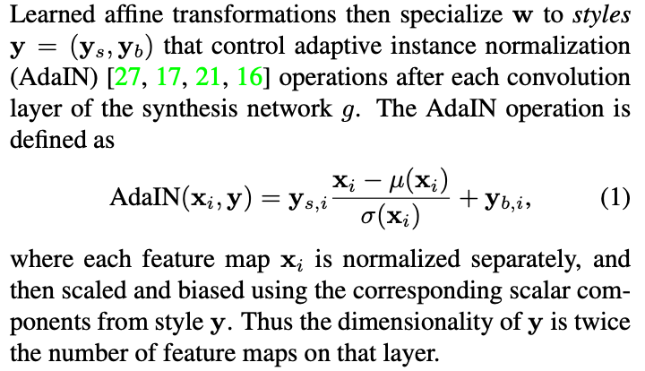

### [A Style-Based Generator Architecture for Generative Adversarial Networks](https://arxiv.org/abs/1812.04948)

- 2019 CVPR tensorFlow provid pre-trained model
- **[Code](https://github.com/NVlabs/stylegan)**
- automatiacally learned, unsupervised separation of high-level attributes (e.g., pose and identity when trained on faces) and stochastic variation in the generated images, (e.g. freckles, hair) and it enables intuitive, scale-specific control of the synthesis.

### [Training Generative Adversarial Networks with Limited Data](https://arxiv.org/abs/2006.06676)

- 2020 pytorch provied pre-trained model
- **[code](https://github.com/NVlabs/stylegan2-ada-pytorch)**
