### [Improving the Adversarial Robustness and Interpretability of Deep Neural Networks by Regularizing Their Input Gradients](https://ojs.aaai.org/index.php/AAAI/article/view/11504)

__Abstract__:
In this work, we evaluate the effectiveness of defenses
that differentiably penalize the degree to which small
changes in inputs can alter model predictions. Across multiple
attacks, architectures, defenses, and datasets, we find
that neural networks trained with this input gradient regularization
exhibit robustness to transferred adversarial examples
generated to fool all of the other models. We also find that
adversarial examples generated to fool gradient-regularized
models fool all other models equally well, and actually lead
to more “legitimate,” interpretable misclassifications as rated
by people (which we confirm in a human subject experiment).
Finally, we demonstrate that regularizing input gradients
makes them more naturally interpretable as rationales for
model predictions.

### [Gradient Adversarial Training of Neural Networks](https://arxiv.org/pdf/1806.08028.pdf)

__Method__:
1. abstract: We propose gradient adversarial training, an auxiliary deep learning framework applicable to different machine learning problems. In gradient adversarial training, we leverage a prior belief that in many contexts, simultaneous gradient updates should be statistically indistinguishable from each other. We enforce this consistency using an auxiliary network that classifies the origin of the gradient tensor, and the main network serves as an adversary to the auxiliary network in addition to performing standard task-based training. 

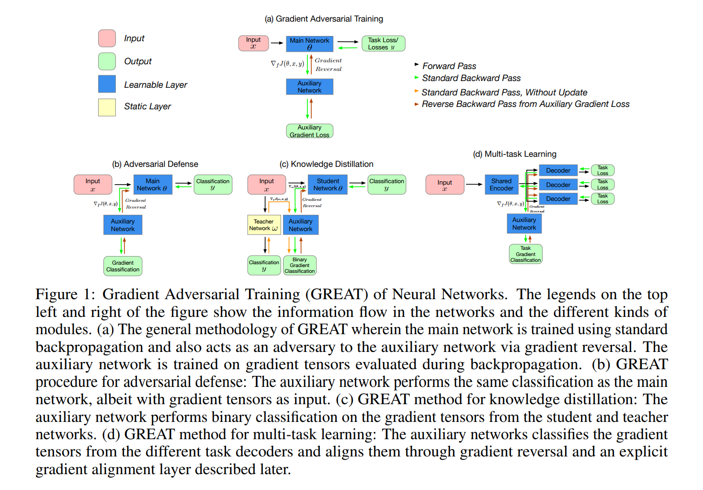

2. GREAT: The auxiliary network is trained to learn the gradient of the class. GREACE loss adapts the cross-entropy loss function to add weight to the negative classes whose gradient tensors are similar to those of the primary class. This added weight helps separate the high-dimensional decision boundary between easily confused classes.

3. They assume that simultaneous gradient updates should be statistically indistinguishable from each other.

__Q__: Does gradient tensors are similar means the two class are easily confused ??? Why??

__Experiments__:
1. Network&Dataset&Attack: 
ResNet-18
CIFAR10 - FGSM, iFGSM, 

SVHN - FGSM, iFGSM, 
target and untarget attack (random target class or least probability target class)

2. Code: NO
3. Experimental results:
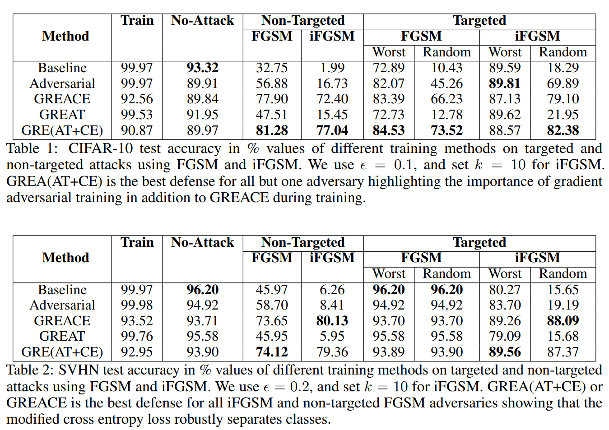
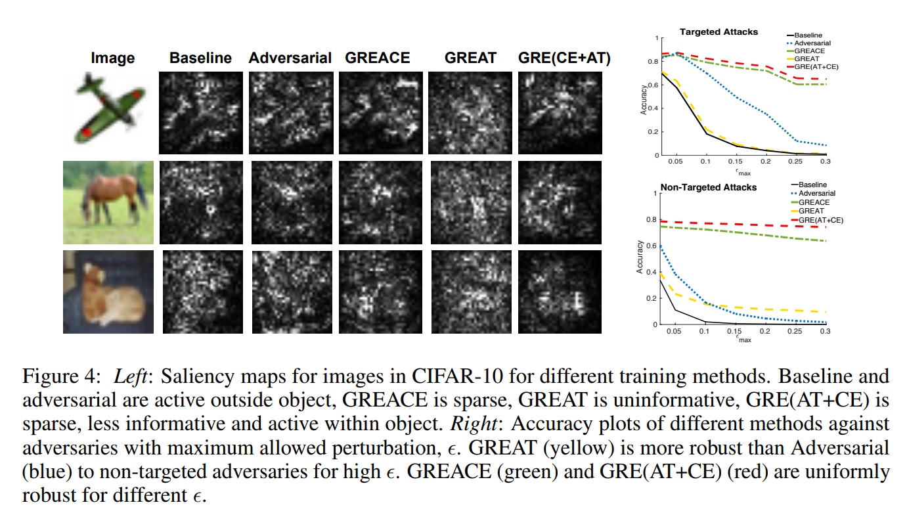

____________________

### [A Unified Gradient Regularization Family for Adversarial Examples](https://arxiv.org/pdf/1511.06385.pdf)

__Method__:
1. abstract: In this paper, we propose a unified framework to build robust machine learning models against adversarial examples. More specifically, using the unified framework, we develop a family of gradient regularization methods that effectively penalize the gradient of loss function w.r.t. inputs. Our proposed framework is appealing in that it offers a unified view to deal with adversarial examples.

2. special case: 
: reduced to the fast gradient sign method.

: Since we are constrained by the sum of absolute value of all perturbations, it is intuitive to put all of our “budgets” into one direction. It is not appealing since it only penalizes gradient in one direction.

: the second order Taylor expansion resembled the term induced by marginalizing over Gaussian noise.

__Experiments__:
1. Network&Dataset&Attack:
MNIST - 3 network(standard sigmoid multilayer perceptron, maxout network, convolutional maxout network)-  for convolutiona maxout network, ;  for the other 2.

CIFAR10 - maxout paper
2. Code: NO
3. Experimental results:
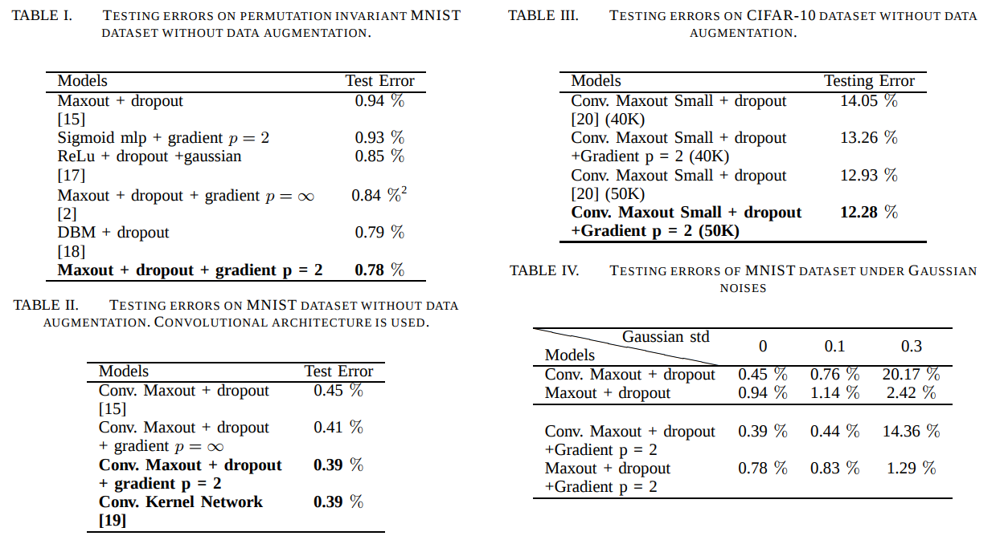
Only test on natural images or images with guassian noise.

____________________________________________________

### [Parametric Noise Injection: Trainable Randomness to Improve Deep Neural Network Robustness against Adversarial Attack](https://arxiv.org/abs/1811.09310)

__Method__:
1. abstract:
In this work, we propose Parametric-Noise-Injection (PNI) which involves
trainable Gaussian noise injection at each layer on either activation or weights through solving the min-max
optimization problem, embedded with adversarial training. These parameters are trained explicitly to
achieve improved robustness. To the best of our knowledge, this is the first work that uses trainable noise
injection to improve network robustness against adversarial attacks, rather than manually configuring the
injected noise level through cross-validation

__Experiments__:

1. Network&Dataset&Attack:
cifar10 - ResNet-18 - FGSM, PGD, CW, ZOO

2. Code: NO

3. Experimental results:

____________________
### [Adversarial Learning with Margin-based Triplet Embedding Regularization](http://openaccess.thecvf.com/content_ICCV_2019/papers/Zhong_Adversarial_Learning_With_Margin-Based_Triplet_Embedding_Regularization_ICCV_2019_paper.pdf)

1. abstract:
To address this
problem, we propose to improve the local smoothness of the
representation space, by integrating a margin-based triplet
embedding regularization term into the classification objective,
so that the obtained model learns to resist adversarial
examples. The regularization term consists of two steps optimizations
which find potential perturbations and punish
them by a large margin in an iterative way.
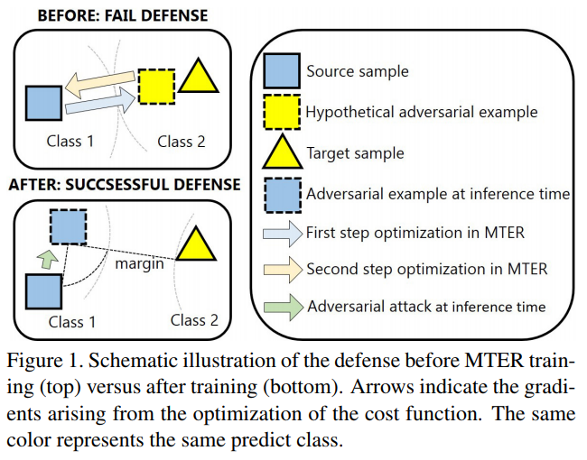

2. differenct to the existing work:
(1) Our MTER method is a straightforward and thorough
feature adversary which will not be limited by number
of training categories, therefore is also appropriate for openset
classification. (2) We introduce the large margin into adversarial
learning, which guarantees not only the intra-class
smoothness but also the inter-class distance in the embedding
space.

3. Margin-based Regularization:
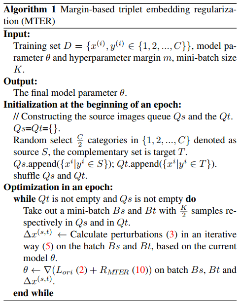

__Experiments__:

1. Network&Dataset&Attack:
MNIST- ResNet-18 - FGSM, IFGSM

CASIA-WebFace, VGGFace2, MS1M-IBUG - ResNet-50，ArcFace － FGSM, IFGSM

2. Code: [YES](https://github.com/zhongyy/Adversarial_MTER)

3. Experimental results:
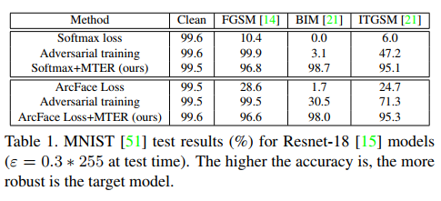

### [Cascade Adversarial Machine Learning Regularized with a Unified Embedding](https://arxiv.org/abs/1708.02582)
__Method__:
1. abstract:
Injecting adversarial examples during training, known as adversarial training, can
improve robustness against one-step attacks, but not for unknown iterative attacks.
To address this challenge, we first show iteratively generated adversarial
images easily transfer between networks trained with the same strategy. Inspired
by this observation, we propose cascade adversarial training, which transfers the
knowledge of the end results of adversarial training. We train a network from
scratch by injecting iteratively generated adversarial images crafted from already
defended networks in addition to one-step adversarial images from the network
being trained. We also propose to utilize embedding space for both classification
and low-level (pixel-level) similarity learning to ignore unknown pixel level perturbation.

2. iterative adversarial attack is easier to transform between networks than the single step attack.

3. Cascade adversarial training:
We propose cascade adversarial training, which trains a network by injecting iter FGSM images crafted
from an already defended network. We hypothesize that the network being trained with cascade
adversarial training will learn to avoid such adversarial perturbation, enhancing robustness against
iter FGSM attack. 

3. Bidirection loss: minimizes the distance between the two embeddings by moving both clean and
adversarial embeddings as shown in the left side of the figure 3.

Pivot loss : minimizes the distance between the two embeddings by moving only the adversarial
embeddings as shown in the right side of the figure 3.

__Experiments__:
1. Network&Dataset&Attack:
Cifar10, MNIST - ResNet(20,56,110) - FGSM, IFGSM,CW

2. Code: [YES](https://github.com/taesikna/cascade_adv_training)

3. Experimental results:
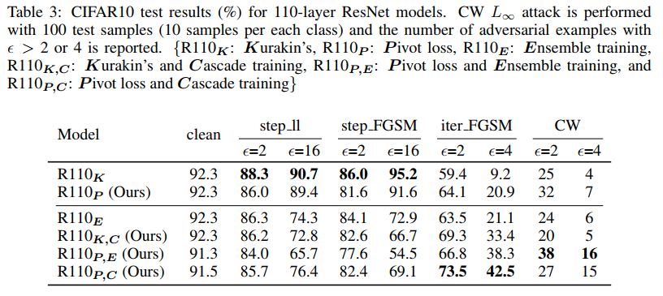

### [Towards Interpretable Deep Neural Networks by Leveraging Adversarial Examples](https://arxiv.org/abs/1708.05493)

__Method__:
1.abstract:
In this paper, we re-examine the internal representations of DNNs using adversarial images, which are generated by an ensemble-optimization algorithm. We find that: (1) the neurons in DNNs do not truly detect semantic objects/parts, but respond to objects/parts only as recurrent discriminative patches; (2) deep visual representations are not robust distributed codes of visual concepts because the representations of adversarial images are largely not consistent with those of real images, although they have similar visual appearance, both of which are different from previous findings. To further improve the interpretability of DNNs, we propose an adversarial training scheme with a consistent loss such that the neurons are endowed with human-interpretable concepts.

2. Ensemble-Optimization Attack:. Since the adversarial examples generated
for a specific model are model-sensitive, we instead generate
them by an ensemble-optimization attack algorithm
following
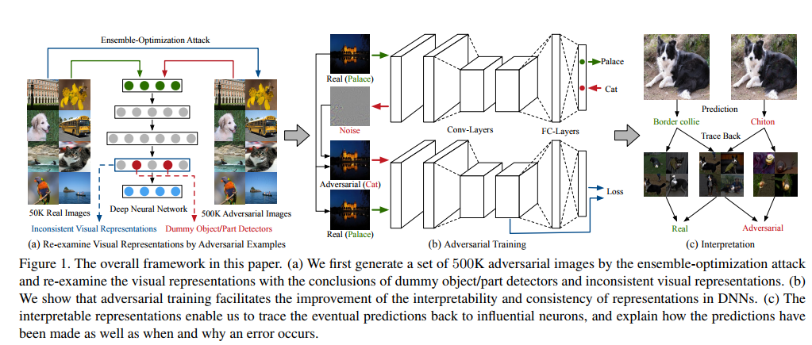

__Experiments__:
1. Network&Dataset&Attack:
ILSVRC 2012 - AlexNet, VGG-16 and ResNet-18 -FGSM
2. Code: No

3. Experimental results:
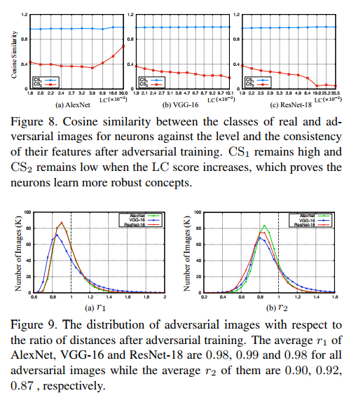

### [Improving Adversarial Robustness via Guided Complement Entropy](http://openaccess.thecvf.com/content_ICCV_2019/papers/Chen_Improving_Adversarial_Robustness_via_Guided_Complement_Entropy_ICCV_2019_paper.pdf)
__Method__:
1.abstract:
In this paper, we propose a new training
paradigm called Guided Complement Entropy (GCE) that
is capable of achieving “adversarial defense for free,” which
involves no additional procedures in the process of improving
adversarial robustness. In addition to maximizing
model probabilities on the ground-truth class like crossentropy,
we neutralize its probabilities on the incorrect
classes along with a “guided” term to balance between
these two terms.

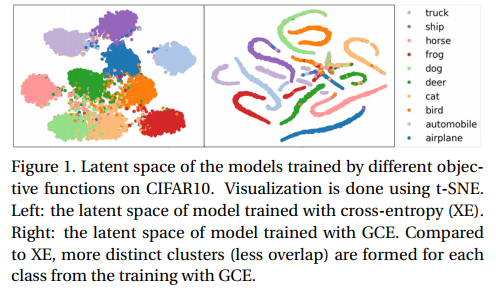

__Experiments__:
1. Network&Dataset&Attack:
MNIST CIFAR10 CIFAR100 Tiny ImageNet - LeNet-5 ResNet-56 ResNet-50 - FGSM, IFGSM, PGD, MIFGSM, CW,JSMA

2. Code: No

3. Experimental results:

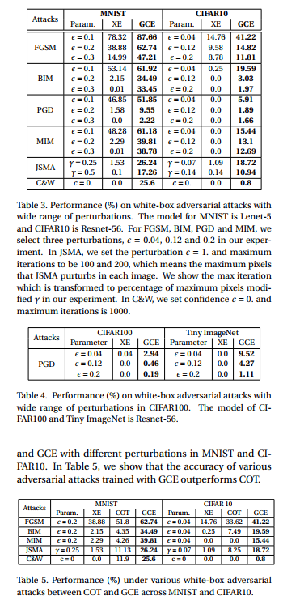

### [Adversarial Defense by Restricting the Hidden Space of Deep Neural Networks](http://openaccess.thecvf.com/content_ICCV_2019/papers/Mustafa_Adversarial_Defense_by_Restricting_the_Hidden_Space_of_Deep_Neural_ICCV_2019_paper.pdf)

__Method__:

1.abstract:
The robustness of existing defenses
suffers greatly under white-box attack settings, where
an adversary has full knowledge about the network and can
iterate several times to find strong perturbations. We observe
that the main reason for the existence of such perturbations
is the close proximity of different class samples
in the learned feature space. This allows model decisions
to be totally changed by adding an imperceptible perturbation
in the inputs. To counter this, we propose to class-wise
disentangle the intermediate feature representations of deep
networks. Specifically, we force the features for each class
to lie inside a convex polytope that is maximally separated
from the polytopes of other classes

2. loss function

Cross-entropy Objective: The cross-entropy objective
function maximizes the dot product between an input feature
fi and its true class representative vector wy, such that
wy ∈ W. In other words, cross-entropy loss forces the
classifier to learn a mapping from feature to output space
such that the projection on to the correct class vector is maximized:

Proposed Objective: We represent each class with its prototype
vector, which represents the training examples of that
class. Each class is assigned a fixed and non-overlapping p-norm
ball and the training samples belonging to a class i are
encouraged to be mapped close to its hyper-ball center.

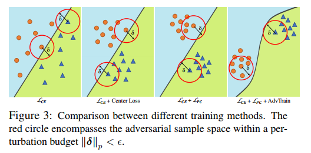

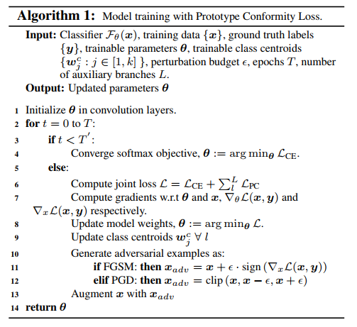

__Experiments__:
1. Network&Dataset&Attack:
 MNIST, Fasion-MNIST (FMNIST),CIFAR-10, CIFAR-100 and SVHN - CNN-6 (MNIST, FMNIST) and ResNet-110 (CIFAR-10,100 and SVHN) - FGSM, IFGSM, PGD, MIFGSM, CW

2. Code: [Yes](https://github.com/aamir-mustafa/pcl-adversarial-defense)

3. Experimental results:
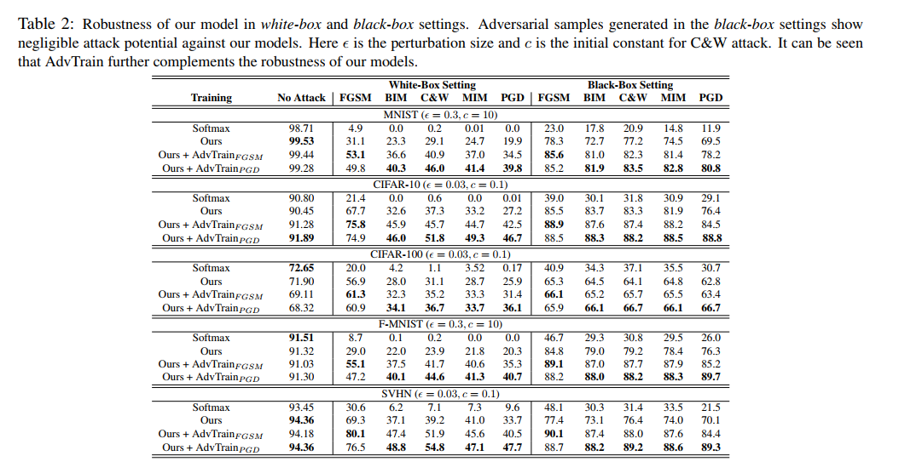
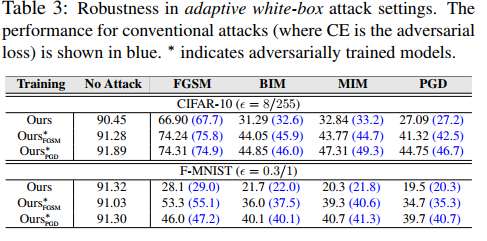
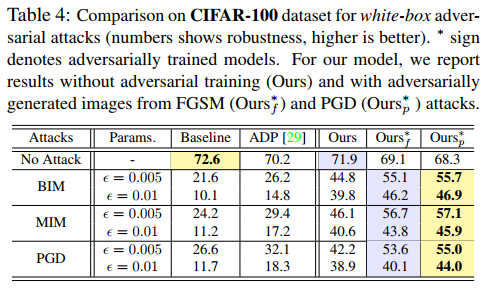

