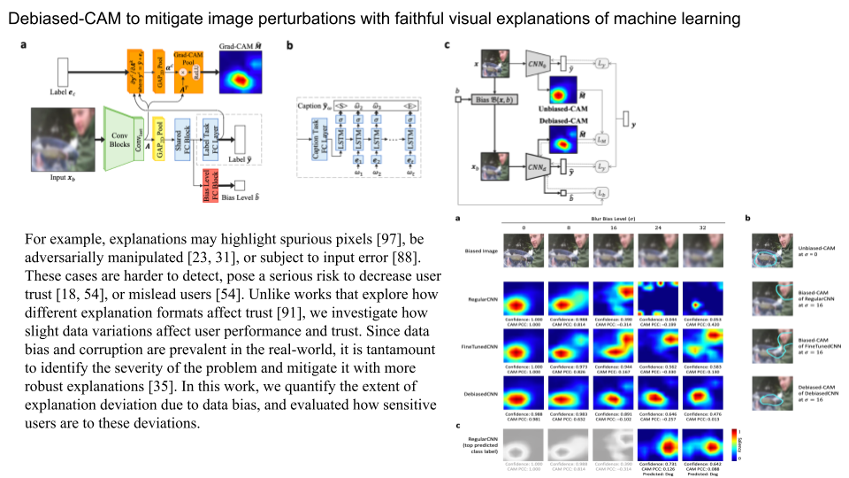

Question:

Why we are not happy with the current saliency map?

What is a satisfied saliency map?

### [On Relating Explanations and Adversarial Examples](https://proceedings.neurips.cc/paper/2019/file/7392ea4ca76ad2fb4c9c3b6a5c6e31e3-Paper.pdf)

The paper proposes the dual concept of counterexample, the notion of breaking an explanation or a
counterexample, and shows that each explanation must break every counterexample and vice-versa.
This property is tightly related with the concept of hitting set duality between diagnoses and conflicts
in model-based diagnosis [45], but also with computation of prime implicants and implicates of
Boolean functions [51]. The paper also overviews algorithms for computing explanations from
counterexamples and vice-versa. Furthermore, the paper shows how adversarial examples can be
computed given a reference instance in feature space and counterexample that minimizes the distance
to the instance. The experimental evidence illustrates the applicability of the duality relationship
between explanations and counterexamples (and adversarial examples)

A feature cannot be counterexample and explanation. It seems indicated that we should distangle/select the feature????

[code](https://github.com/alexeyignatiev/xpce-duality/blob/master/compile.py)

### [THE (UN)RELIABILITY OF SALIENCY METHODS](https://arxiv.org/pdf/1711.00867.pdf)

In order to guarantee reliability, we posit that methods should fulfill input invariance, the requirement that a saliency method mirror the sensitivity of the model
with respect to transformations of the input.

### [Keep CALM and Improve Visual Feature Attribution](https://openaccess.thecvf.com/content/ICCV2021/papers/Kim_Keep_CALM_and_Improve_Visual_Feature_Attribution_ICCV_2021_paper.pdf)

### [Neural Response Interpretation through the Lens of Critical Pathways](https://openaccess.thecvf.com/content/CVPR2021/papers/Khakzar_Neural_Response_Interpretation_Through_the_Lens_of_Critical_Pathways_CVPR_2021_paper.pdf)

### [RESTRICTING THE FLOW: INFORMATION BOTTLENECKS FOR ATTRIBUTION](https://openreview.net/pdf?id=S1xWh1rYwB)
- ICLR 2020
- IBA
- use the mutual information to make sure only most important region remain

### [Understanding Deep Networks via Extremal Perturbations and Smooth Masks](https://arxiv.org/pdf/1910.08485.pdf)
- 2019
- bineary mask
- mask is defined by a discrete lattice, and smooth the region with smooth function (Gaussian blur, convolution operator, max-convolution operator)

### [NBDT: NEURAL-BACKED DECISION TREE](https://arxiv.org/pdf/2004.00221.pdf)

### [Optimizing Relevance Maps of Vision Transformers Improves Robustness](https://arxiv.org/pdf/2206.01161.pdf)

## Formal explainability of DNNs

#### [Don’t Lie to Me! Robust and Efficient Explainability with Verified Perturbation Analysis]()

#### [Towards Trustable Explainable AI]()

#### [Abduction-Based Explanations for Machine Learning Models]()

#### [From Contrastive to Abductive Explanations and Back Again]()

#### [Efficient Explanations with Relevant Sets]()

#### [Reluplex:AnEfficient SMT Solver for Verifying Deep Neural Networks]()

#### [On Tractable Representations of Binary Neural Networks]()

#### [The Computational Complexity of Understanding Binary Classifier Decisions]()

### [Debiased-CAM to mitigate image perturbations with faithful visual explanations of machine learning](http://www.iri.upc.edu/files/scidoc/2555-Debiased-CAM-to-mitigate-image-perturbations-with-faithful-visual-explanations-of-machine-learning-.pdf)
- 2022 CHI Conference on Human Factors in Computing Systems

## Heuristic XAI

#### [A Unified Approach to Interpreting Model Predictions]()

#### [“Why should I Trust You?” Explaining the Predictions of any Classifier]()

#### [Anchors: High-Precision Model-Agnostic Explanations]()

## CAM-based

#### [HIGH-RESOLUTION CLASS ACTIVATION MAPPING](https://ieeexplore.ieee.org/stamp/stamp.jsp?arnumber=8803474&casa_token=jnDXtwnOKMEAAAAA:73sXA8Yv6_XnG6-96BC3gZasnbbhONxe626HfVVq6Gle1-0UGu0ZTzLvAGL-yCjC-9oxK7B4ue_4&tag=1)

#### [Towards Rich Feature Discovery with Class Activation Maps Augmentation for Person Re-Identification](https://openaccess.thecvf.com/content_CVPR_2019/papers/Yang_Towards_Rich_Feature_Discovery_With_Class_Activation_Maps_Augmentation_for_CVPR_2019_paper.pdf)

#### [Mask-GradCAM: Object Identification and Localization of Visual Presentation for Deep Convolutional Network](https://ieeexplore.ieee.org/stamp/stamp.jsp?arnumber=9358569&casa_token=4u6j5jXu5qUAAAAA:sLMhSM308rEjO7BHG9AyRitNje8tDUiWAjYC2FsG7nxR7epDGlw9cVNROzEEaqgcN5nkGtAY4BZT)

#### [Towards Better Explanations of Class Activation Mapping](https://openaccess.thecvf.com/content/ICCV2021/papers/Jung_Towards_Better_Explanations_of_Class_Activation_Mapping_ICCV_2021_paper.pdf)

#### [F-CAM: Full Resolution Class Activation Maps via Guided Parametric Upscaling](https://openaccess.thecvf.com/content/WACV2022/papers/Belharbi_F-CAM_Full_Resolution_Class_Activation_Maps_via_Guided_Parametric_Upscaling_WACV_2022_paper.pdf)

### [Improving Interpretability by Information Bottleneck Saliency Guided Localization](https://bmvc2022.mpi-inf.mpg.de/0605.pdf)

- saliency suppression mechanism: the saliency map of ground truth should be different from saliency map of other class (we can follow the same idea, instead of feeding masked images and make decision, we just check the overlap)
- information bottleneck guided localization, check if the region of saliency maps contains information that is useful for classification (IBM)
- they use ibm saliency map as ground truth for grad-cam saliency map, minimize the kl distance between current feature map to previous feature map

### [Improving Deep Learning Interpretability by Saliency Guided Training](https://arxiv.org/pdf/2111.14338.pdf)
- mask the image with top k pixel sorted by gradient, force masked images as similar as possible to original one

### [Use HiResCAM instead of Grad-CAM for faithful explanations of convolutional neural networks](https://arxiv.org/pdf/2011.08891.pdf)
- Instead of summing up the gradient for each channel, they directly multiply the gradient with a feature map element-wise

### [Libra-CAM: An Activation-Based Attribution Based on the Linear Approximation of Deep Neural Nets and Threshold Calibration](https://www.ijcai.org/proceedings/2022/0442.pdf)

### [LFI-CAM: Learning Feature Importance for Better Visual Explanation](https://openaccess.thecvf.com/content/ICCV2021/papers/Lee_LFI-CAM_Learning_Feature_Importance_for_Better_Visual_Explanation_ICCV_2021_paper.pdf)
- ICCV 2021
- Using an attention branch to learn feature importance (score) then use them to weigh the last feature maps to get attention maps; The adding an attention mechanism between feature maps and attention map.
- Comment: The attention mechanism is better than using an attention map to mask features (problem of range of values). 

### [Explaining Local, Global, And Higher-Order Interactions In Deep Learning](https://openaccess.thecvf.com/content/ICCV2021/papers/Lerman_Explaining_Local_Global_and_Higher-Order_Interactions_in_Deep_Learning_ICCV_2021_paper.pdf)
- ICCV 2021 Taylor-CAM
- Interaction effects

