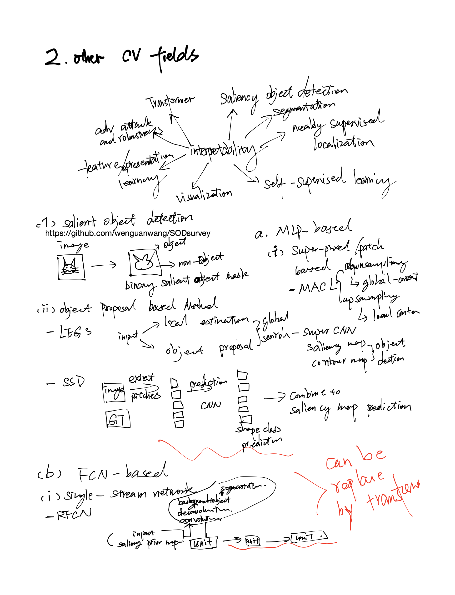

Question:

Why we are not happy with the current saliency map?

What is a satisfied saliency map?

### [On Relating Explanations and Adversarial Examples](https://proceedings.neurips.cc/paper/2019/file/7392ea4ca76ad2fb4c9c3b6a5c6e31e3-Paper.pdf)

The paper proposes the dual concept of counterexample, the notion of breaking an explanation or a
counterexample, and shows that each explanation must break every counterexample and vice-versa.
This property is tightly related with the concept of hitting set duality between diagnoses and conflicts
in model-based diagnosis [45], but also with computation of prime implicants and implicates of
Boolean functions [51]. The paper also overviews algorithms for computing explanations from
counterexamples and vice-versa. Furthermore, the paper shows how adversarial examples can be
computed given a reference instance in feature space and counterexample that minimizes the distance
to the instance. The experimental evidence illustrates the applicability of the duality relationship
between explanations and counterexamples (and adversarial examples)

A feature cannot be counterexample and explanation. It seems indicated that we should distangle/select the feature????

[code](https://github.com/alexeyignatiev/xpce-duality/blob/master/compile.py)

### [THE (UN)RELIABILITY OF SALIENCY METHODS](https://arxiv.org/pdf/1711.00867.pdf)

In order to guarantee reliability, we posit that methods should fulfill input invariance, the requirement that a saliency method mirror the sensitivity of the model
with respect to transformations of the input.

### [Keep CALM and Improve Visual Feature Attribution](https://openaccess.thecvf.com/content/ICCV2021/papers/Kim_Keep_CALM_and_Improve_Visual_Feature_Attribution_ICCV_2021_paper.pdf)

### [Neural Response Interpretation through the Lens of Critical Pathways](https://openaccess.thecvf.com/content/CVPR2021/papers/Khakzar_Neural_Response_Interpretation_Through_the_Lens_of_Critical_Pathways_CVPR_2021_paper.pdf)

### [RESTRICTING THE FLOW: INFORMATION BOTTLENECKS FOR ATTRIBUTION](https://openreview.net/pdf?id=S1xWh1rYwB)
- ICLR 2020
- IBA
- use the mutual information to make sure only most important region remain

### [Understanding Deep Networks via Extremal Perturbations and Smooth Masks](https://arxiv.org/pdf/1910.08485.pdf)
- 2019
- bineary mask
- mask is defined by a discrete lattice, and smooth the region with smooth function (Gaussian blur, convolution operator, max-convolution operator)

### [NBDT: NEURAL-BACKED DECISION TREE](https://arxiv.org/pdf/2004.00221.pdf)

### [Optimizing Relevance Maps of Vision Transformers Improves Robustness](https://arxiv.org/pdf/2206.01161.pdf)

