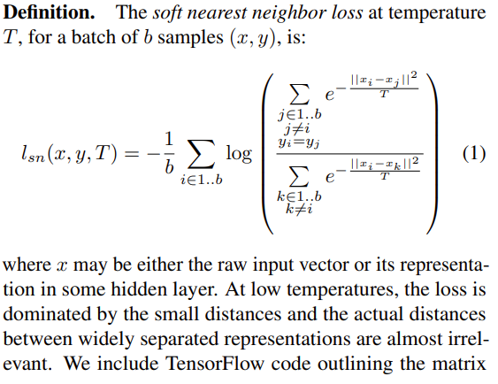

### [Defending Against Adversarial Examples with K-Nearest Neighbor](https://arxiv.org/pdf/1906.09525.pdf)
[code](https://github.com/chawins/knn-defense)

#### Related Works

#####  Deep k-Nearest Neighbors ([Analyzing and Improving Representations with the Soft Nearest Neighbor Loss](https://arxiv.org/abs/1902.01889))

__Soft Nearest Neighbor Loss__:

##### [mixup: Beyond Empirical Risk Minimization](https://arxiv.org/abs/1710.09412)

#### Experiments
Two Settings:
1. Heuristic Defense
2. Certifiable Defense

**7 models**
1. Vanilla CNN
2. [NN trianed with soft nearest neighbor loss (SNN loss)](https://arxiv.org/abs/1902.01889)

3. [NN trained with input mixup](https://arxiv.org/abs/1710.09412)
4. [NN trained with manifold mixup](https://arxiv.org/abs/1806.05236)
5. AutoEncoder
6. VAE
7. [Rotation Prediction](https://arxiv.org/abs/1803.07728)

### [EXPLOITING CNN LAYER ACTIVATIONS TO IMPROVE ADVERSARIAL IMAGE CLASSIFICATION](https://ieeexplore.ieee.org/stamp/stamp.jsp?arnumber=8803776&tag=1)

### [Adversarial image detection in deep neural networks](http://www.nmis.isti.cnr.it/falchi/Draft/2018-MTAP-adv.pdf)