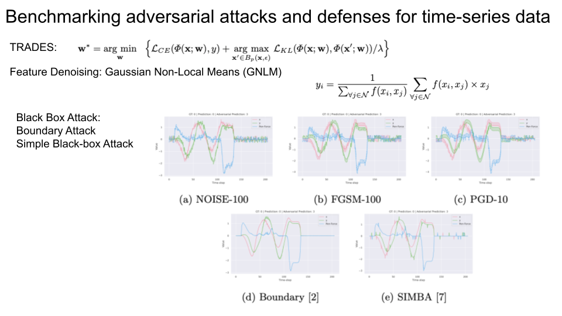

### [Smooth Perturbations for Time Series Adversarial Attacks](https://germain-forestier.info/publis/pakdd2022.pdf)
- 2022 PAKDD

### [Adversarial Attacks on Time Series](https://arxiv.org/pdf/1902.10755.pdf)
- 2021 IEEE TPAMI

### [Benchmarking adversarial attacks and defenses for time-series data](https://arxiv.org/pdf/2008.13261.pdf)
- 2020

### [Adversarial Attacks on Deep Neural Networks for Time Series Classification](https://ieeexplore.ieee.org/stamp/stamp.jsp?arnumber=8851936&casa_token=Zleksid02isAAAAA:GiTeZsLxEz0HytsGBDjQeCoRGKXEWLZOrXx4r64fwBHMUCICMPhUaLqLPyLRYU48wLSEUuScikft&tag=1)
- 2019 IJCNN
- BIM FGSM

### [Adversarial Examples in Deep Learning for Multivariate Time Series Regression](https://ieeexplore.ieee.org/stamp/stamp.jsp?arnumber=9425190&casa_token=RvPAPVoowuQAAAAA:0D4XH7M0WKVLqDlWtGQRcBFG69rcMFYVb_cSaxzVM-6yA7IUY_qvVIRaoQeGkDUm71ax4pAbROND)
- BIM FGSM

