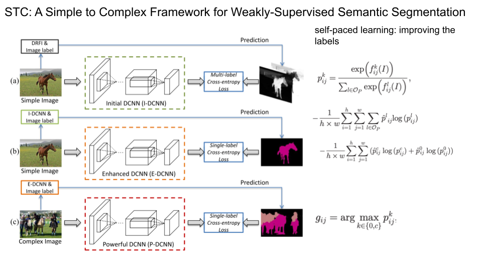
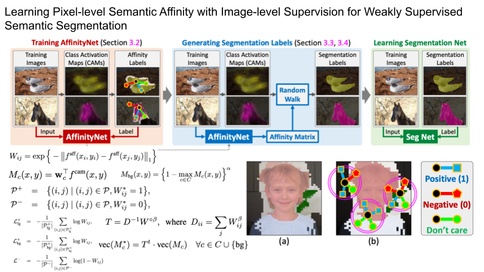
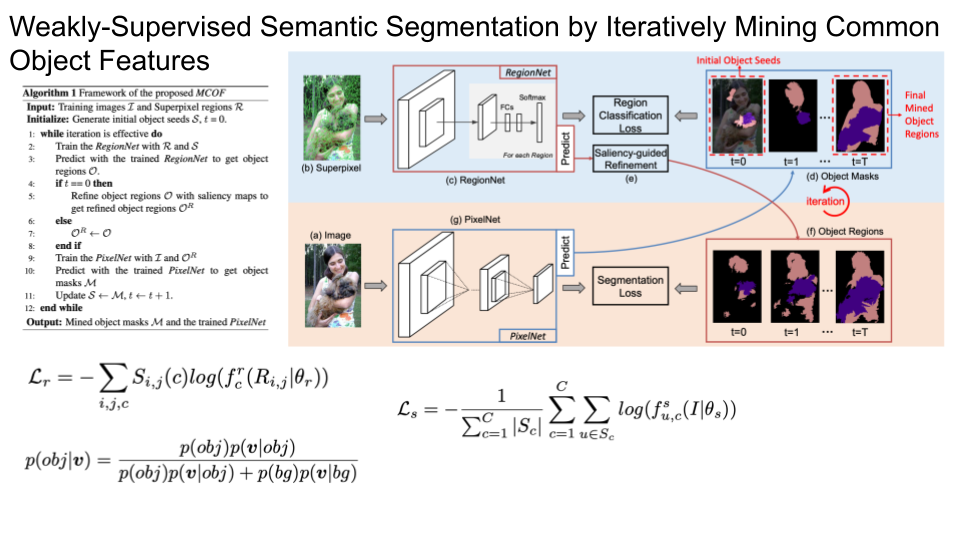
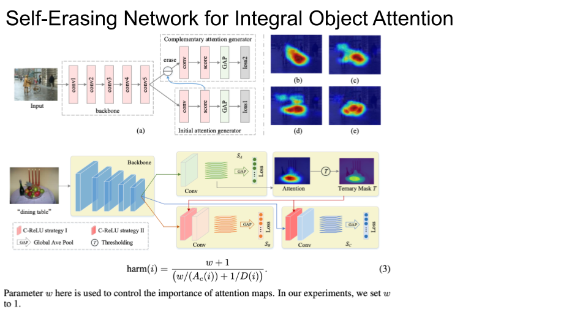
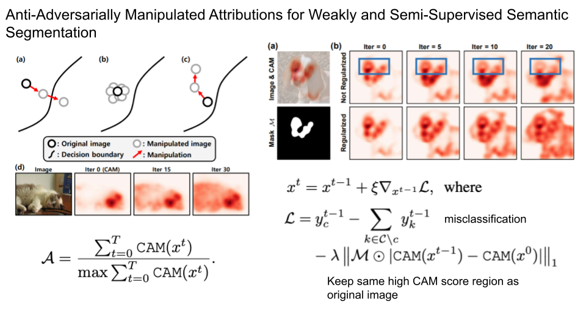

### [Constrained convolutional neural networks for weakly supervised segmentation](https://openaccess.thecvf.com/content_iccv_2015/papers/Pathak_Constrained_Convolutional_Neural_ICCV_2015_paper.pdf)
- 2015 CVPR
- CCNN
- No Saliency

### [Weakly-and semi-supervised learning of a deep convolutional network for semantic image segmentation](https://ieeexplore.ieee.org/document/7410560)
- 2015 ICCV
- EM-Adapt
- no saliency

### [From image-level to pixel-level labeling with convolutional networks](https://www.cv-foundation.org/openaccess/content_cvpr_2015/papers/Pinheiro_From_Image-Level_to_2015_CVPR_paper.pdf)
- 2015 CVPR
- MIL-Seq
- no saliency

### [Seed, expand and constrain: Three principles for weakly-supervised image segmentation](https://arxiv.org/abs/1603.06098)
- 2016 ECCV
- SEC
- no Saliency

### [STC: A Simple to Complex Framework for Weakly-Supervised Semantic Segmentation](https://ieeexplore.ieee.org/stamp/stamp.jsp?arnumber=7775087&casa_token=GVpLKpj5ph0AAAAA:v60Oe6aI3TbLmlvv3BvYG2LSTQ15Co823UC2pszc_6_I7fkbzHHzUALlzkl8jX_hccaAAj60i3OTkQ&tag=1)
- 2017 IEEE TPAMI
- saliency

### [Object region mining with adversarial erasing: A simple classification to semantic segmentation approach](https://openaccess.thecvf.com/content_cvpr_2017/papers/Wei_Object_Region_Mining_CVPR_2017_paper.pdf)
- 2017 CVPR
- AdvErasing
- saliency

### [Discovering class-specific pixels for weakly-supervised semantic segmentation](https://www.robots.ox.ac.uk/~tvg/publications/2017/dcsp_final.pdf)
- 2017 BMVC
- DCSP
- saliency

### [Learning Pixel-level Semantic Affinity with Image-level Supervision for Weakly Supervised Semantic Segmentation](https://openaccess.thecvf.com/content_cvpr_2018/papers/Ahn_Learning_Pixel-Level_Semantic_CVPR_2018_paper.pdf)
- 2018 CVPR
- AffinityNet
- No saliency

### [Revisiting dilated convolution: A simple approach for weakly-and semi-supervised semantic segmentation](https://openaccess.thecvf.com/content_cvpr_2018/papers/Wei_Revisiting_Dilated_Convolution_CVPR_2018_paper.pdf)
- 2018 CVPR
- MDC
- saliency

### [Weaklysupervised semantic segmentation by iteratively mining common object features](https://openaccess.thecvf.com/content_cvpr_2018/papers/Wang_Weakly-Supervised_Semantic_Segmentation_CVPR_2018_paper.pdf)
- 2018 CVPR
- MCOF
- saliency

### [Self-erasing network for integral object attention](https://proceedings.neurips.cc/paper/2018/file/c042f4db68f23406c6cecf84a7ebb0fe-Paper.pdf)
- 2018 NIPS
- SeeNet
- saliency

### [Weakly-supervised semantic segmentation network with deep seeded region growing](https://openaccess.thecvf.com/content_cvpr_2018/papers/Huang_Weakly-Supervised_Semantic_Segmentation_CVPR_2018_paper.pdf)
- 2018 CVPR
- DSRG
- saliency

### [Weakly supervised learning of instance segmentation with inter-pixel relations](https://openaccess.thecvf.com/content_CVPR_2019/papers/Ahn_Weakly_Supervised_Learning_of_Instance_Segmentation_With_Inter-Pixel_Relations_CVPR_2019_paper.pdf)
- 2019 CVPR
- IrNET
- no saliency

### [Ficklenet: Weakly and semi-supervised semantic image segmentation using stochastic inference](https://openaccess.thecvf.com/content_CVPR_2019/papers/Lee_FickleNet_Weakly_and_Semi-Supervised_Semantic_Image_Segmentation_Using_Stochastic_Inference_CVPR_2019_paper.pdf)
- 2019 CVPR
- Ficklenet
- saliency

### [Cian: Cross-image affinity net for weakly supervised semantic segmentation](https://ojs.aaai.org/index.php/AAAI/article/view/6705)
- 2020 AAAI
- Cian
- saliency

### [Self-supervised Equivariant Attention Mechanism for Weakly Supervised Semantic Segmentation](https://openaccess.thecvf.com/content_CVPR_2020/papers/Wang_Self-Supervised_Equivariant_Attention_Mechanism_for_Weakly_Supervised_Semantic_Segmentation_CVPR_2020_paper.pdf)
- 2020 CVPR
- SEAM
- Saliency

### [Self-supervised difference detection for weakly-supervised semantic segmentation](https://openaccess.thecvf.com/content_ICCV_2019/papers/Shimoda_Self-Supervised_Difference_Detection_for_Weakly-Supervised_Semantic_Segmentation_ICCV_2019_paper.pdf)
- ICCV 2019
- SSDD

### [Mining cross-image semantics for weakly supervised semantic segmentation](https://www.ecva.net/papers/eccv_2020/papers_ECCV/papers/123470341.pdf)
- ECCV 2020 

### [Weaklysupervised semantic segmentation via sub-category exploration](https://openaccess.thecvf.com/content_CVPR_2020/papers/Chang_Weakly-Supervised_Semantic_Segmentation_via_Sub-Category_Exploration_CVPR_2020_paper.pdf)
- CVPR 2020

### [Causal intervention for weakly-supervised semantic segmentation](https://proceedings.neurips.cc/paper/2020/file/07211688a0869d995947a8fb11b215d6-Paper.pdf)
- NIPS 2020

### [Non-salient region object mining for weakly supervised semantic segmentation](https://openaccess.thecvf.com/content/CVPR2021/papers/Yao_Non-Salient_Region_Object_Mining_for_Weakly_Supervised_Semantic_Segmentation_CVPR_2021_paper.pdf)
- CVPR 2021

### [Affinity attention graph neural network for weakly supervised semantic segmentation](https://ora.ox.ac.uk/objects/uuid:6979ca15-94ad-42d5-b842-db28540f808d)
- 2021 TPAMI
- A2GNN

### [Leveraging auxiliary tasks with affinity learning for weakly supervised semantic segmentation](https://openaccess.thecvf.com/content/ICCV2021/papers/Xu_Leveraging_Auxiliary_Tasks_With_Affinity_Learning_for_Weakly_Supervised_Semantic_ICCV_2021_paper.pdf)
- 2021 ICCV
- AugSegNet

### [Embedded discriminative attention mechanism for weakly supervised semantic segmentation](https://openaccess.thecvf.com/content/CVPR2021/papers/Wu_Embedded_Discriminative_Attention_Mechanism_for_Weakly_Supervised_Semantic_Segmentation_CVPR_2021_paper.pdf)
- CVPR 2021
- EDAM

### [Antiadversarially manipulated attributions for weakly and semisupervised semantic segmentation](https://openaccess.thecvf.com/content/CVPR2021/papers/Lee_Anti-Adversarially_Manipulated_Attributions_for_Weakly_and_Semi-Supervised_Semantic_Segmentation_CVPR_2021_paper.pdf)
- CVPR 2021
- AdvCAM

### [Unlocking the potential of ordinary classifier: Class-specific adversarial erasing framework for weakly supervised semantic segmentation](https://openaccess.thecvf.com/content/ICCV2021/papers/Kweon_Unlocking_the_Potential_of_Ordinary_Classifier_Class-Specific_Adversarial_Erasing_Framework_ICCV_2021_paper.pdf)
－ ICCV 2021
- CSE

### [Pseudo-mask matters in weakly-supervised semantic segmentation](https://openaccess.thecvf.com/content/ICCV2021/papers/Li_Pseudo-Mask_Matters_in_Weakly-Supervised_Semantic_Segmentation_ICCV_2021_paper.pdf)
- ICCV 2021
- PMM

### [Weakly Supervised Semantic Segmentation using Out-of-Distribution Data](https://openaccess.thecvf.com/content/CVPR2022/papers/Lee_Weakly_Supervised_Semantic_Segmentation_Using_Out-of-Distribution_Data_CVPR_2022_paper.pdf)
- 2022 CVPR
- OoD

_____________Ronan's recommmendation_________

### [Transformer based multiple instance learning for weakly supervised histopathology image segmentation](https://arxiv.org/pdf/2205.08878.pdf)

### [BOXTEACHER: EXPLORING HIGH-QUALITY PSEUDO LABELS FOR WEAKLY SUPERVISED INSTANCE SEGMENTATION](https://arxiv.org/pdf/2210.05174.pdf)

### [Weakly-supervised segmentation using inherently-explainable classification models and their application to brain tumour classification](https://arxiv.org/pdf/2206.05148.pdf)

### [CaCL: class-aware codebook learning for weakly supervised segmentation on diffuse image patterns](https://arxiv.org/pdf/2011.00794.pdf)

### [ECS-Net: Improving Weakly Supervised Semantic Segmentation by Using Connections Between Class Activation Maps](https://openaccess.thecvf.com/content/ICCV2021/papers/Sun_ECS-Net_Improving_Weakly_Supervised_Semantic_Segmentation_by_Using_Connections_Between_ICCV_2021_paper.pdf)
