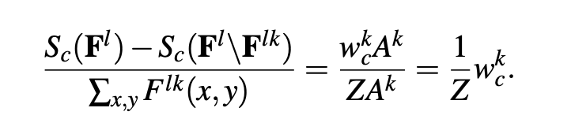
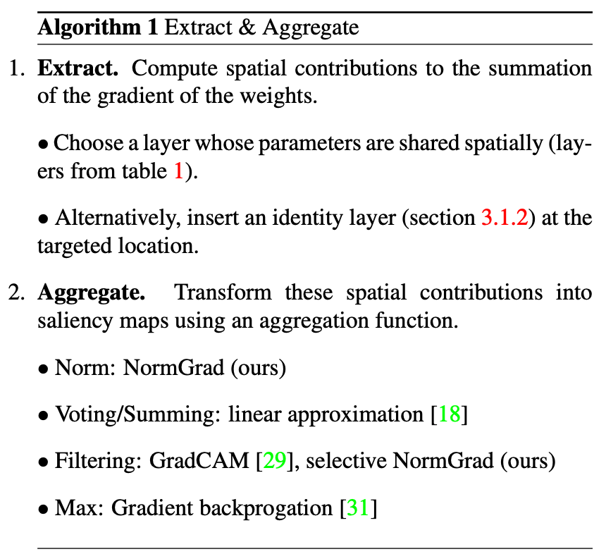

### CAM based methods

- **CAM** established one approach towards interpretability, class activation maps. Interpretability as saliency for discriminative regions (2015)

- **Grad-CAM** generalization of CAM. Use gradient to obtain weight importance and no need of training (2016)

- **Smooth Grad** improving stand gradient by adding noise and make the average (2017)
- **Grad-CAM++** improving Grad-CAM by soveling the issues that there are multiple accurrences of same object with slightly different orientations or views. It takes a weighted average of pixel-wise gradients (2018)
- **Smooth Grad-CAM++** smooth grad + grad-CAM++; takes interest in grad-CAM++'s apprach for getting fradient weights by adding the denoising in the partial derivatives (2019)
- **Score CAM** get rid of gradient dependency, assigns weights for each activation map by forward pass score on target class. They define tha increase in confidence by the contribution ci for a known baseline input xb, xi towards y, which is the change in the output by replacing the ith entry in xb with xi.(2020)
- **Integrated Grad** take the integrad of the gradient, find a path from baseline (random image or black image) to input, then calculate the gradients for each of points and make the average, multiply it with the difference between baseline and input.(2020)
- **IS-CAM** score CAM + integrated grad (2020) 
- **SS-CAM** smooth grad + score CAM(2020)
- **LagerCAM** grad CAM variant leveraging pixel-wise contribution to gradient to the activation(2020)
- **[AblationCAM](https://openaccess.thecvf.com/content_WACV_2020/papers/Desai_Ablation-CAM_Visual_Explanations_for_Deep_Convolutional_Network_via_Gradient-free_Localization_WACV_2020_paper.pdf)** use DE, i.e. (y - y_k)/||A_k|| instead of the gradient from y to A_k (2020)

- **[XGrad-GAM](https://arxiv.org/pdf/2008.02312.pdf)** start with the axiom of sensitivity and conservation, the score define as the normalized grad cam(2021)

- **[Norm Grad](https://arxiv.org/abs/2004.02866)** Redifine the framework of cam, divided it into two phrases, one is to extract gradients or weights of network, another is to aggragate and get the saliency map(2020)

－ **[Eigen-CAM](https://arxiv.org/abs/2008.00299)** Uses the principla component of the learned representation from CNN to create the visual explanation (2021)
- **[]**

### Evaluation protocol

#### Grad-CAM++: object recoginition and localization
- objective evaluation for object recognition: explanation map : Ec = Lc * I
- Average Drop(AD): \sum max(0, yi-pi)/pi. yi: prob age, pi: prob explaination
- increase in confidence(IC): \sum 1_(yi<pi)/N
- win: \sum (1_(di_GC++ < di_GC))/N
- Harnessing explanation for object localization: modification of E(\delta) -> min-max norm and \delta thresholding
- implementation of IOU, IOC for a threshold \delta and a class c: LOC(\delta) = Area (internal pixels)/(Area(bbox)+Area(internal pixels))
#### Score-CAM
- pointing game
- make bbox 1, empty for else. hamard product with saliency: prportion = \sum L(i,j) \in bbox / (\sum L(i,j) \in bbox + \sum L(i,j) \in bbox)
- random select images from val, remove those with objects >= 50% of whole image. 
#### Integrated Grad
- object recognition: Ii = Il * (1-Mi) + \mu Mi. Mi: heatmap mask
- choose only top 20% pixels, as in average drop Pc(I), prob orig Pc(\hat(I)) = 1/N \sum ((Pc(I)-Pc(\hat(I)))/Pc(I))
- sensitivity: 
- conservation
#### IS-CAM
- localization experimetns: average drop, 
- insertion&deletion 
- Object evaluation: AD IC
#### SS-CAM
- average drop, increase in confidence, win %
- poiting game, insertion&delection
#### Larger CAM
- weakly supervised approach loc1,loc5
- image occlusion experiments, accuracy
