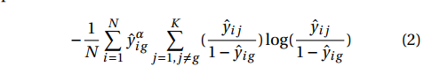

### [Unsupervised Domain Adaptation by Backpropagation](http://proceedings.mlr.press/v37/ganin15.pdf)

任务主要是：有一个source domain， source domain上数据有大量的label，但是target domain是一个没有label，我们真正想要work on的domain。因此要在source domain上学习，并且学习到的东西可以用于target domain。

他们的方法显示，this adaptation behaviour can be achieved in almost any feed-forward model by augmenting in almost any feed-forwrd model by augmentation it with few standard layers and simple new gradient reversal layer.

该文章的目标是让提取的feature具备domain invariance，districminativeness。label predictor是用来预测class label，domain classifier是用来在training的时候区分source domain和target domain。

_________________________________

### [Learning Anonymized Representations with Adversarial Neural Networks](https://arxiv.org/pdf/1802.09386.pdf)

该文章的任务主要是，一张图中有一个我们必须要识别的信息，和隐私的信息。我们在能正确找到我们需要的信息的同时，不能泄露隐私信息。

这个方法跟前面很类似，就是有两个分类器，一个分类需要识别的信息，一个分类隐私信息。
___________________________________

Imagine we have a dataset (x_i, y_i, z_i) where x_i is an image, y_i is a class, and z_i an extra label.
- In domain adaptation, z_i is the domain label
- In anonymized representation, z_i is the private class (a la MNIST, it would be the person who wrote that number)

These papers learn a representation u of x s.t.:
- it is possible to predict y from u
- it is not possible to predict z from u even with best effort

- In domain adaptation, this means that u is invariant wrt the domain.
- In anonymization, this means that the private label is protected because it cannot be inferred from u
In brief, that u carries only information on y but not about z (this is their claim)

So there are 3 networks:
1. create u from x
2. predict y from u
3. predict z from u

- theta_2 is learned by minimising the classification loss on y (as usual)
- theta_3 is learned by minimising the classification loss on z (as usual, to ensure best effort)
- theta_1 is learned by minimising the loss of y AND maximising the loss on z (unusual).

______________________________________

### [Improving Adversarial Robustness via Guided Complement Entropy](https://arxiv.org/abs/1903.09799)

这篇文章提出一种不需要任何额外结构的提高模型鲁棒性的方法，Guided Complement Entropy（GCE）。GCE的核心思想就是maximizing model probabilities on the ground-truth class like cross-entropy.

为了达到上图的效果，他们提出Guided Complement Entropy loss function。

这个方程基于Complement Entropy提出，Complement Entropy可以flatten out the weight distribution among the incorrect classes。
而GCE在原来的基础上加入了guiding factor，从而在训练的过程中平衡complement loss factor和model‘s prediction quality
