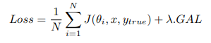
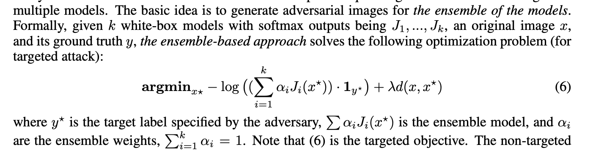
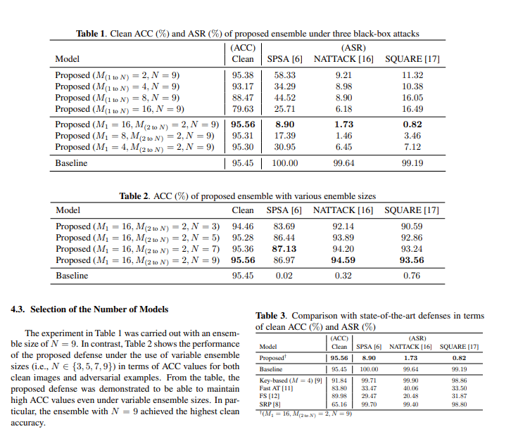

### ensembles

## [Ensemble Adversarial Training: Attacks and Defenses](https://arxiv.org/abs/1705.07204)

[code](https://github.com/ftramer/ensemble-adv-training)

#### [Simple and Scalable Predictive Uncertainty Estimation using Deep Ensembles](https://arxiv.org/abs/1612.01474)
- abstract:
They propose an alternative to *Bayesian NNs* that
is simple to implement, readily parallelizable, requires very little hyperparameter
tuning, and yields high quality predictive uncertainty estimates.

#### [Adversarially Robust Generalization Requires More Data](https://arxiv.org/abs/1804.11285)
- abstract: To understand adversarial phenomenon, they show that already in a simple natural data model, the sample complexity of robust learning can be significantly
larger than that of “standard” learning. This gap is information theoretic and holds irrespective
of the training algorithm or the model family. 

#### [Towards Robust Neural Networks via Random Self-ensemble](https://openaccess.thecvf.com/content_ECCV_2018/html/Xuanqing_Liu_Towards_Robust_Neural_ECCV_2018_paper.html)
- abstract: They proposed a new defense algorithm called Random SelfEnsemble (RSE) by combining two important concepts: randomness
and ensemble. To protect a targeted model, RSE adds random noise
layers to the neural network to prevent the strong gradient-based attacks,
and ensembles the prediction over random noises to stabilize the performance.

## [Improving Adversarial Robustness via Promoting Ensemble Diversity](http://proceedings.mlr.press/v97/pang19a)
- abstract: This paper presents a new method that explores the interaction among individual networks to improve robustness for ensemble models. Technically, we define a new notion of ensemble diversity in the adversarial setting as the diversity among non-maximal predictions of individual members, and present an adaptive diversity promoting (ADP) regularizer to encourage the diversity, which leads to globally better robustness for the ensemble by making adversarial examples difficult to transfer among individual members. Our method is computationally efficient and compatible with the defense methods acting on individual networks.
- *Training Strategies for ensemle models*
- *Ensamble diversity*: Inspired by the theory of
the determinant point process (DPP) (Kulesza et al., 2012),
we define the ensemble diversity as ED = det(M^T_{\y}M_{\y})

[code](https://github.com/P2333/Adaptive-Diversity-Promoting)
 
## [Ensemble Methods as a Defense to Adversarial Perturbations Against Deep Neural Networks](https://arxiv.org/pdf/1709.03423.pdf)
- abstract: We propose to use ensemble methods as a defense strategy
against adversarial perturbations. We find that an attack leading one model to misclassify does not
imply the same for other networks performing the same task. This makes ensemble methods an
attractive defense strategy against adversarial attacks.
1. some network architecture but random initial weights
2. different but similar network architectures
3. bagging
4. add small Gaussian noise

#### [Prediction of landslide displacement with an ensemble-based extreme learning machine and copula models](https://link.springer.com/article/10.1007/s10346-018-1020-2)
- abstract: This paper proposes a novel data-driven approach to monitor and predict the landslide displacement.

## [Improving Adversarial Robustness of Ensembles with Diversity Training](https://arxiv.org/pdf/1901.09981.pdf)
- abstract: We
show that an ensemble of models with misaligned
loss gradients can provide an effective defense
against transfer-based attacks. Our key insight is
that an adversarial example is less likely to fool
multiple models in the ensemble if their loss functions do not increase in a correlated fashion. To
this end, we propose Diversity Training, a novel
method to train an ensemble of models with uncorrelated loss functions.
- *Gradient Alignment Loss*: LogSumExp of cosine similarity between gradient of two models.

## [Deep Neural Network Ensembles Against Deception: Ensemble Diversity, Accuracy and Robustness](https://ieeexplore.ieee.org/document/9077380)
- abstract: In this paper we first give an overview of the concept of ensemble diversity and examine the three types of ensemble diversity in the context of DNN classifiers. We then describe a set of ensemble diversity measures, a suite of algorithms for creating diversity ensembles and for performing ensemble consensus (voted or learned) for generating high accuracy ensemble output by strategically combining outputs of individual members.

#### [Diverse Ensemble Evolution: Curriculum Data-Model Marriage](https://www.semanticscholar.org/paper/Diverse-Ensemble-Evolution%3A-Curriculum-Data-Model-Zhou-Wang/ebbac18c556ba9ac2b68854a0124ff1c93055023?p2df)
- abstract: We utilize an intra-model diversity term on data assigned to each model, and an inter-model diversity term on data assigned to pairs of models, to penalize both within-model and cross-model redundancy. We formulate the data-model marriage problem as a generalized bipartite matching, represented as submodular maximization subject to two matroid constraints. DivE$^2$ solves a sequence of continuous-combinatorial optimizations with slowly varying objectives and constraints. The combinatorial part handles the data-model marriage while the continuous part updates model parameters based on the assignments.

## [Denoising and Verification Cross-Layer Ensemble Against Black-box Adversarial Attacks](https://ieeexplore.ieee.org/document/9006090)
- abstract: In this paper, we present MODEF, a cross-layer model diversity ensemble framework. MODEF intelligently combines unsupervised model denoising ensemble with supervised model verification ensemble by quantifying model diversity, aiming to boost the robustness of the target model against adversarial examples. Evaluated using eleven representative attacks on popular benchmark datasets, 

## [STRENGTH IN NUMBERS: TRADING-OFF ROBUSTNESS AND COMPUTATION VIA ADVERSARIALLY-TRAINED ENSEMBLES](https://arxiv.org/pdf/1811.09300.pdf)
- abstract:  In this paper we investigate how this approach scales
as we increase the computational budget given to the defender. We show that
increasing the number of parameters in adversarially-trained models increases their
robustness, and in particular that ensembling smaller models while adversarially
training the entire ensemble as a single model is a more efficient way of spending
said budget than simply using a larger single model. *Crucially, we show that it is
the adversarial training of the ensemble, rather than the ensembling of adversarially
trained models, which provides robustness.*
- *Adversarially-trained ensembles*: using a 'gating network' to generate data-dependent weights for each model rather than a simple average

#### [Adversarial example generation with adaptive gradient search for single and ensemble deep neural network](https://www.sciencedirect.com/science/article/abs/pii/S0020025520303273?casa_token=SYcLfOAZZVoAAAAA:gyFgCYVqJMq5Sm-gr01BRVC1HYigePb-EwkFrTzGtPmIn_NftVPSJ6mXdL4xi3PPyU44uA3Trw)
-abstract: we introduce an adaptive gradient-based adversarial attack method named Adaptive Iteration Fast Gradient Method (AI-FGM), which focuses on seeking the input’s preceding gradient and adjusts the accumulation of perturbed entity adaptively for performing adversarial attacks. By maximizing the specific loss for generating adaptive gradient-based entities, AI-FGM calls for several gradient-based operators on the clean input to map crafted sample with the corresponding prediction directly. AI-FGM helps to reduce unnecessary gradient-based entity accumulation when processing adversary by adaptive gradient-based seeking strategy.

#### [Robust Opponent Modeling via Adversarial Ensemble Reinforcement Learning in Asymmetric Imperfect-Information Games](https://arxiv.org/pdf/1909.08735.pdf)
- abstract: This paper presents an algorithmic framework for learning robust
policies in asymmetric imperfect-information games (AIIG), which
are a subset of Bayesian games. We consider an information-asymmetric
adversarial scenario in the context of multi-agent reinforcement
learning (MARL), which has not been investigated before

#### [Ensemble adversarial black-box attacks against deep learning systems](https://www.sciencedirect.com/science/article/abs/pii/S0031320319304844?casa_token=FrQEHnaCvPYAAAAA:joIbSEvdoXOkXoK_7DPdGmYpXLlhHFr01dAi9VSqVCNWV8puO_-OlymVuv8iwurCNM2NFE62Aw)
- abstract: In this paper, the authors attempt to ensemble multiple pre-trained substitute models to produce adversarial examples with more powerful transferability in the form of selective cascade ensemble and stack parallel ensemble. Moreover, potential factors that contribute to the high-efficiency attacks are presented from three perspectives: the transferability of substitutes, the diversity of substitutes and the number of substitutes. 

## [Toward Adversarial Robustness by Diversity in an Ensemble of Specialized Deep Neural Networks](https://arxiv.org/pdf/2005.08321.pdf)
- abstract: We aim at demonstrating the influence of diversity in the ensemble of
CNNs on the detection of black-box adversarial instances and hardening the generation of white-box adversarial attacks. To this end, we propose an ensemble of
diverse specialized CNNs along with a simple voting mechanism. The diversity
in this ensemble creates a gap between the predictive confidences of adversaries
and those of clean samples, making adversaries detectable. We then analyze how
diversity in such an ensemble of specialists may mitigate the risk of the black-box
and white-box adversarial examples.

#### [Adversarial Deep Ensemble: Evasion Attacks and Defenses for Malware Detection](https://ieeexplore.ieee.org/document/9121297)
- abstract: We thus propose a new attack approach, named mixture of attacks, by rendering attackers capable of multiple generative methods and multiple manipulation sets, to perturb a malware example without ruining its malicious functionality. This naturally leads to a new instantiation of adversarial training, which is further geared to enhancing the ensemble of deep neural networks. 

### [Ensemble Methods for Object Detection](http://ecai2020.eu/papers/320_paper.pdf)
- abstract: In this paper, we present an ensemble algorithm
that can be applied with any object detection model independently of
the underlying algorithm. In addition, our ensemble method has been
employed to define a test-time augmentation procedure for object detection models

#### [Iterative Ensemble Adversarial Attack](http://hof.geekpwn.org/caad/docs/RNG.pdf)
- abstract: To improve the success
rates for black-box adversarial attacks, we proposed an iterated adversarial attack against an ensemble of image classifiers.

### [Customised ensemble methodologies for Deep Learning: Boosted Residual Networks and related approaches](https://eprints.bbk.ac.uk/id/eprint/25541/1/NCA-Biron.pdf)
- abstract: This paper introduces a family of new customised methodologies for ensembles, called Boosted Residual Networks (BRN), which
builds a boosted ensemble of Residual Networks by growing the member
network at each round of boosting. The proposed approach combines
recent developements in Residual Networks - a method for creating very
deep networks by including a shortcut layer between different groups of
layers - with Deep Incremental Boosting, a methodology to train fast
ensembles of networks of increasing depth through the use of boosting.
Additionally, we explore a simpler variant of Boosted Residual Networks
based on Bagging, called Bagged Residual Networks (BaRN)

## [Certifying Joint Adversarial Robustness for Model Ensembles](https://arxiv.org/pdf/2004.10250.pdf)
- abstract: We consider
the joint vulnerability of an ensemble of models, and propose a novel technique
for certifying the joint robustness of ensembles, building upon prior works on
single-model robustness certification. We evaluate the robustness of various models
ensembles, including models trained using cost-sensitive robustness to be diverse,
to improve understanding of the potential effectiveness of ensemble models as a
defense against adversarial examples.

## [Robust Deep Learning Ensemble against Deception](https://ieeexplore.ieee.org/document/9200713)
- abstract: his paper presents XEnsemble, a diversity ensemble verification methodology for enhancing the adversarial robustness of DNN models against deception caused by either adversarial examples or out-of-distribution inputs. XEnsemble by design has three unique capabilities. 
1. XEnsemble builds diverse input denoising verifiers by leveraging different data cleaning techniques
2. XEnsemble develops a disagreement-diversity ensemble learning methodology for guarding the output of the prediction model against deception. 
3. XEnsemble provides a suite of algorithms to combine input verification and output verification to protect the DNN prediction models from both adversarial examples and out of distribution inputs

## [n-ML: Mitigating Adversarial Examples via Ensembles of Topologically Manipulated Classifiers](https://arxiv.org/pdf/1912.09059.pdf)
- abstract: This paper proposes a new defense called n-ML
against adversarial examples, i.e., inputs crafted by perturbing
benign inputs by small amounts to induce misclassifications by
classifiers. Inspired by n-version programming, n-ML trains an
ensemble of n classifiers, and inputs are classified by a vote of
the classifiers in the ensemble. Unlike prior such approaches,
however, the classifiers in the ensemble are trained specifically
to classify adversarial examples differently, rendering it very
difficult for an adversarial example to obtain enough votes to
be misclassified

## [Omni: Automated Ensemble with Unexpected Models against Adversarial Evasion Attack](https://arxiv.org/pdf/2011.12720.pdf)
- abstract: We propose an approach called Omni, the main idea of which is to explore methods that create an ensemble of “unexpected models”; i.e., models whose
control hyperparameters have a large distance to the hyperparameters of an adversary’s target model, with which we then make an optimized weighted ensemble prediction

#### [Efficient Ensemble Model Generation for Uncertainty Estimation with Bayesian Approximation in Segmentation](https://arxiv.org/pdf/2005.10754.pdf)
- abstract:  In the proposed method, ensemble models can be efficiently
generated by using the stochastic layer selection method. The ensemble
models are trained to estimate uncertainty through Bayesian approximation. Moreover, to overcome its limitation from uncertain instances, we
devise a new pixel-wise uncertainty loss, which improves the predictive
performance.

## [DVERGE: Diversifying Vulnerabilities for Enhanced Robust Generation of Ensembles](https://arxiv.org/pdf/2009.14720.pdf)
- abstract:  Alternatively, ensemble
methods are proposed to induce sub-models with diverse outputs against a transfer
adversarial example, making the ensemble robust against transfer attacks even
if each sub-model is individually non-robust. Only small clean accuracy drop
is observed in the process. However, previous ensemble training methods are
not efficacious in inducing such diversity and thus ineffective on reaching robust
ensemble. We propose DVERGE, which isolates the adversarial vulnerability in
each sub-model by distilling non-robust features, and diversifies the adversarial
vulnerability to induce diverse outputs against a transfer attack. The novel diversity
metric and training procedure enables DVERGE to achieve higher robustness
against transfer attacks comparing to previous ensemble methods, and enables the
improved robustness when more sub-models are added to the ensemble. 
- [code](https://github.com/zjysteven/DVERGE)

#### [Learning Transferable Adversarial Examples via Ghost Networks](https://ojs.aaai.org/index.php/AAAI/article/view/6810)
- abstract: In this paper, we propose Ghost Networks to improve the
transferability of adversarial examples. The critical principle
of ghost networks is to apply feature-level perturbations to
an existing model to potentially create a huge set of diverse
models. After that, models are subsequently fused by longitudinal
ensemble.

#### [Delving into Diversity in Substitute Ensembles and Transferability of Adversarial Examples](https://link.springer.com/chapter/10.1007/978-3-030-04182-3_16)
- abstract: In this paper, two types of ensemble-based black-box attack strategies, iterative cascade ensemble strategy and stack parallel ensemble strategy, are proposed to explore the vulnerability of DL system and potential factors that contribute to the high-efficiency attacks are examined. Moreover, two pairwise and non-pairwise diversity measures are adopted to explore the relationship between the diversity in substitutes ensembles and transferability of crafted adversarial examples.

### [Ensemble of Predictions from Augmented Input as Adversarial Defense for Face Verification System](https://link.springer.com/chapter/10.1007/978-3-030-14802-7_57)
- abstract: This paper proposed a simple defense strategy to improve the reliability of a system in the presence of adversarial attack. By combining the prediction from few samples of altered input image, the effect of adversarial attack can be reduced effectively. The proposed method has been tested using public face dataset in the presence of strong attacks. 

### [Efficient Project Gradient Descent for Ensemble Adversarial Attack](https://arxiv.org/pdf/1906.03333.pdf)
- abstract: In this report, we
propose an efficient modified PGD method for attacking ensemble models by automatically changing ensemble weights and step size per iteration per
input. 

### [Ensemble of Random Binary Output Encoding for Adversarial Robustness](https://ieeexplore.ieee.org/stamp/stamp.jsp?arnumber=8813035)
- abstract: In this paper, we propose to create multiple and independent random binary
codes per input class and train ensemble of homogeneous CNN classifiers with these codes to improve
the adversarial robustness of the networks. The proposed ensemble structure consists of replicas of the
same learning architecture, but each network is trained with different random target outputs. The network
model is simultaneously trained with their own unique binary codes, and optimized through a single and
common objective function in an end-to-end manner.

#### [Using an ensemble color space model to tackle adversarial examples?](https://arxiv.org/pdf/2003.05005.pdf)
- abstract: We propose a 3 step
method for defending such attacks. First, we denoise the image using statistical
methods. Second, we show that adopting multiple color spaces in the same
model can help us to fight these adversarial attacks further as each color space
detects certain features explicit to itself. Finally, the feature maps generated
are enlarged and sent back as an input to obtain even smaller features

## [Ensembles of Locally Independent Prediction Models](https://ojs.aaai.org/index.php/AAAI/article/view/6004)
- abstrat:In this paper, however,
we demonstrate the diversity of predictions on the training
set does not necessarily imply diversity under mild covariate
shift, which can harm generalization in practical settings.
To address this issue, we introduce a new diversity metric
and associated method of training ensembles of models
that extrapolate differently on local patches of the data manifold.

#### [Evaluation of Algorithm Selection and Ensemble Methods for Causal Discovery](https://www.cmu.edu/dietrich/causality/CameraReadys-accepted%20papers/28%5CCameraReady%5CEvaluating_Causal_Ensembles_NeurIPS_CR.pdf)
- abstract: To address
this issue, we explore two different approaches for leveraging multiple different
algorithms for causal discovery. First, we explore several heuristics which compare
the predictions of multiple algorithms in order to inform the selection of a single
algorithm for the task. Second, we develop a novel causal ensemble method which
combines the output of multiple algorithms into a single causal structure prediction.

#### [SMGEA: A New Ensemble Adversarial Attack Powered by Long-Term Gradient Memories](https://ieeexplore.ieee.org/document/9288740)
- abstract:In this article, we propose a novel transfer-based black-box attack, dubbed serial-minigroup-ensemble-attack (SMGEA). Concretely, SMGEA first divides a large number of pretrained white-box source models into several minigroups. For each minigroup, we design three new ensemble strategies to improve the intragroup transferability. Moreover, we propose a new algorithm that recursively accumulates the long-term'' gradient memories of the previous minigroup to the subsequent minigroup. 

#### [Improving the Transferability of Adversarial Examples with Resized-Diverse-Inputs, Diversity-Ensemble and Region Fitting](https://www.ecva.net/papers/eccv_2020/papers_ECCV/papers/123670562.pdf)
- abstract: We introduce a three stage pipeline: resized-diverse-inputs
(RDIM), diversity-ensemble (DEM) and region fitting, that work together to generate transferable adversarial examples. We first explore
the internal relationship between existing attacks, and propose RDIM
that is capable of exploiting this relationship. Then we propose DEM,
the multi-scale version of RDIM, to generate multi-scale gradients. After
the first two steps we transform value fitting into region fitting across
iterations. RDIM and region fitting do not require extra running time
and these three steps can be well integrated into other attacks

#### [Defending Against Adversarial Attacks Using Random Forest](https://openaccess.thecvf.com/content_CVPRW_2019/papers/CV-COPS/Ding_Defending_Against_Adversarial_Attacks_Using_Random_Forest_CVPRW_2019_paper.pdf)
- abstract: Upon observing that adversarial examples are
mostly generated by gradient-based methods, in this paper, we first propose to use a simple yet very effective nondifferentiable hybrid model that combines DNNs and random forests, rather than hide gradients from attackers, to
defend against the attacks.

## [Ensemble Generative Cleaning With Feedback Loops for Defending Adversarial Attacks](https://openaccess.thecvf.com/content_CVPR_2020/html/Yuan_Ensemble_Generative_Cleaning_With_Feedback_Loops_for_Defending_Adversarial_Attacks_CVPR_2020_paper.html)
- abstract: In this paper, we develop a new method called ensemble generative cleaning with feedback loops (EGC-FL) for effective defense of deep neural networks. The proposed EGC-FL method is based on two central ideas. First, we introduce a transformed deadzone layer into the defense network, which consists of an orthonormal transform and a deadzone-based activation function, to destroy the sophisticated noise pattern of adversarial attacks. Second, by constructing a generative cleaning network with a feedback loop, we are able to generate an ensemble of diverse estimations of the original clean image. We then learn a network to fuse this set of diverse estimations together to restore the original image. 

## [Ensemble of Models Trained by Key-based Transformed Images for Adversarially Robust Defense Against Black-box Attacks](https://arxiv.org/abs/2011.07697)
- abstract: We propose a voting ensemble of models trained by using block-wise transformed images with secret keys for an adversarially robust defense. Key-based adversarial defenses were demonstrated to outperform state-of-the-art defenses against gradient-based (white-box) attacks. However, the key-based defenses are not effective enough against gradient-free (black-box) attacks without requiring any secret keys. Accordingly, we aim to enhance robustness against black-box attacks by using a voting ensemble of models. In the proposed ensemble, a number of models are trained by using images transformed with different keys and block sizes, and then a voting ensemble is applied to the models

#### [Improving Ensemble Robustness by Collaboratively Promoting and Demoting Adversarial Robustness](https://arxiv.org/abs/2009.09612)
- abstract: We propose in this work a simple yet effective strategy to collaborate among committee models of an ensemble model. This is achieved via the secure and insecure sets defined for each model member on a given sample, hence help us to quantify and regularize the transferability. Consequently, our proposed framework provides the flexibility to reduce the adversarial transferability as well as to promote the diversity of ensemble members, which are two crucial factors for better robustness in our ensemble approach. 

_____
#### [Ensemble deep learning: A review](https://arxiv.org/pdf/2104.02395.pdf)
