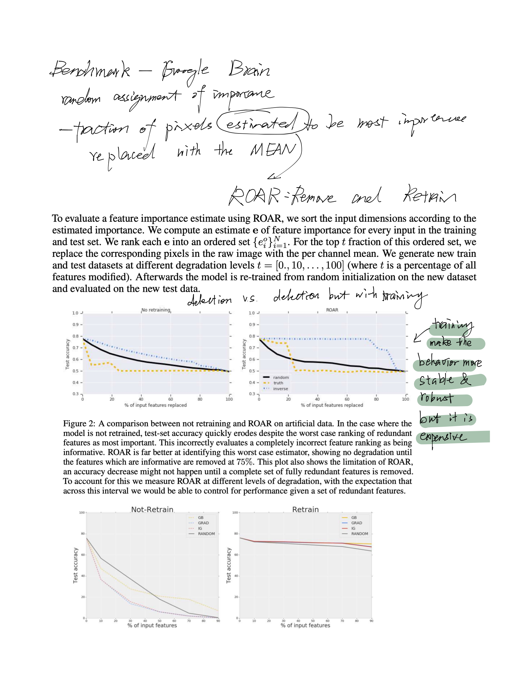
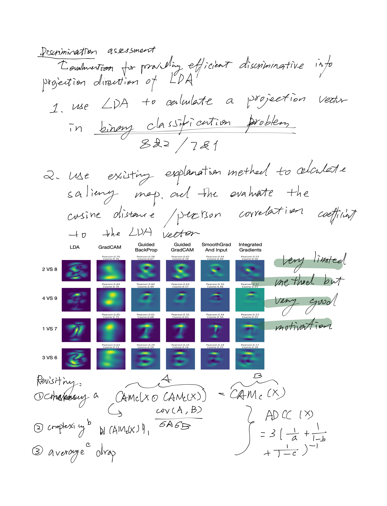
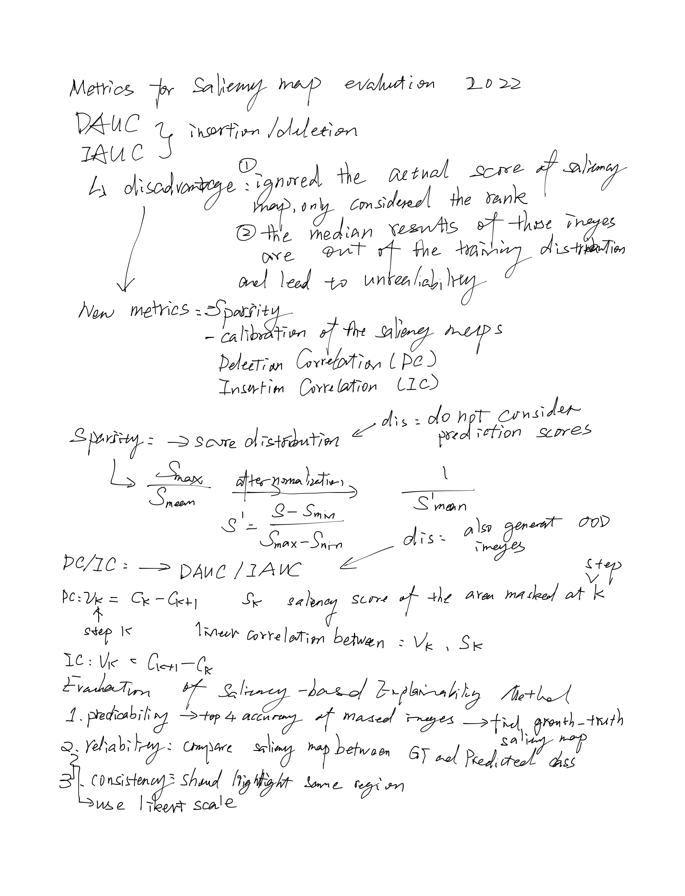

## TOOL

### [Quantus](https://github.com/understandable-machine-intelligence-lab/Quantus)

## New Metrics and Benchmark

### [CLEVR-XAI: A benchmark dataset for the ground truth evaluation of neural network explanations](https://www.sciencedirect.com/science/article/pii/S1566253521002335)
[code](https://github.com/ahmedmagdiosman/clevr-xai)
**year** 2022

**abstract** CLEVR-XAI aims to provide a benchmark dataset for the quantitative evaluation of XAI explanations (aka heatmaps) in computer vision.
The CLEVR-XAI dataset consists of 39,761 simple questions (CLEVR-XAI-simple) and 100,000 complex questions (CLEVR-XAI-complex), which are based on the same underlying set of 10,000 images (i.e., there are approx. 4 simple questions and 10 complex questions per image).

### [Which Explanation Should I Choose? A Function Approximation Perspective toCharacterizing Post hoc Explanations](https://arxiv.org/pdf/2206.01254.pdf)

**year** 2022 

**abstract** In this work, we bridge these gaps and address a fundamental question: Which explanation method should one use in a given situation?
To this end, we adopt a function approximation perspective and formalize the
local function approximation (LFA) framework. We show that popular explanation
methods are instances of this framework, performing function approximations of
the underlying model in different neighborhoods using different loss functions. We
introduce a no free lunch theorem for explanation methods which demonstrates
that no single method can perform optimally across all neighbourhoods and calls
for choosing among methods. To choose among methods, we set forth a guiding
principle based on the function approximation perspective, considering a method
to be effective if it recovers the underlying model when the model is a member
of the explanation function class. Then, we analyze the conditions under which
popular explanation methods are effective and provide recommendations for choosing among explanation methods and creating new ones. Lastly, we empirically
validate our theoretical results using various real world datasets, model classes,
and prediction tasks. By providing a principled mathematical framework which
unifies diverse explanation methods, our work characterizes the behaviour of these
methods and their relation to one another, guides the choice of explanation methods,
and paves the way for the creation of new ones.

**why interesting** provide mathmatical analysis

### [Convolutional Dynamic Alignment Networks for Interpretable Classifications](https://arxiv.org/pdf/2104.00032.pdf)

**year** 2021

**abstract** We introduce a new family of neural network models called Convolutional Dynamic Alignment Networks1
(CoDA-Nets), which are performant classifiers with a high
degree of inherent interpretability. Their core building blocks are Dynamic Alignment Units (DAUs), which
linearly transform their input with weight vectors that
dynamically align with task-relevant patterns. As a result,
CoDA-Nets model the classification prediction through a
series of input-dependent linear transformations, allowing
for linear decomposition of the output into individual input contributions. Given the alignment of the DAUs, the
resulting contribution maps align with discriminative input
patterns. These model-inherent decompositions are of high
visual quality and outperform existing attribution methods
under quantitative metrics. 

**why interesting** Grid Pointing Game

### [Towards Better Understanding Attribution Methods](https://openaccess.thecvf.com/content/CVPR2022/papers/Rao_Towards_Better_Understanding_Attribution_Methods_CVPR_2022_paper.pdf)

**year** 2022

**abstract**  To address faithfulness, we propose
a novel evaluation setting (DiFull) in which we carefully
control which parts of the input can influence the output in
order to distinguish possible from impossible attributions.
To address fairness, we note that different methods are applied at different layers, which skews any comparison, and
so evaluate all methods on the same layers (ML-Att) and
discuss how this impacts their performance on quantitative metrics. For more systematic visualizations, we propose a scheme (AggAtt) to qualitatively evaluate the methods on complete datasets. We use these evaluation schemes
to study strengths and shortcomings of some widely used
attribution methods. Finally, we propose a post-processing
smoothing step that significantly improves the performance
of some attribution methods, and discuss its applicability.

**why interesting** new evaluation from different perspective

### [Do Explanations Explain? Model Knows Best](https://openaccess.thecvf.com/content/CVPR2022/papers/Khakzar_Do_Explanations_Explain_Model_Knows_Best_CVPR_2022_paper.pdf)

**year** 2022

**abstract**  We propose a framework for evaluating
the explanations using the neural network model itself. The
framework leverages the network to generate input features
that impose a particular behavior on the output. Using the
generated features, we devise controlled experimental setups to evaluate whether an explanation method conforms
to an axiom. Thus we propose an empirical framework for
axiomatic evaluation of explanation methods. We evaluate
well-known and promising explanation solutions using the
proposed framework. The framework provides a toolset to
reveal properties and drawbacks within existing and future
explanation solutions

**why interesting** construct special patches as ground truth and use them to evaluate the saliency maps

### [A Benchmark for Interpretability Methods in Deep Neural Networks](https://proceedings.neurips.cc/paper/2019/file/fe4b8556000d0f0cae99daa5c5c5a410-Paper.pdf)

**year** 2019

**abstract** We propose an empirical measure of the approximate accuracy of feature importance estimates in deep neural networks. Our results across several large-scale
image classification datasets show that many popular interpretability methods produce estimates of feature importance that are not better than a random designation
of feature importance. Only certain ensemble based approaches—VarGrad and
SmoothGrad-Squared—outperform such a random assignment of importance. The
manner of ensembling remains critical, we show that some approaches do no better
then the underlying method but carry a far higher computational burden.

**why interesting** google brain's benchmark

[code](https://github.com/CAMP-eXplain-AI/RoarTorch)

### [Discrimination Assessment for Saliency Maps](http://tcci.ccf.org.cn/conference/2019/papers/XAI100.pdf)

**year** 2019

**abstract** Saliency methods can effectively mark which patterns in the
input have higher impacts in model decision, and highlight the relationship between the features and inference results. However, different
saliency maps have different performance in classification tasks. Through
experiments, we find that some saliency maps show more discriminative
ability, while others do not. Saliency methods with higher discrimination ability will be more helpful to human while making final decision,
for example, the dominant features of malignant area are expected to
be identified in medical diagnosis. In this work, a method is proposed
to evaluate whether the saliency methods can provide effective discriminant information. In addition to giving intuitive judgment, we will also
introduce a quantitative measurement method. We regard the saliency
map as a weighting vector in class discrimination, which is analogue
to the projection direction of Linear Discriminant Analysis (LDA) [12],
and measure the discriminant ability of saliency map by comparing the
difference between the vector direction of saliency map and the projection direction of LDA. Through this metric, our experiments will present
the ranking of popular saliency map methods, in terms of discriminative
ability.

**why interesting** evaluate saliency map by discriminative ability

### [Evaluation of Saliency-based Explainability Methods](https://arxiv.org/pdf/2106.12773.pdf)

**year** 2021 Jun

**abstract** A particular class of Explainable AI (XAI) methods provide saliency maps to highlight part of the
image a Convolutional Neural Network (CNN)
model looks at to classify the image as a way to
explain its working. These methods provide an
intuitive way for users to understand predictions
made by CNNs. Other than quantitative computational tests, the vast majority of evidence to highlight that the methods are valuable is anecdotal.
Given that humans would be the end-users of such
methods, we devise three human subject experiments through which we gauge the effectiveness
of these saliency-based explainability methods.

**why interesting** new evaluation

### [Revisiting The Evaluation of Class Activation Mapping for Explainability: A Novel Metric and Experimental Analysis](https://openaccess.thecvf.com/content/CVPR2021W/RCV/papers/Poppi_Revisiting_the_Evaluation_of_Class_Activation_Mapping_for_Explainability_A_CVPRW_2021_paper.pdf)

**year** 2021

**abstract** As the request for deep learning solutions increases, the
need for explainability is even more fundamental. In this
setting, particular attention has been given to visualization
techniques, that try to attribute the right relevance to each
input pixel with respect to the output of the network. In
this paper, we focus on Class Activation Mapping (CAM)
approaches, which provide an effective visualization by taking weighted averages of the activation maps. To enhance
the evaluation and the reproducibility of such approaches,
we propose a novel set of metrics to quantify explanation
maps, which show better effectiveness and simplify comparisons between approaches. To evaluate the appropriateness
of the proposal, we compare different CAM-based visualization methods on the entire ImageNet validation set, fostering proper comparisons and reproducibility.

**why interesting** new evaluation

**code** https://github.com/aimagelab/ADCC?fbclid=IwAR0YK_93lxp4pZQnt34SlA9aeNCLRX8m0u8yTZPxbTXi80qiyhTiqxWaQ7o

### [Metrics for saliency map evaluation of deep learning explanation methods](https://arxiv.org/pdf/2201.13291.pdf)

**year** 2022 Jan

**abstract** In this paper, we critically analyze the Deletion Area Under Curve (DAUC) and Insertion Area Under
Curve (IAUC) metrics proposed by Petsiuk et al. (2018). These metrics
were designed to evaluate the faithfulness of saliency maps generated
by generic methods such as Grad-CAM or RISE. First, we show that
the actual saliency score values given by the saliency map are ignored
as only the ranking of the scores is taken into account. This shows that
these metrics are insufficient by themselves, as the visual appearance
of a saliency map can change significantly without the ranking of the
scores being modified. Secondly, we argue that during the computation
of DAUC and IAUC, the model is presented with images that are out
of the training distribution which might lead to an unreliable behavior
of the model being explained. To complement DAUC/IAUC, we propose
new metrics that quantify the sparsity and the calibration of explanation
methods, two previously unstudied properties. Finally, we give general
remarks about the metrics studied in this paper and discuss how to evaluate them in a user study

**why interesting** newest work to evaluation saliency map

## Discussion & analysis paper

### [Explanations can be manipulated and geometry is to blame](https://proceedings.neurips.cc/paper/2019/file/bb836c01cdc9120a9c984c525e4b1a4a-Paper.pdf)
**year** 2019
**abstract** Explanation methods aim to make neural networks more trustworthy and interpretable. In this paper, we demonstrate a property of explanation methods which is
disconcerting for both of these purposes. Namely, we show that explanations can
be manipulated arbitrarily by applying visually hardly perceptible perturbations
to the input that keep the network’s output approximately constant. We establish
theoretically that this phenomenon can be related to certain geometrical properties
of neural networks. This allows us to derive an upper bound on the susceptibility of explanations to manipulations. Based on this result, we propose effective
mechanisms to enhance the robustness of explanations.
**why interesting** discuss the robustness of explanations.

### [Understanding Deep Networks via Extremal Perturbations and Smooth Masks](https://openaccess.thecvf.com/content_ICCV_2019/papers/Fong_Understanding_Deep_Networks_via_Extremal_Perturbations_and_Smooth_Masks_ICCV_2019_paper.pdf)

**year** 2019

**abstract** .In this paper, we discuss some of the shortcomings of
existing approaches to perturbation analysis and address
them by introducing the concept of extremal perturbations,
which are theoretically grounded and interpretable. We also
introduce a number of technical innovations to compute extremal perturbations, including a new area constraint and
a parametric family of smooth perturbations, which allow
us to remove all tunable hyper-parameters from the optimization problem. We analyze the effect of perturbations as
a function of their area, demonstrating excellent sensitivity
to the spatial properties of the deep neural network under
stimulation. We also extend perturbation analysis to the intermediate layers of a network. This application allows us
to identify the salient channels necessary for classification,
which, when visualized using feature inversion, can be used
to elucidate model behavior

**why interesting** discuss the problem of perturbation, deletion smoth mask

### [Input Bias in Rectified Gradients and Modified Saliency Maps](https://ieeexplore.ieee.org/document/9373270)

**year** 2021

**abstract** Several modifications to conventional saliency maps, such as Rectified Gradients [1] and Layer-wise Relevance Propagation (LRP) [2], have been introduced to allegedly denoise and improve interpretability. While visually coherent in certain cases, Rectified Gradients and other modified saliency maps introduce a strong input bias (e.g., brightness in the RGB space) because of inappropriate uses of the input features. We demonstrate that dark areas of an input image are not highlighted by a saliency map using Rectified Gradients, even if it is relevant for the class or concept. Even in the scaled images, the input bias exists around an artificial point in color spectrum. Our modification, which simply eliminates multiplication with input features, removes this bias. This showcases how a visual criteria may not align with true explainability of deep learning models.

**why interesting** eliminates multiplication with input features, removes the bias, provide "true explainability"

### [Sanity Checks for Saliency Metrics](https://dais-ita.org/sites/default/files/4012.pdf)

**abstract** investigate possible metrics for evaluating the fidelity of saliency methods (i.e. saliency
metrics) based on perturbing high-relevance pixels. We develop the theory of how we expect such metrics to perform, and what precisely they are measuring. We find that there is
little consistency in the literature in how such metrics are calculated, and show that such
inconsistencies can have a significant effect on the measured fidelity. Further, we note that
the fidelity of a single saliency method measured over a set of images is highly variable, and
influenced by image class. This leads to inconsistencies in ranking saliency methods for
individual images. Overall our results show that current approaches for measuring saliency
map fidelity suffer serious drawbacks that are difficult to overcome, and that quantitative
comparisons between saliency methods using such metrics are flawed.

**why interesting** Explain why the existing metrics MoRF and LeRF pixel delextion, AOPC-R are not good.

### [INVESTIGATING SANITY CHECKS FOR SALIENCY MAPS WITH IMAGE AND TEXT CLASSIFICATION](https://arxiv.org/pdf/2106.07475.pdf)

**year** 2021 Jun

**abstract**  In this paper, we perform sanity
checks for text modality and show that the conclusions made for image do not
directly transfer to text. We also analyze the effects of the input multiplier in
certain saliency maps using similarity scores, max-sensitivity and infidelity evaluation metrics. Our observations reveal that the input multiplier carries input’s
structural patterns in explanation maps, thus leading to similar results regardless
of the choice of model parameters. We also show that the smoothness of a Neural Network (NN) function can affect the quality of saliency-based explanations.
Our investigations reveal that replacing ReLUs with Softplus and MaxPool with
smoother variants such as LogSumExp (LSE) can lead to explanations that are
more reliable based on the infidelity evaluation metric.

**why interesting** They found the smoothness of NN affect the quality of saliency map.

### [Evaluating Input Perturbation Methods for Interpreting CNNs and Saliency Map Comparison](https://arxiv.org/pdf/2101.10977.pdf)

**year** 2021 jan

**abstract** arguably neutral baseline images still impact
the generated saliency maps and their evaluation with input perturbations. We also demonstrate that many choices of hyperparameters lead
to the divergence of saliency maps generated by input perturbations. We
experimentally reveal inconsistencies among a selection of input perturbation methods and find that they lack robustness for generating saliency
maps and for evaluating saliency maps as saliency metrics.

**Why interesting** explain the influence of perturbations to saliency map

### [No Explainability without Accountability: An Empirical Study of Explanations and Feedback in Interactive ML](https://dl.acm.org/doi/pdf/10.1145/3313831.3376624)

**year** 2020 April

**abstract** Automatically generated explanations of how machine learning (ML) models reason can help users understand and accept
them. However, explanations can have unintended consequences: promoting over-reliance or undermining trust. This
paper investigates how explanations shape users’ perceptions
of ML models with or without the ability to provide feedback
to them: (1) does revealing model flaws increase users’ desire
to “fix” them; (2) does providing explanations cause users
to believe—wrongly—that models are introspective, and will
thus improve over time. Through two controlled experiments—
varying model quality—we show how the combination of
explanations and user feedback impacted perceptions, such
as frustration and expectations of model improvement. Explanations without opportunity for feedback were frustrating
with a lower quality model, while interactions between explanation and feedback for the higher quality model suggest that
detailed feedback should not be requested without explanation.
Users expected model correction, regardless of whether they
provided feedback or received explanations. 

**why interesting** discuss the interpretablity and feedback

### [Evaluating Saliency Map Explanations for Convolutional Neural Networks: A User Study](https://arxiv.org/pdf/2002.00772.pdf)

**year** 2020 Feb

**abstract** In this paper,
we report on an online between-group user study designed to evaluate the performance of “saliency maps” - a popular explanation
algorithm for image classification applications of CNNs. Our results
indicate that saliency maps produced by the LRP algorithm helped
participants to learn about some specific image features the system
is sensitive to. However, the maps seem to provide very limited
help for participants to anticipate the network’s output for new
images. Drawing on our findings, we highlight implications for design and further research on explainable AI. In particular, we argue
the HCI and AI communities should look beyond instance-level
explanations.

**why interesting** talking about the unalignment between saliency map and scores, it might explain why AI/AD work but visualization does not good

### [A SIMPLE TECHNIQUE TO ENABLE SALIENCY METHODS TO PASS THE SANITY CHECKS](https://openreview.net/pdf?id=BJeGZxrFvS)
https://arxiv.org/pdf/1905.12152.pdf?ref=https://githubhelp.com

**year** 2020

**abstract** We propose a simple fix to existing saliency methods that helps them pass sanity
checks, which we call competition for pixels. This involves computing saliency
maps for all possible labels in the classification task, and using a simple competition among them to identify and remove less relevant pixels from the map.

**why interesting** explain how to help gradient based method pass the sanity check and explain with theory

### [Why do These Match? Explaining the Behavior of Image Similarity Models](https://arxiv.org/pdf/1905.10797.pdf)

**year** 2020 Aug

**abstract**  In this paper, we introduce
Salient Attributes for Network Explanation (SANE) to explain image
similarity models, where a model’s output is a score measuring the similarity of two inputs rather than a classification score. In this task, an
explanation depends on both of the input images, so standard methods
do not apply. Our SANE explanations pairs a saliency map identifying important image regions with an attribute that best explains the
match.

**why interesting** Instead of defining the interpretability as object localization without reference, they define the interpretability relatively as similarity

**code** https://github.com/VisionLearningGroup/SANE

## Sanity Check

### [On the (In)fidelity and Sensitivity of Explanations](https://proceedings.neurips.cc/paper/2019/file/a7471fdc77b3435276507cc8f2dc2569-Paper.pdf)

**year** 2019

**abstract** We consider objective evaluation measures of saliency explanations for complex
black-box machine learning models. We propose simple robust variants of two
notions that have been considered in recent literature: (in)fidelity, and sensitivity.
We analyze optimal explanations with respect to both these measures, and while
the optimal explanation for sensitivity is a vacuous constant explanation, the
optimal explanation for infidelity is a novel combination of two popular explanation
methods. By varying the perturbation distribution that defines infidelity, we obtain
novel explanations by optimizing infidelity, which we show to out-perform existing
explanations in both quantitative and qualitative measurements. Another salient
question given these measures is how to modify any given explanation to have
better values with respect to these measures. We propose a simple modification
based on lowering sensitivity, and moreover show that when done appropriately,
we could simultaneously improve both sensitivity as well as fidelity.

**why interesting** sanity check

### [THE (UN)RELIABILITY OF SALIENCY METHODS](https://arxiv.org/pdf/1711.00867.pdf?ref=https://githubhelp.com)

**year** 2017

**abstract** Saliency methods aim to explain the predictions of deep neural networks. These
methods lack reliability when the explanation is sensitive to factors that do not
contribute to the model prediction. We use a simple and common pre-processing
step —adding a constant shift to the input data— to show that a transformation
with no effect on the model can cause numerous methods to incorrectly attribute.
In order to guarantee reliability, we posit that methods should fulfill input invariance, the requirement that a saliency method mirror the sensitivity of the model
with respect to transformations of the input. We show, through several examples,
that saliency methods that do not satisfy input invariance result in misleading attribution.

**why interesting** saliency maps's reliability with respect to transformation

### [Revisiting Sanity Checks for Saliency Maps](https://arxiv.org/pdf/2110.14297.pdf)

**year** 2021 Oct

**abstract** Saliency methods are a popular approach for model debugging and explainability.
However, in the absence of ground-truth data for what the correct maps should be,
evaluating and comparing different approaches remains a long-standing challenge.
The sanity checks methodology of Adebayo et al [Neurips 2018] has sought to
address this challenge. They argue that some popular saliency methods should not
be used for explainability purposes since the maps they produce are not sensitive to
the underlying model that is to be explained. Through a causal re-framing of their
objective, we argue that their empirical evaluation does not fully establish these
conclusions, due to a form of confounding introduced by the tasks they evaluate on.
Through various experiments on simple custom tasks we demonstrate that some
of their conclusions may indeed be artifacts of the tasks more than a criticism of
the saliency methods themselves. More broadly, our work challenges the utility of
the sanity check methodology, and further highlights that saliency map evaluation
beyond ad-hoc visual examination remains a fundamental challenge.

**why interesting** highlight the problem of sanity check, discuss the existing sanity check

### [Sanity Simulations for Saliency Methods](https://arxiv.org/pdf/2105.06506.pdf)

**year** 2021 Jun

**abstract**  the development and adoption of these methods is currently
hindered by the lack of access to ground-truth model reasoning, which prevents
accurate evaluation. In this work, we design a synthetic evaluation framework,
SMERF, that allows us to perform ground-truth-based evaluation while controlling
the complexity of the model’s reasoning.

**why interesting** based on pointing game, discuss "how do we define “important” and subsequently evaluate the efficacy of
these methods?"

### [When Explanations Lie: Why Many Modified BP Attributions Fail](http://proceedings.mlr.press/v119/sixt20a/sixt20a.pdf)

**year** 2020

**abstract** Attribution methods aim to explain a neural network’s prediction by highlighting the most relevant image areas. A popular approach is to
backpropagate (BP) a custom relevance score using modified rules, rather than the gradient. We
analyze an extensive set of modified BP methods: Deep Taylor Decomposition, Layer-wise
Relevance Propagation (LRP), Excitation BP, PatternAttribution, DeepLIFT, Deconv, RectGrad,
and Guided BP. We find empirically that the explanations of all mentioned methods, except for
DeepLIFT, are independent of the parameters of
later layers. We provide theoretical insights for
this surprising behavior and also analyze why
DeepLIFT does not suffer from this limitation.
Empirically, we measure how information of later
layers is ignored by using our new metric, cosine similarity convergence (CSC). The paper provides a framework to assess the faithfulness of
new and existing modified BP methods theoretically and empirically.

**why interesting** explain why backpropagate methods fail

### [Sanity Checks for Saliency Maps](https://proceedings.neurips.cc/paper/2018/file/294a8ed24b1ad22ec2e7efea049b8737-Paper.pdf)

**year** 2018

**abstract** . In this work, we
propose an actionable methodology to evaluate what kinds of explanations a given
method can and cannot provide. We find that reliance, solely, on visual assessment
can be misleading. Through extensive experiments we show that some existing
saliency methods are independent both of the model and of the data generating
process. Consequently, methods that fail the proposed tests are inadequate for
tasks that are sensitive to either data or model, such as, finding outliers in the data,
explaining the relationship between inputs and outputs that the model learned,
and debugging the model.

**why interesting** standard sanity check

## Robustness and interpretability

### [Learning Reliable Visual Saliency For Model Explanations](https://ieeexplore.ieee.org/document/8884184)

**year** 2019

**abstract** we find that previous visual saliency methods are not reliable enough to provide meaningful interpretation through a simple sanity check: saliency methods are required to explain the output of non-maximum prediction classes, which are usually not ground-truth classes. For example, let the methods interpret an image of “dog” given a wrong class label “fish” as the query. This procedure can test whether these methods reliably interpret model's predictions based on existing features that appear in the data. Our experiments show that previous methods failed to pass the test by generating similar saliency maps or scattered patterns.
In order to learn reliable visual saliency, we propose a simple method that requires the output of the model to be close to the original output while learning an explanatory saliency mask. To enhance the smoothness of the optimized saliency masks, we then propose a simple Hierarchical Attribution Fusion (HAF) technique. In order to fully evaluate the reliability of visual saliency methods, we propose a new task Disturbed Weakly Supervised Object Localization (D-WSOL) to measure whether these methods can correctly attribute the model's output to existing features. 

**why interesting** Using the same princeple as our method, but with different technique, they claim their methods are more robust

### [You Shouldn’t Trust Me: Learning Models Which Conceal Unfairness From Multiple Explanation Methods](http://ceur-ws.org/Vol-2560/paper8.pdf)

**year** 2020

**abstract** Transparency of algorithmic systems has been discussed as
a way for end-users and regulators to develop appropriate
trust in machine learning models. One popular approach,
LIME (Ribeiro, Singh, and Guestrin 2016), even suggests that
model explanations can answer the question “Why should I
trust you?”. Here we show a straightforward method for modifying a pre-trained model to manipulate the output of many
popular feature importance explanation methods with little
change in accuracy, thus demonstrating the danger of trusting such explanation methods. We show how this explanation
attack can mask a model’s discriminatory use of a sensitive
feature, raising strong concerns about using such explanation
methods to check the fairness of a model.

**why interesting** adversarial attack in the sence of interpretability, gave good accuracy but bad interpretability

### [Fooling Neural Network Interpretations via Adversarial Model Manipulation](https://proceedings.neurips.cc/paper/2019/file/7fea637fd6d02b8f0adf6f7dc36aed93-Paper.pdf)

**year** 2019

**abstract** By incorporating the interpretation
results directly in the penalty term of the objective function for fine-tuning, we show
that the state-of-the-art saliency map based interpreters, e.g., LRP, Grad-CAM, and
SimpleGrad, can be easily fooled with our model manipulation. We propose two
types of fooling, Passive and Active, and demonstrate such foolings generalize well
to the entire validation set as well as transfer to other interpretation methods. Our
results are validated by both visually showing the fooled explanations and reporting
quantitative metrics that measure the deviations from the original explanations. We
claim that the stability of neural network interpretation method with respect to our
adversarial model manipulation is an important criterion to check for developing robust and reliable neural network interpretation method

**why interesting** adversarial attack in the sence of interpretability, gave good accuracy but bad interpretability

**code**  https://github.com/rmrisforbidden/FoolingNeuralNetwork-Interpretations.

## Survey paper
### [Causal Interpretability for Machine Learning- Problems, Methods and Evaluation](https://dl.acm.org/doi/pdf/10.1145/3400051.3400058?casa_token=0_sH3fFZA40AAAAA:rOTUHS_kcv8qrBN1Qk728KHm-UlvGA__nm-zh4oMlcQwgtewgyE1njf8VxdeoL-EwD5J06itj1T2)

**abstract** To provide insights into the decision making processes of these models, a variety of traditional interpretable models
have been proposed. Moreover, to generate more humanfriendly explanations, recent work on interpretability tries
to answer questions related to causality such as “Why does
this model makes such decisions?” or “Was it a specific feature that caused the decision made by the model?”. In this
work, models that aim to answer causal questions are referred to as causal interpretable models. The existing surveys have covered concepts and methodologies of traditional
interpretability. In this work, we present a comprehensive
survey on causal interpretable models from the aspects of
the problems and methods. In addition, this survey provides in-depth insights into the existing evaluation metrics
for measuring interpretability, which can help practitioners
understand for what scenarios each evaluation metric is suitable.

**why interesting** Survey paper, evaluation in general

### [A Multidisciplinary Survey and Framework for Design and Evaluation of Explainable AI Systems](https://dl.acm.org/doi/pdf/10.1145/3387166?casa_token=3FTy_rvOczAAAAAA:4ME7GhKfjSHJoZZiQuQ672BDRPvSfIwfF7-ilHO2Lk_Tfu7BmxcaR9KGaon3PipoA4KfKFusxOYl)

**year** 2021 Augest

**abstract** The need for interpretable and accountable intelligent systems grows along with the prevalence of artificial
intelligence (AI) applications used in everyday life. Explainable AI (XAI) systems are intended to selfexplain the reasoning behind system decisions and predictions. Researchers from different disciplines work
together to define, design, and evaluate explainable systems. However, scholars from different disciplines
focus on different objectives and fairly independent topics of XAI research, which poses challenges for identifying appropriate design and evaluation methodology and consolidating knowledge across efforts. To this
end, this article presents a survey and framework intended to share knowledge and experiences of XAI design
and evaluation methods across multiple disciplines. Aiming to support diverse design goals and evaluation
methods in XAI research, after a thorough review of XAI related papers in the fields of machine learning, visualization, and human-computer interaction, we present a categorization of XAI design goals and evaluation
methods. Our categorization presents the mapping between design goals for different XAI user groups and
their evaluation methods. From our findings, we develop a framework with step-by-step design guidelines
paired with evaluation methods to close the iterative design and evaluation cycles in multidisciplinary XAI
teams. Further, we provide summarized ready-to-use tables of evaluation methods and recommendations for
different goals in XAI research.

**why interesting** Survey paper

### [Opportunities and Challenges in Explainable Artificial Intelligence (XAI): A Survey](https://arxiv.org/pdf/2006.11371.pdf)

**year** 2020 Jun

**abstract** Nowadays, deep neural networks are widely used in
mission critical systems such as healthcare, self-driving vehicles,
and military which have direct impact on human lives. However,
the black-box nature of deep neural networks challenges its use in
mission critical applications, raising ethical and judicial concerns
inducing lack of trust. Explainable Artificial Intelligence (XAI)
is a field of Artificial Intelligence (AI) that promotes a set of
tools, techniques, and algorithms that can generate high-quality
interpretable, intuitive, human-understandable explanations of
AI decisions. In addition to providing a holistic view of the
current XAI landscape in deep learning, this paper provides
mathematical summaries of seminal work. We start by proposing
a taxonomy and categorizing the XAI techniques based on
their scope of explanations, methodology behind the algorithms,
and explanation level or usage which helps build trustworthy,
interpretable, and self-explanatory deep learning models. We
then describe the main principles used in XAI research and
present the historical timeline for landmark studies in XAI
from 2007 to 2020. After explaining each category of algorithms
and approaches in detail, we then evaluate the explanation
maps generated by eight XAI algorithms on image data, discuss
the limitations of this approach, and provide potential future
directions to improve XAI evaluation.

**why interesting** survey paper

## Evaluation with human

### [Quantitative Evaluation of Machine Learning Explanations: A Human-Grounded Benchmark](https://dl.acm.org/doi/pdf/10.1145/3397481.3450689?casa_token=ux50s6BKbfgAAAAA:Gb-1476L5ARiBihFvnuZey6HwyBgnwXmhTxA336_Hr_pGssmMk2FTsUE7TFICjQcE7e3V4EckIUH)

**year** 2021

**abstract** Research in interpretable machine learning proposes different computational and human subject approaches to evaluate model saliency
explanations. These approaches measure different qualities of explanations to achieve diverse goals in designing interpretable machine
learning systems. In this paper, we propose a benchmark for image
and text domains using multi-layer human attention masks aggregated from multiple human annotators. We then present an evaluation study to compare model saliency explanations obtained using
Grad-cam and LIME techniques to human understanding and acceptance. We demonstrate our benchmark’s utility for quantitative
evaluation of model explanations by comparing it with human subjective ratings and ground-truth single-layer segmentation masks
evaluations. Our study results show that our threshold agnostic
evaluation method with the human attention baseline is more effective than single-layer object segmentation masks to ground truth.
Our experiments also reveal user biases in the subjective rating of
model saliency explanations.

**why interesting** new benchmark but involving human being

### [Visual, textual or hybrid: the effect of user expertise on different explanations](https://dl.acm.org/doi/pdf/10.1145/3397481.3450662?casa_token=xLfJJeRyvCwAAAAA:x8tAsZPeA5kLfaqy9wdZUp6pUOZ2WA5tU-VxvvfPSEYX9DxJYuxCvhyIfgytEa2W5x8BdUgbjYt_)

**year** 2021

**abstract** As the use of AI algorithms keeps rising continuously, so does the
need for their transparency and accountability. However, literature
often adopts a one-size-fits-all approach for developing explanations when in practice, the type of explanations needed depends on
the type of end-user. This research will look at user expertise as a
variable to see how different levels of expertise influence the understanding of explanations. The first iteration consists of developing
two common types of explanations (visual and textual explanations) that explain predictions made by a general class of predictive
model learners. These explanations are then evaluated by users
of different expertise backgrounds to compare the understanding
and ease-of-use of each type of explanation with respect to the
different expertise groups. Results show strong differences between
experts and lay users when using visual and textual explanations,
as well as lay users having a preference for visual explanations
which they perform significantly worse with. To solve this problem,
the second iteration of this research focuses on the shortcomings
of the first two explanations and tries to minimize the difference in
understanding between both expertise groups. This is done through
the means of developing and testing a candidate solution in the
form of hybrid explanations, which essentially combine both visual
and textual explanations. This hybrid form of explanations shows a
significant improvement in terms of correct understanding (for lay
users in particular) when compared to visual explanations, whilst
not compromising on ease-of-use at the same time.

**why interesting** what is good explanation

### [I Think I Get Your Point, AI! The Illusion of Explanatory Depth in Explainable AI](https://dl.acm.org/doi/pdf/10.1145/3397481.3450644?casa_token=osJUJH3Fbu8AAAAA:Xkkk1nmTJobUqNIKZo8ROsE2koULPaYrPgv4mPewwj3-FkBvtGblmrNrq3Fia8OGcllK-BwT-GLQ)

**year** 2021

**abstract** Unintended consequences of deployed AI systems fueled the call
for more interpretability in AI systems. Often explainable AI (XAI)
systems provide users with simplifying local explanations for individual predictions but leave it up to them to construct a global
understanding of the model behavior. In this work, we examine
if non-technical users of XAI fall for an illusion of explanatory
depth when interpreting additive local explanations. We applied a
mixed methods approach consisting of a moderated study with 40
participants and an unmoderated study with 107 crowd workers
using a spreadsheet-like explanation interface based on the SHAP
framework. We observed what non-technical users do to form their
mental models of global AI model behavior from local explanations
and how their perception of understanding decreases when it is
examined.

**why interesting** align human-being understanding to explantory

## Others

### [One Map Does Not Fit All: Evaluating Saliency Map Explanation on Multi-Modal Medical Images](https://arxiv.org/abs/2107.05047)

**year** 2021 Jul

**abstract** being able to explain the prediction to clinical end-users is a necessity to leverage the power of AI models for clinical decision support. For medical images, saliency maps are the most common form of explanation. The maps highlight important features for AI model's prediction. Although many saliency map methods have been proposed, it is unknown how well they perform on explaining decisions on multi-modal medical images, where each modality/channel carries distinct clinical meanings of the same underlying biomedical phenomenon. Understanding such modality-dependent features is essential for clinical users' interpretation of AI decisions. To tackle this clinically important but technically ignored problem, we propose the MSFI (Modality-Specific Feature Importance) metric to examine whether saliency maps can highlight modality-specific important features. MSFI encodes the clinical requirements on modality prioritization and modality-specific feature localization. Our evaluations on 16 commonly used saliency map methods, including a clinician user study, show that although most saliency map methods captured modality importance information in general, most of them failed to highlight modality-specific important features consistently and precisely. The evaluation results guide the choices of saliency map methods and provide insights to propose new ones targeting clinical applications.

**why interesting** for medical images, might interested for other people in the team

### [Saliency Benchmarking Made Easy: Separating Models, Maps and Metrics](https://www.ecva.net/papers/eccv_2018/papers_ECCV/papers/Matthias_Kummerer_Saliency_Benchmarking_Made_ECCV_2018_paper.pdf)

**year** 2018

**abstract** Dozens of new models on fixation prediction are published
every year and compared on open benchmarks such as MIT300 and
LSUN. However, progress in the field can be difficult to judge because
models are compared using a variety of inconsistent metrics. Here we
show that no single saliency map can perform well under all metrics.
Instead, we propose a principled approach to solve the benchmarking
problem by separating the notions of saliency models, maps and metrics.
Inspired by Bayesian decision theory, we define a saliency model to be
a probabilistic model of fixation density prediction and a saliency map
to be a metric-specific prediction derived from the model density which
maximizes the expected performance on that metric given the model density. We derive these optimal saliency maps for the most commonly used
saliency metrics (AUC, sAUC, NSS, CC, SIM, KL-Div) and show that
they can be computed analytically or approximated with high precision.
We show that this leads to consistent rankings in all metrics and avoids
the penalties of using one saliency map for all metrics. Our method allows researchers to have their model compete on many different metrics
with state-of-the-art in those metrics: “good” models will perform well
in all metrics

**why interesting** important to understand how the similar task measures saliency maps

### [Is Attention Interpretable?](https://arxiv.org/pdf/1906.03731.pdf?ref=https://githubhelp.com)

**year** 2019

**abstract** We test whether
that assumption holds by manipulating attention weights in already-trained text classification models and analyzing the resulting differences in their predictions. While we observe
some ways in which higher attention weights
correlate with greater impact on model predictions, we also find many ways in which this
does not hold, i.e., where gradient-based rankings of attention weights better predict their effects than their magnitudes. We conclude that
while attention noisily predicts input components’ overall importance to a model, it is by
no means a fail-safe indicator.1

**why interesting** in text, they observe that CAM saliency maps better than attention saliency maps. Useful for dimitrios'work

**code**  https://github.com/serrano-s/attn-tests

### [Debugging Tests for Model Explanations](https://arxiv.org/pdf/2011.05429.pdf)

**year** 2020

**abstract** We investigate whether post-hoc model explanations are effective for diagnosing model
errors–model debugging. In response to the challenge of explaining a model’s prediction, a
vast array of explanation methods have been proposed. Despite increasing use, it is unclear if
they are effective. To start, we categorize bugs, based on their source, into: data, model, and
test-time contamination bugs. For several explanation methods, we assess their ability to: detect spurious correlation artifacts (data contamination), diagnose mislabeled training examples
(data contamination), differentiate between a (partially) re-initialized model and a trained one
(model contamination), and detect out-of-distribution inputs (test-time contamination). We
find that the methods tested are able to diagnose a spurious background bug, but not conclusively identify mislabeled training examples. In addition, a class of methods, that modify
the back-propagation algorithm are invariant to the higher layer parameters of a deep network;
hence, ineffective for diagnosing model contamination. We complement our analysis with a human subject study, and find that subjects fail to identify defective models using attributions,
but instead rely, primarily, on model predictions. Taken together, our results provide guidance
for practitioners and researchers turning to explanations as tools for model debugging.

**why interesting** interetability for model debugging

### [Global Saliency: Aggregating Saliency Maps to Assess Dataset Artefact Bias](https://arxiv.org/pdf/1910.07604.pdf)

**year** 2019

**abstract** In high-stakes applications of machine learning models, interpretability methods
provide guarantees that models are right for the right reasons. In medical imaging,
saliency maps have become the standard tool for determining whether a neural
model has learned relevant robust features, rather than artefactual noise. However,
saliency maps are limited to local model explanation because they interpret predictions on an image-by-image basis. We propose aggregating saliency globally,
using semantic segmentation masks, to provide quantitative measures of model
bias across a dataset. To evaluate global saliency methods, we propose two metrics
for quantifying the validity of saliency explanations. We apply the global saliency
method to skin lesion diagnosis to determine the effect of artefacts, such as ink, on
model bias.

**why interesting** Two metrics for globel saliency map

### [Evaluation of post-hoc interpretability methods in time-series classification](https://www.nature.com/articles/s42256-023-00620-w)
- 2023

### [Evaluation of interpretability methods for multivariate time series forecasting](https://pubmed.ncbi.nlm.nih.gov/34764613/)
-2022

### [Interpretability and fairness evaluation of deep learning models on MIMIC‑IV dataset](https://www.nature.com/articles/s41598-022-11012-2)
- 2022

### [Eye into AI: Evaluating the Interpretability of Explainable AI Techniques through a Game With a Purpose](https://dl.acm.org/doi/pdf/10.1145/3610064)
- 2023

 ### [Exploring Evaluation Methods for Interpretable Machine Learning: A Survey](https://www.mdpi.com/2078-2489/14/8/469)
 - 2023
