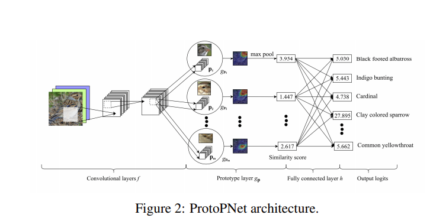
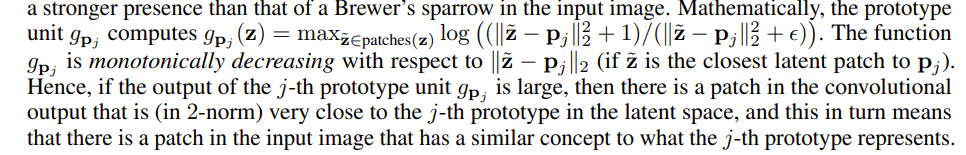
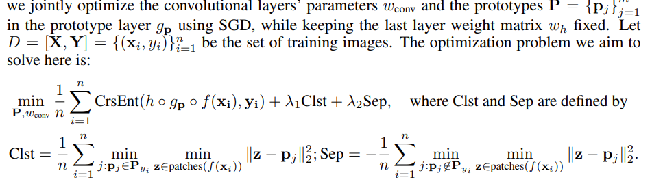

# Suggested 

## CAM papers

#### [Grad-cam: Visual explanations from deep networks via gradient-based localization](https://arxiv.org/abs/1610.02391)

#### [Grad-cam++: Generalized gradient-based visual explanations for deep convolutional networks](https://arxiv.org/pdf/1710.11063.pdf)

## General papers

#### [The mythos of model interpretability](https://arxiv.org/pdf/1606.03490.pdf)

#### [LIME: "Why Should I Trust You?": Explaining the Predictions of Any Classifier](https://arxiv.org/pdf/1602.04938.pdf)

-SHAP: A Unified Approach to Interpreting Model Predictions
-Interpretable Explanations of Black Boxes by Meaningful Perturbation
-How Can I Explain This to You? An Empirical Study of Deep Neural
Network Explanation Methods

## Part based
-This Looks Like That: Deep Learning for Interpretable Image
Recognition

## Recent

-Toward interpretable machine learning: Transparent deep neural
networks and beyond
-A Disentangling Invertible Interpretation Network for Explaining
Latent Representations (3 papers from the same guys)

# Seminar by Prof. Cynthia Rudin

#### [This Looks Like That: Deep Learning for Interpretable Image Recognition](https://arxiv.org/pdf/1806.10574.pdf)
- abstract: In this work, we introduce a deep network architecture –
prototypical part network (ProtoPNet), that reasons in a similar way: the network
dissects the image by finding prototypical parts, and combines evidence from the
prototypes to make a final classification. The model thus reasons in a way that is
qualitatively similar to the way ornithologists, physicians, and others would explain
to people on how to solve challenging image classification tasks. The network uses
only image-level labels for training without any annotations for parts of images.

[code](https://github.com/cfchen-duke/ProtoPNet)

**Improving the idea of salience map for interpretable**

#### [Concept Whitening for Interpretable Image Recognition](https://arxiv.org/pdf/2002.01650.pdf)
- abstract: In this
work, rather than attempting to analyze a neural network posthoc, we introduce a mechanism,
called concept whitening (CW), to alter a given
layer of the network to allow us to better understand the computation leading up to that layer.
When a concept whitening module is added to a
CNN, the axes of the latent space are aligned with
known concepts of interest.

**Improving the idea of the representation/feature**

# Adversarial ralated

#### Not Just A Black Box: Learning Important Features Through Propagating Activation Differences
#### [Attack to Explain Deep Representation](https://openaccess.thecvf.com/content_CVPR_2020/html/Jalwana_Attack_to_Explain_Deep_Representation_CVPR_2020_paper.html)
#### Robust Semantic Interpretability: Revisiting Concept Activation Vectors
#### Adaptive Clustering of Robust Semantic Representations for Adversarial Image Purification
#### Learning Robust Visual-semantic Mapping for Zero-shot Learning
#### Few-Cost Salient Object Detection with Adversarial-Paced Learning
#### Adaptive Clustering of Robust Semantic Representations for Adversarial Image Purification
#### FIMAP: Feature Importance by Minimal Adversarial Perturbation
#### Adversarial Training and Provable Robustness: A Tale of Two Objectives

Adversarial Robustness through Disentangled Representations

Adversarial Permutation Guided Node Representations for Link Prediction

Achieving Robustness in the Wild via Adversarial Mixing With Disentangled Representations

Learn2Perturb: An End-to-End Feature Perturbation Learning to Improve Adversarial Robustness

Adversarial Examples Improve Image Recognition

Enhancing Intrinsic Adversarial Robustness via Feature Pyramid Decoder

A Unified Approach to Interpreting and Boosting Adversarial Transferability

Improving Adversarial Robustness via Channel-wise Activation Suppressing

