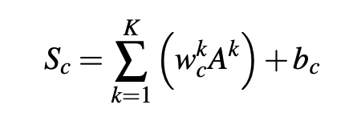

# Suggested 

## CAM papers

#### CAM
- Instead of fully connected layer, they use global average pooling (GAP)
- advantage of GAP: make full use of the spacial information, less parameters than fully-connected layer, more robustness and better performance in generalization, give clear semantic meaning to each feature map.
- Mc represents the weights of different feature map to each class

- Cons: it modifies the architecture of the network, needs retraining. It is simple with respect to idea but computation-consuming.

#### [Grad-cam: Visual explanations from deep networks via gradient-based localization](https://arxiv.org/abs/1610.02391)
- similar idea to CAM, but instead of use GAP and retraining to obtain the weight, grad-CAM calculate the weights by global average pooling of gradients via backprop
- Then calculate the linear combination of the feature map from last layer, and give ReLu, becasue we only interest in the region contributed to the class.

- they give the proof that grad-CAM is a generalization to CAM
- Cons: grad-CAM cannot localize the object very well, sometimes, it only recognizes part of object.

#### [Grad-cam++: Generalized gradient-based visual explanations for deep convolutional networks](https://arxiv.org/pdf/1710.11063.pdf)
- For each class, they consider it as a binary object classification task, if it contributes this class, it should be 1, otherwise 0, so they make the problem a weighted average of the pixel-wise gradients

### XAI

#### [Explanations can be manipulated and geometry is to blame](https://arxiv.org/pdf/1906.07983.pdf)
- abstract:  In this paper, we demonstrate a property of explanation methods which is
disconcerting for both of these purposes. Namely, we show that explanations can be
manipulated arbitrarily by applying visually hardly perceptible perturbations to the
input that keep the network’s output approximately constant. We establish theoretically that this phenomenon can be related to certain geometrical properties of neural
networks. This allows us to derive an upper bound on the susceptibility of explanations
to manipulations. Based on this result, we propose effective mechanisms to enhance
the robustness of explanations.
- They propose a attack which generate adversarial perturbation by modifing the feature map of a dog image to a cat image. (need to specify target image)
- The they plot differnt maps:1) gradient; 2) gradient \times input; 3) layerwise relevance propagation; 4) integrated gradients; 5) guided backpropagation; 6) pattern attribution
- Theoretical consideration: 1) the geodesic distance can be substantially greater than the Euclidean distance for curved manifold; 2) the upper bound is proportional to the \beta parameter of the softplus non-linearity
- \beta-smoothing of explanation: replace ReLu with softplus. For **one-layer** NN, smoothGrad provide robustness 

#### [Interpretable and Fine-Grained Visual Explanations for Convolutional Neural Networks](https://arxiv.org/abs/1908.02686)

- abstract: In this work, we propose
a post-hoc, optimization based visual explanation method,
which highlights the evidence in the input image for a specific prediction. Our approach is based on a novel technique
to defend against adversarial evidence (i.e. faulty evidence
due to artefacts) by filtering gradients during optimization.
The defense does not depend on human-tuned parameters.
It enables explanations which are both fine-grained and
preserve the characteristics of images, such as edges and
colors. The explanations are interpretable, suited for visualizing detailed evidence and can be tested as they are valid
model inputs. We qualitatively and quantitatively evaluate
our approach on a multitude of models and datasets.
- Perturbation based visual explanations: 1) the resulting explanations are interpretable due to their image-like nature; 2) explanations represent valid model inputs and are thus testable; 3) explanations are optimized to be faithfull.
1. Ecplanation by perservation: the smallest region of the image which must be retained to preserve the original model output;
2. Explanation by deletion: the smallest region of the image which must be deleted to change the model output

## General papers

#### [The mythos of model interpretability](https://arxiv.org/pdf/1606.03490.pdf)

#### [LIME: "Why Should I Trust You?": Explaining the Predictions of Any Classifier](https://arxiv.org/pdf/1602.04938.pdf)

#### [SHAP: A Unified Approach to Interpreting Model Predictions](https://arxiv.org/pdf/1705.07874.pdf)

#### [Interpretable Explanations of Black Boxes by Meaningful Perturbation](https://arxiv.org/abs/1704.03296)
#### [How Can I Explain This to You? An Empirical Study of Deep Neural Network Explanation Methods](https://proceedings.neurips.cc/paper/2020/file/2c29d89cc56cdb191c60db2f0bae796b-Paper.pdf)

## Part based

#### [This Looks Like That: Deep Learning for Interpretable Image Recognition](https://arxiv.org/pdf/1806.10574.pdf)
- abstract: In this work, we introduce a deep network architecture –
prototypical part network (ProtoPNet), that reasons in a similar way: the network
dissects the image by finding prototypical parts, and combines evidence from the
prototypes to make a final classification. The model thus reasons in a way that is
qualitatively similar to the way ornithologists, physicians, and others would explain
to people on how to solve challenging image classification tasks. The network uses
only image-level labels for training without any annotations for parts of images.

[code](https://github.com/cfchen-duke/ProtoPNet)

**Improving the idea of salience map for interpretable**

## Recent

#### [Toward interpretable machine learning: Transparent deep neural networks and beyond](https://arxiv.org/abs/2003.07631v1?utm_campaign=AI%20Scholar%20Weekly%20&utm_medium=email&utm_source=Revue%20newsletter)
#### [A Disentangling Invertible Interpretation Network for Explaining Latent Representations](https://arxiv.org/pdf/2004.13166.pdf)
(3 papers from the same guys)

#### [Concept Whitening for Interpretable Image Recognition](https://arxiv.org/pdf/2002.01650.pdf)
- abstract: In this
work, rather than attempting to analyze a neural network posthoc, we introduce a mechanism,
called concept whitening (CW), to alter a given
layer of the network to allow us to better understand the computation leading up to that layer.
When a concept whitening module is added to a
CNN, the axes of the latent space are aligned with
known concepts of interest.

**Improving the idea of the representation/feature**

# Adversarial ralated

#### Not Just A Black Box: Learning Important Features Through Propagating Activation Differences
#### [Attack to Explain Deep Representation](https://openaccess.thecvf.com/content_CVPR_2020/html/Jalwana_Attack_to_Explain_Deep_Representation_CVPR_2020_paper.html)
#### Robust Semantic Interpretability: Revisiting Concept Activation Vectors
#### Adaptive Clustering of Robust Semantic Representations for Adversarial Image Purification
#### Learning Robust Visual-semantic Mapping for Zero-shot Learning
#### Few-Cost Salient Object Detection with Adversarial-Paced Learning
#### Adaptive Clustering of Robust Semantic Representations for Adversarial Image Purification
#### FIMAP: Feature Importance by Minimal Adversarial Perturbation
#### Adversarial Training and Provable Robustness: A Tale of Two Objectives

Adversarial Robustness through Disentangled Representations

Adversarial Permutation Guided Node Representations for Link Prediction

Achieving Robustness in the Wild via Adversarial Mixing With Disentangled Representations

Learn2Perturb: An End-to-End Feature Perturbation Learning to Improve Adversarial Robustness

Adversarial Examples Improve Image Recognition

Enhancing Intrinsic Adversarial Robustness via Feature Pyramid Decoder

A Unified Approach to Interpreting and Boosting Adversarial Transferability

Improving Adversarial Robustness via Channel-wise Activation Suppressing

