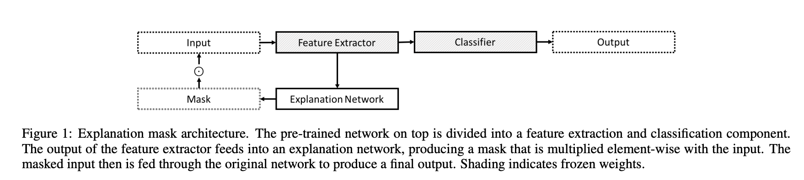
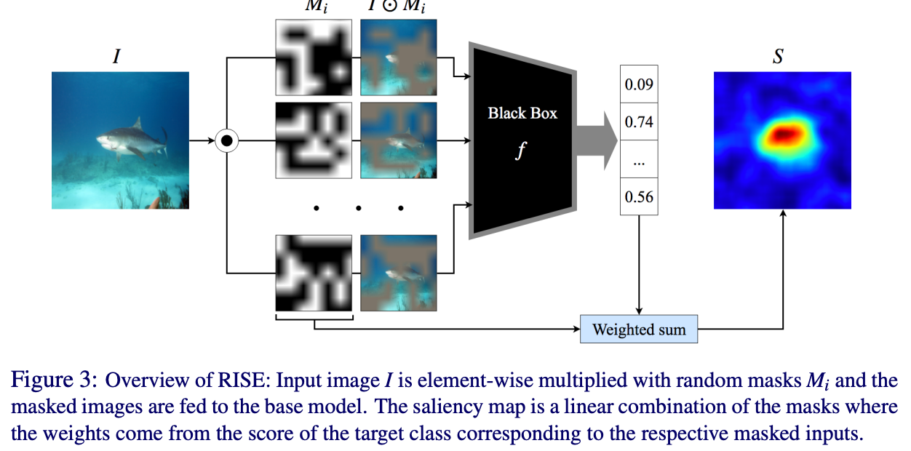
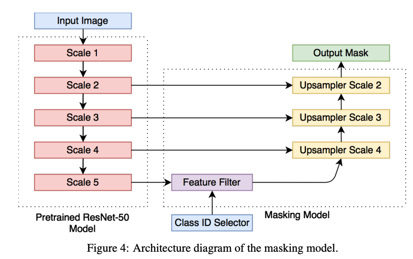
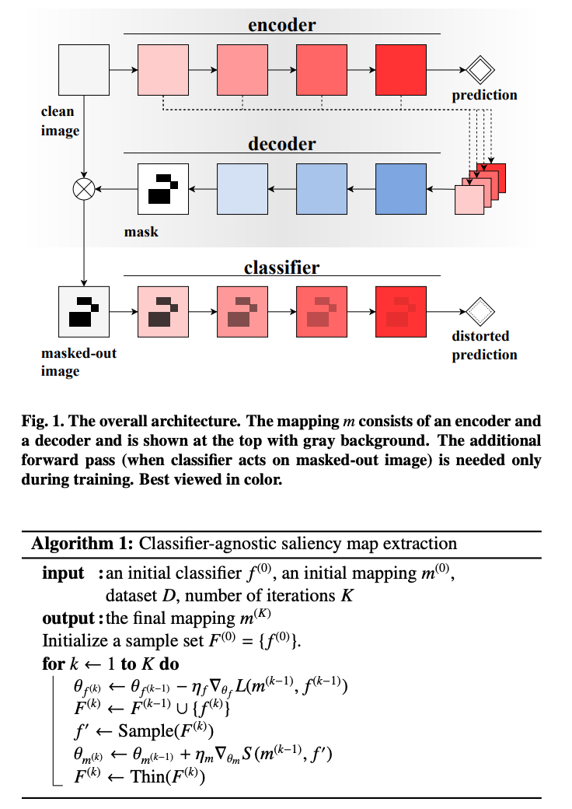
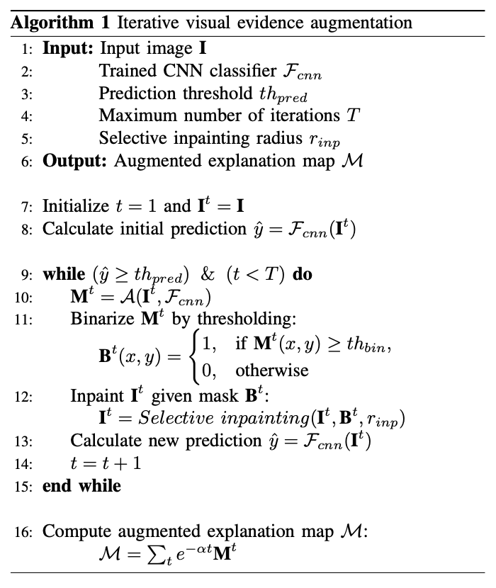
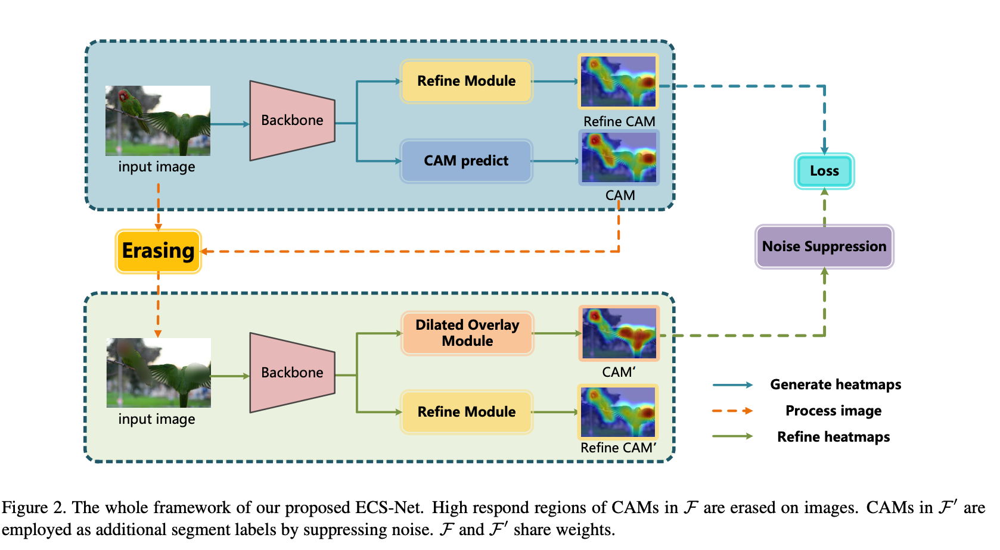

### [Explanatory Masks for Neural Network Interpretability](https://arxiv.org/pdf/1911.06876.pdf)

- masks are created by a secondary network whose goal is to create as small an explanation as possible while still 
preserving the predictive accuracy of the original network.
- for image clasification (CIFAR10), NLP task (IMDB), chemical solubility 
- 4 pages paper

### [Investigating and Simplifying Masking-based Saliency Map Methods for Model Interpretability](https://arxiv.org/pdf/2010.09750.pdf)

- mask out portions of an image to maximally deteriorate classification performance
- mask in an image to preserve classification performance
- counterfactual generation and optimization over a gumbel-softmax distribution
- training:  (1) using both masked-in and masked-out objectives and (2)
training the classifier alongside the masking model
- we find that a well-tuned, relatively simple
formulation of a masking-based saliency model outperforms many more complex
approaches

### [RISE: Randomized Input Sampling for Explanation of Black-box Models](https://arxiv.org/pdf/1806.07421.pdf)

- estimates importance empirically by probing the model with randomly
masked versions of the input image and obtaining the corresponding outputs

### [Interpretable Explanations of Black Boxes by Meaningful Perturbation](https://arxiv.org/pdf/1704.03296.pdf)

- explaining black box with meta-learning

### [Explaining Image Classifiers by counterfactual generation](https://arxiv.org/pdf/1807.08024.pdf)

- sample plausible image in-fills by conditioning a generative model on the
rest of the image. 
- optimize to find the image regions that most change
the classifier’s decision after in-fill. 
- contrasts with ad-hoc in-filling
approaches, such as blurring or injecting noise, which generate inputs far from the
data distribution, and ignore informative relationships between different parts of
the image. 

### [Real Time Image Saliency for Black Box Classifiers](https://arxiv.org/pdf/1705.07857.pdf)

- objective function is composed of 4 terms: (1) enforces mask smoothness (Total Variation); (2) encourage region small (average of the mask elements); 
(3) make sure the classifier recognize the selected class from the preserved region (log of softmax probability); (4) ensures the probability of selected class is low after the salient region is removed
- solve the objective function by a trainable masking model

### [Classifier-agnostic saliency map extraction](https://arxiv.org/pdf/1805.08249.pdf)

- train a explaination model to generate saliency map

### [Iterative augmentation of visual evidence for weakly-supervised lesion localization in deep interpretability frameworks: application to color fundus images](https://arxiv.org/abs/1910.07373)

- iterative version of CAM

### [ECS-Net: Improving Weakly Supervised Semantic Segmentation by Using Connections Between Class Activation Maps](https://openaccess.thecvf.com/content/ICCV2021/papers/Sun_ECS-Net_Improving_Weakly_Supervised_Semantic_Segmentation_by_Using_Connections_Between_ICCV_2021_paper.pdf)

- apply these features, learned from erased images, as segmentation supervision, driving network to study robust representation
- mapping heat map to [0,1] by max-min normalization
- take the maximum as score map
- get erased image

