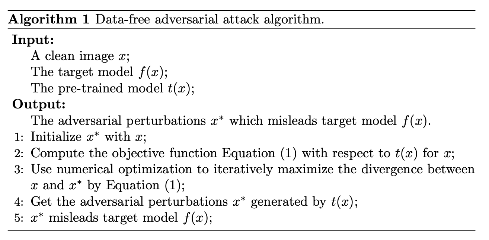
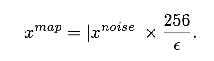
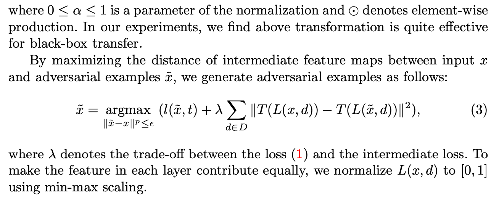

### [Data-Free Adversarial Perturbations for Practical Black-Box Attack](https://arxiv.org/abs/2003.01295)

- do not use the distribution of the training data (universal adversarial perturbation methods)
- learn adversarial perturbation that disturb the internal representation
- maximizeds the divergence between clean images and their adversarial examples in the representation space
- suragation model VS target model --> pre-trained model and fine-tuned model

**comments**
- the transferability is tested in fine-tuned model, and they use the gradient of pre-trained model (should have similar architecure), which means they actually already know some information
- they claim they disturb the internal representation, but their loss function is using the output at logits layer, it is a kind of exaggeration.
- they maximized the divergence equation, but why not other formulation of divergence, why this works better? No ideas.

## Stablizing Gradients

### [Boosting Adversarial Attacks with Momentum](https://arxiv.org/abs/1710.06081)

- MI-FGSM
- They believe that momentum term provides more stable directions and results in more transferable adversarial examples.
- becuase some ppor local maxima in optimization process are only related to specific model. They exist around a data point due to highly non-linear structure of DNN. And hard to transform to other models.
- one-step gradients based method generate more transferable adversarial examples but usually have a low success rate

### [Patch-wise Attack for Fooling Deep Neural Network](https://arxiv.org/abs/2007.06765)

- [patch-wise iterative algorithm](https://github.com/qilong-zhang/Patch-wise-iterative-attack)
- amplification factor to the step size in each iteration
- one pixel's overall gradient overflowing the epsilon=constraint is properly assigned to its surrounding regions by a project kernel
- regionally homogeneous perturbations are strong in attacking defense models
- Patch Map

Wp is a special uniform project kernel, it is to reuse the cut noise to alleviate the disadvantages of direct clipping, increasing the aggregation degree of noise patches

**comments**
- not sure how much the Wp helps... 
- It makes sence to make a patch-wise version but how it is not fair to compare fgsm-based methods, how it compare to patch-based method like square attack...

### [Enhancing the Transferability of Adversarial Attacks through Variance Tuning](https://arxiv.org/abs/2103.15571)

- [Variance Tuning Attack](https://github.com/JHL-HUST/VT)
- instead of directly using the current gradient for the momentum accumulation, they further consider the gradient variance of the previous iteration to tune the current gradient so as to stabilize the update direction and escape from poor local optima.

**comments**
- make since to use the gradient variance to make it more stable but why L1 norm???

## Augmenting Image Data

### [Improving Transferability of Adversarial Examples with Input Diversity](https://arxiv.org/abs/1803.06978)

- [DI-2-FGSM](https://github.com/cihangxie/DI-2-FGSM)
- apply random transformations to the input images at each iteration, they found random resizing and padding yields adversarial examples with the best transferability.

### [Evading Defenses to Transferable Adversarial Examples by Translation-Invariant Attacks](https://arxiv.org/abs/1904.02884)

- translation-invariant attack-- optimizing a perturbation over an ensemble of translated images
- [TI-FGSM](https://github.com/dongyp13/Translation-Invariant-Attacks)

- they consider three different choices for W: uniform kernal;linear kernel;Gaussian kernel

**comments**
- It seems the kernels makes the perturbation more "patch-wise"

### [Admix: Enhancing the Transferability of Adversarial Attacks](https://arxiv.org/abs/2102.00436)

- [Admix](https://github.com/JHL-HUST/Admix)
- input images + a set of images randomly samples from other categories; Admix calculates the gradient on the input image admixed with a small portion of each add-in image while using the original label of the input to craft more transferable adversaries

### [Nesterov Accelerated Gradient and Scale Invariance for Adversarial Attacks](https://arxiv.org/abs/1908.06281)

## New loss functions

### [Feature space perturbations yield more transferable adversarial examples](https://openaccess.thecvf.com/content_CVPR_2019/papers/Inkawhich_Feature_Space_Perturbations_Yield_More_Transferable_Adversarial_Examples_CVPR_2019_paper.pdf)

- The attack is explicitly designed for transferability and drives feature space representation of a source image at layer L towards the representation of a target image at L.

- loss function is built based on L２ norm difference of feature of layer 
- attack is ＴＭI－FSGM based

**comments**
- it needs a specific target image, which influence the results.
- which layer to choose is also need to discuss
- the discussion of the layer is interesting

### [Enhancing Adversarial Example Transferability with an Intermediate Level Attack](https://arxiv.org/abs/1907.10823)

- [ILA](https://github.com/CUAI/Intermediate-Level-Attack)
- attempt to fine-tune an existing adversarial example for greater balck-box transferability by increasing its perturbation on apre-specified layer of the source model

**conmments**
- it seems only encourage to have larger perturbation....

### [Feature Importance-aware Transferable Adversarial Attacks](https://arxiv.org/abs/2107.14185)

- [FIA](https://github.com/hcguoO0/FIA)
- obtain feature importance by aggregate gradient -- (similar idea to RISE)

### [Towards evaluating the robustness of neural networks](https://arxiv.org/abs/1608.04644)

- large margin, i.e. high-confidence, provides high transferability

### [Towards Transferable Targeted Attack](https://openaccess.thecvf.com/content_CVPR_2020/papers/Li_Towards_Transferable_Targeted_Attack_CVPR_2020_paper.pdf)

- poincare distance
-  two defects that lead to the difficulty in generating transferable examples: (1) the magnitude of gradient is decreasing during iterative attack, causing excessive consistency between two successive noises in accumulation of momentum, which is termed as noise curing; (2) it is not enough for targeted adversarial examples to just get close to target class without moving away from true class
-  triplet loss: compare the distance to the positive example and the negtive example

### [On Success and Simplicity: A Second Look at Transferable Targeted Attacks](https://arxiv.org/abs/2012.11207)

- [targeted-transfer](https://github.com/ZhengyuZhao/Targeted-Tansfer)
- logit loss, largely surpass the commonly adopted 

- three transfer scenarios: (1) ensemble transfer scenario with little model similarity, (2)a worse-case scenario with low-ranked target classes, (3)a real-world attack on the Google Cloud Vision API.
- existing transfer methods with more iterations yield good results

### [Transferable adversarial perturbations](https://openaccess.thecvf.com/content_ECCV_2018/papers/Bruce_Hou_Transferable_Adversarial_Perturbations_ECCV_2018_paper.pdf)
- introduce two terms into cost function to guide the search directions of perturbations: (1) maximize the distances between natural images and their adversarial examples in the intermediate feature maps which can address vanishing gradients for adversarial perturbations generation. (2) introduce a regularization term into cost function to remove the high-frequency perturbations, which enables black-box transfer with high error rates.
- Maximizing distance: intermediate loss (intermediate feature maps)

- Regularization: 

- optimization: IFGSM

### [Boosting the Transferability of AdversarialSamples via Attention](https://openaccess.thecvf.com/content_CVPR_2020/html/Wu_Boosting_the_Transferability_of_Adversarial_Samples_via_Attention_CVPR_2020_paper.html)
- they propose a movel mechanism to alleviate the overfitting issue

## Devising Surrogate Models

### [Delving into transferable adversarial examples and black-box attacks](https://openreview.net/pdf?id=Sys6GJqxl)

- first to conduct an extensive study of the transferability over large models and a large scale dataset; first to study the transferability of targeted adversarail examples with their target labels
- ensemble-based approaches to generating transferable adversarial examples
- geometric properties: gradient directions of different models are orthogonal to each other; decision boundaries of different models align well with each other

### [Learning Transferable Adversarial Examples via Ghost Networks](https://arxiv.org/pdf/1812.03413.pdf)

- Ghost Networks: apply feature-level perturbations to an existing model to potential create a huge set of diverse models; models are subsequently fused by longitudinal ensemble
- customized fusion method + logitudinal ensemble
- Dropout Erosion: densely apply dropout to every block throughout the base network
