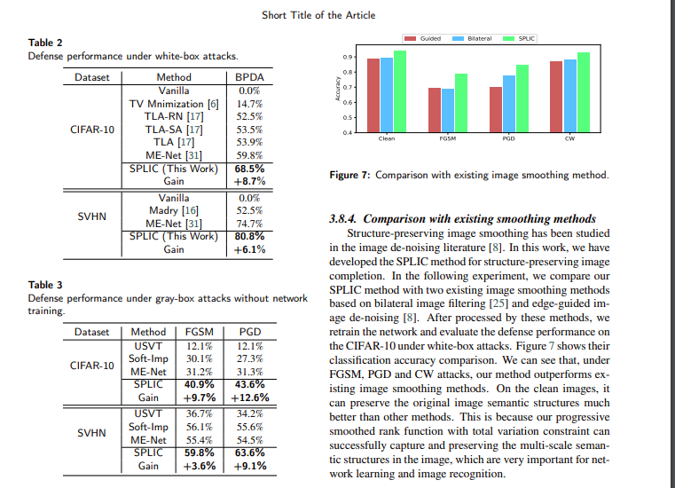

### [Robustness of saak transform against adversarial attacks](https://ieeexplore.ieee.org/iel7/8791230/8799366/08803240.pdf?casa_token=snoJp85EcsUAAAAA:ZiMzwd3S6Ba24HfdEaF9KUAW9YgZabNuj3bftLR812-ZeSalviMaILfXsW79UMcY4Z7S7CPlpQ)
- abstract: This work investigates the robustness of Saak transform
against adversarial attacks towards high performance image
classification. We develop a complete image classification
system based on multi-stage Saak transform. In the Saak
transform domain, clean and adversarial images demonstrate
different distributions at different spectral dimensions. Selection of the spectral dimensions at every stage can be viewed
as an automatic denoising process. Motivated by this observation, we carefully design strategies of feature extraction, representation and classification that increase adversarial robustness
- Saak transform: Saak transform defines a mapping from three-dimensional
real-valued function (consisting of spatial and spectral dimensions) to a one-dimensional rectified spectral vector. It is presented as a new feature representation method. It consists
of two main ideas: subspace approximation and kernel augmentation. For the former, we build the optimal linear subspace approximation to the original signal space via PCA or
the truncated Karhunen-Loeve Transform (KLT) 

### [Adversarial dual network learning with randomized image transform for restoring attacked images](https://ieeexplore.ieee.org/stamp/stamp.jsp?arnumber=8968395)
- abstract: We introduce a randomized nonlinear
transform to disturb and partially destroy the sophisticated pattern of attack noise. We then design a
generative cleaning network to recover the original image content damaged by this nonlinear transform
and remove residual attack noise. We also construct a detector network which serves as the dual network
for the target classifier to be defended, being able to detect patterns of attack noise

### [Generative Cleaning Networks with Quantized Nonlinear Transform for Deep Neural Network Defense](https://openreview.net/pdf?id=SkxOhANKDr)
- abstract: In this paper, we develop a new generative cleaning network with quantized nonlinear transform for
effective defense of deep neural networks. The generative cleaning network,
equipped with a trainable quantized nonlinear transform block, is able to destroy
the sophisticated noise pattern of adversarial attacks and recover the original image content.

### [Defending against adversarial attacks in deep neural networks](https://www.spiedigitallibrary.org/conference-proceedings-of-spie/11006/110061C/Defending-against-adversarial-attacks-in-deep-neural-networks/10.1117/12.2519268.short?SSO=1)
- abstract: The method employs a novel signal processing theory as a defense to adversarial perturbations. The method neither modifies the protected network nor requires knowledge of the process for generating adversarial examples. 

### [Local gradients smoothing: Defense against localized adversarial attacks](https://ieeexplore.ieee.org/stamp/stamp.jsp?arnumber=8658401&casa_token=ToUDz-lu-a0AAAAA:wmjpUQnPigxU5qmefAXZR5Oa8h8k02JiBR00qLv5ox89LXrlk-FGA1TSuc6isSrTvlYNqjK1RA)
- abstract: Driven by the observation
that such attacks introduce concentrated high-frequency
changes at a particular image location, we have developed
an effective method to estimate noise location in gradient
domain and transform those high activation regions caused
by adversarial noise in image domain while having minimal effect on the salient object that is important for correct
classification. Our proposed Local Gradients Smoothing
(LGS) scheme achieves this by regularizing gradients in the
estimated noisy region before feeding the image to DNN for
inference.

## [Defending against adversarial images using basis functions transformations](https://arxiv.org/abs/1803.10840)
- abstract: We study the effectiveness of various approaches that defend against adversarial attacks on
deep networks via manipulations based on basis function representations of images. Specifically, we experiment with low-pass filtering, PCA, JPEG compression, low resolution wavelet
approximation, and soft-thresholding. We evaluate these defense techniques using three types
of popular attacks in black, gray and white-box settings

## [Encryption inspired adversarial defense for visual classification](https://ieeexplore.ieee.org/stamp/stamp.jsp?arnumber=9190904&casa_token=Z1Iyo_hyV_QAAAAA:0UdK0p2dbvxrtukVhPI81PLJ6YuWkTOAQEWZ7Lu30-PjYfBU8Zn239IxIBVx-eVODokbHEAI7w)
- abstract: In this paper, we
propose a new adversarial defense which is a defensive transform for both training and test images inspired by perceptual
image encryption methods. The proposed method utilizes a
block-wise pixel shuffling method with a secret key.

## [Barrage of Random Transforms for Adversarially Robust Defense](https://openaccess.thecvf.com/content_CVPR_2019/papers/Raff_Barrage_of_Random_Transforms_for_Adversarially_Robust_Defense_CVPR_2019_paper.pdf)
- abstract： In this paper, we explore the idea of stochastically combining a large number of individually weak defenses into
a single barrage of randomized transformations to build
a strong defense against adversarial attacks. We show
that, even after accounting for obfuscated gradients, the
Barrage of Random Transforms (BaRT) is a resilient
defense against even the most difficult attacks, such as
PGD.

## [Structure-Preserving Progressive Low-rank Image Completion for Defending Adversarial Attacks](https://arxiv.org/pdf/2103.02781.pdf)
- abstract：In this work, we propose to develop a structure-preserving
progressive low-rank image completion (SPLIC) method to remove unneeded texture details from the
input images and shift the bias of deep neural networks towards global object structures and semantic cues. We formulate the problem into a low-rank matrix completion problem with progressively
smoothed rank functions to avoid local minimums during the optimization process

## [Diminishing the Effect of Adversarial Perturbations via Refining Feature Representation](https://arxiv.org/pdf/1907.01023.pdf)
- abstract:  In this work, we analytically
investigate each layer’s representation of non-perturbed and perturbed images and
show the effect of perturbations on each of these representations. Accordingly, a
method based on whitening coloring transform is proposed in order to diminish the
misrepresentation of any desirable layer caused by adversaries. Our method can be
applied to any layer of any arbitrary model without the need of any modification or
additional training. 

## [Ensemble Generative Cleaning With Feedback Loops for Defending Adversarial Attacks](https://openaccess.thecvf.com/content_CVPR_2020/html/Yuan_Ensemble_Generative_Cleaning_With_Feedback_Loops_for_Defending_Adversarial_Attacks_CVPR_2020_paper.html)
- abstract: In this paper, we develop a new method called ensemble generative cleaning with feedback loops (EGC-FL) for effective defense of deep neural networks. The proposed EGC-FL method is based on two central ideas. First, we introduce a transformed deadzone layer into the defense network, which consists of an orthonormal transform and a deadzone-based activation function, to destroy the sophisticated noise pattern of adversarial attacks. Second, by constructing a generative cleaning network with a feedback loop, we are able to generate an ensemble of diverse estimations of the original clean image. We then learn a network to fuse this set of diverse estimations together to restore the original image. 

## [Ensemble of Models Trained by Key-based Transformed Images for Adversarially Robust Defense Against Black-box Attacks](https://arxiv.org/abs/2011.07697)
- abstract: We propose a voting ensemble of models trained by using block-wise transformed images with secret keys for an adversarially robust defense. Key-based adversarial defenses were demonstrated to outperform state-of-the-art defenses against gradient-based (white-box) attacks. However, the key-based defenses are not effective enough against gradient-free (black-box) attacks without requiring any secret keys. Accordingly, we aim to enhance robustness against black-box attacks by using a voting ensemble of models. In the proposed ensemble, a number of models are trained by using images transformed with different keys and block sizes, and then a voting ensemble is applied to the models

##### [An Extension of Encryption-Inspired Adversarial Defense with Secret Keys against Adversarial Examples](https://ieeexplore.ieee.org/abstract/document/9306231?casa_token=wGqcY5ak2H8AAAAA:raMBexbTaUDpVkQ4cIQ_eVGis4XeeKua6o6CbzdNuBy1vJItQ_b424fffD4tRJbys-Ys4lIXDg)
- abstract: In this work, we first extend the block-wise image transformation for increasing its key space by using additional transformation steps. Moreover, the extended defense is extensively evaluated in terms of robustness against various attacks under a number of metrics. We also conduct adaptive attacks with key estimation. 

### [VectorDefense: Vectorization as a Defense to Adversarial Examples](https://link.springer.com/chapter/10.1007/978-3-030-49536-7_3)
- abstract: Inspired by how humans reconstruct abstract concepts, we attempt to codify the input bitmap image into a set of compact, interpretable elements to avoid being fooled by the adversarial structures. We take the first step in this direction by experimenting with image vectorization as an input transformation step to map the adversarial examples back into the natural manifold of MNIST handwritten digits. 

*Haha, seriously? back to the era of feature extraction ;p*

## [Adversarial Defense by Stratified Convolutional Sparse Coding](https://openaccess.thecvf.com/content_CVPR_2019/html/Sun_Adversarial_Defense_by_Stratified_Convolutional_Sparse_Coding_CVPR_2019_paper.html)
- abstract: We propose an adversarial defense method that achieves state-of-the-art performance among attack-agnostic adversarial defense methods while also maintaining robustness to input resolution, scale of adversarial perturbation, and scale of dataset size. Based on convolutional sparse coding, we construct a stratified low-dimensional quasi-natural image space that faithfully approximates the natural image space while also removing adversarial perturbations. We introduce a novel Sparse Transformation Layer (STL) in between the input image and the first layer of the neural network to efficiently project images into our quasi-natural image space. 

### [Defending Against Universal Attacks Through Selective Feature Regeneration](https://openaccess.thecvf.com/content_CVPR_2020/html/Borkar_Defending_Against_Universal_Attacks_Through_Selective_Feature_Regeneration_CVPR_2020_paper.html)
- abstract: Our approach identifies pre-trained convolutional features that are most vulnerable to adversarial noise and deploys trainable feature regeneration units which transform these DNN filter activations into resilient features that are robust to universal perturbations. Regenerating only the top 50% adversarially susceptible activations in at most 6 DNN layers and leaving all remaining DNN activations unchanged, we outperform existing defense strategies across different network architectures by more than 10% in restored accuracy. 

### [Regional Homogeneity: Towards Learning Transferable Universal Adversarial Perturbations Against Defenses](https://arxiv.org/abs/1904.00979)
- abstract: This paper focuses on learning transferable adversarial examples specifically against defense models (models to defense adversarial attacks). In particular, we show that a simple universal perturbation can fool a series of state-of-the-art defenses.
Adversarial examples generated by existing attacks are generally hard to transfer to defense models. We observe the property of regional homogeneity in adversarial perturbations and suggest that the defenses are less robust to regionally homogeneous perturbations. Therefore, we propose an effective transforming paradigm and a customized gradient transformer module to transform existing perturbations into regionally homogeneous ones. Without explicitly forcing the perturbations to be universal, we observe that a well-trained gradient transformer module tends to output input-independent gradients (hence universal) benefiting from the under-fitting phenomenon.

### [Learning Defense Transformers for Counterattacking Adversarial Examples](https://arxiv.org/abs/2103.07595)
- abstract: In this paper, motivated by that adversarial examples are more likely to appear near the classification boundary, we study adversarial examples from a new perspective that whether we can defend against adversarial examples by pulling them back to the original clean distribution. We theoretically and empirically verify the existence of defense affine transformations that restore adversarial examples. Relying on this, we learn a defense transformer to counterattack the adversarial examples by parameterizing the affine transformations and exploiting the boundary information of DNNs.

### [Mitigating large adversarial perturbations on X-MAS (X minus Moving Averaged Samples)](https://arxiv.org/abs/1912.12170)
- abstract: We propose the scheme that mitigates the adversarial perturbation ϵ on the adversarial example Xadv (= X ± ϵ, X is a benign sample) by subtracting the estimated perturbation ϵ^ from X + ϵ and adding ϵ^ to X − ϵ. The estimated perturbation ϵ^ comes from the difference between Xadv and its moving-averaged outcome Wavg∗Xadv where Wavg is N×N moving average kernel that all the coefficients are one. Usually, the adjacent samples of an image are close to each other such that we can let X ≈ Wavg∗X (naming this relation after X-MAS[X minus Moving Averaged Samples]).

*No comparison experiments, only pictures.*

### [Enhancing Transformation-based Defenses using a Distribution Classifier](https://arxiv.org/abs/1906.00258)
- abstract: In this paper, we study the distribution of softmax induced by stochastic transformations. We observe that with random transformations on the clean images, although the mass of the softmax distribution could shift to the wrong class, the resulting distribution of softmax could be used to correct the prediction. Furthermore, on the adversarial counterparts, with the image transformation, the resulting shapes of the distribution of softmax are similar to the distributions from the clean images. With these observations, we propose a method to improve existing transformation-based defenses. We train a separate lightweight distribution classifier to recognize distinct features in the distributions of softmax outputs of transformed images. 

### [Feature Denoising for Improving Adversarial Robustness](https://openaccess.thecvf.com/content_CVPR_2019/html/Xie_Feature_Denoising_for_Improving_Adversarial_Robustness_CVPR_2019_paper.html)
- abstract: This study suggests that adversarial perturbations on images lead to noise in the features constructed by these networks. Motivated by this observation, we develop new network architectures that increase adversarial robustness by performing feature denoising. Specifically, our networks contain blocks that denoise the features using non-local means or other filters; the entire networks are trained end-to-end. When combined with adversarial training, our feature denoising networks substantially improve the state-of-the-art in adversarial robustness in both white-box and black-box attack settings.

### [DIPDefend: Deep Image Prior Driven Defense against Adversarial Examples](https://dl.acm.org/doi/abs/10.1145/3394171.3413898?casa_token=hr14vy59uS0AAAAA:SJUwQm4Kab9-fNxeiUqpnMHjy4XG0m0kRuqD807Uet1WzPwT_sX9sb9rcVmNEDKxhqc2NS4HgRbU)
- abstract: we propose an effective Deep Image Prior Driven Defense (DIPDefend) method against adversarial examples. With a DIP generator to fit the target/adversarial input, we find that our image reconstruction exhibits quite interesting learning preference from a feature learning perspectives, i.e., the early stage primarily learns the robust features resistant to adversarial perturbation, followed by learning non-robust features that are sensitive to adversarial perturbation. Besides, we develop an adaptive stopping strategy that adapts our method to diverse images. In this way, the proposed model obtains a unique defender for each individual adversarial input, thus being robust to various attackers.

### [Evading Defenses to Transferable Adversarial Examples by Translation-Invariant Attacks](https://openaccess.thecvf.com/content_CVPR_2019/html/Dong_Evading_Defenses_to_Transferable_Adversarial_Examples_by_Translation-Invariant_Attacks_CVPR_2019_paper.html)
- abstract: In this paper, we propose a translation-invariant attack method to generate more transferable adversarial examples against the defense models. By optimizing a perturbation over an ensemble of translated images, the generated adversarial example is less sensitive to the white-box model being attacked and has better transferability.

### [From a Fourier-Domain Perspective on Adversarial Examples to a Wiener Filter Defense for Semantic Segmentation](https://arxiv.org/abs/2012.01558)
- abstract: In this work, we study the adversarial problem from a frequency domain perspective. More specifically, we analyze discrete Fourier transform (DFT) spectra of several adversarial images and report two major findings: First, there exists a strong connection between a model architecture and the nature of adversarial perturbations that can be observed and addressed in the frequency domain. Second, the observed frequency patterns are largely image- and attack-type independent, which is important for the practical impact of any defense making use of such patterns. Motivated by these findings, we additionally propose an adversarial defense method based on the well-known Wiener filters that captures and suppresses adversarial frequencies in a data-driven manner. Our proposed method not only generalizes across unseen attacks but also beats five existing state-of-the-art methods across two models in a variety of attack settings.

### [BlurNet: Defense by Filtering the Feature Maps](https://ieeexplore.ieee.org/abstract/document/9151833?casa_token=BVXOgBJzluwAAAAA:Q6mjIC-ck2bQUAG30sMaNW4US54DUpMgTm7dv8zer5BA8efvuxJo2PbedIvnCokfP5bAgMLgbQ)
- abstract: In this paper, we propose BlurNet, a defense against the Robust Physical Perturbations RP 2 attack. First, we motivate the defense with a frequency analysis of the first layer feature maps of the network on the LISA dataset, which shows that high frequency noise is introduced into the input image by the RP 2 algorithm. To remove the high frequency noise, we introduce a depthwise convolution layer of standard blur kernels after the first layer. We perform a blackbox transfer attack to show that low-pass filtering the feature maps is more beneficial than filtering the input. We then present various regularization schemes to incorporate this lowpass filtering behavior into the training regime of the network and perform white-box attacks.

### [PPD: Permutation Phase Defense Against Adversarial Examples in Deep Learning](https://ieeexplore.ieee.org/abstract/document/8999137?casa_token=pV-eNkQkowwAAAAA:3WgwskvkGsifYAC93wgfv4z7LAphfAiYl4VljkEW5TpL2FKYoIPPioP-1qXz7s7uCb6UPrn7Yw)
- abstract: In this paper, Permutation Phase Defense (PPD), is proposed as a novel method to resist adversarial attacks. PPD combines random permutation of the image with phase component of its Fourier transform. The basic idea behind this approach is to turn adversarial defense problems analogously into symmetric cryptography, which relies solely on safekeeping of the keys for security. 

### [MagNet with Randomization Defense against Adversarial Examples](https://ieeexplore.ieee.org/abstract/document/9353828?casa_token=RkET7ugWIYMAAAAA:hEihRV9QsOvCKYjCGySlNnxT2huCfi1WtNdFof8MX1MICp0G9E5__8qlphXnAC077B2ROxOj5g)
- abstract: This paper proposes a new defense method against adversarial examples attack. Based on the defense strategy of the MagNet, we add two random layers: one is used to randomly adjust the image size and the other is used to randomly fill the image with zero to reduce the impact of adversarial attack. Our method provides the following advantages: 1)The framework does not rely on adversarial examples and its generation process. 2)The method is relatively easy and effective in practice. 

### [Noise Is Inside Me! Generating Adversarial Perturbations With Noise Derived From Natural Filters](https://openaccess.thecvf.com/content_CVPRW_2020/html/w47/Agarwal_Noise_Is_Inside_Me_Generating_Adversarial_Perturbations_With_Noise_Derived_CVPRW_2020_paper.html)
- abstract: In this research, we present a novel scheme termed as Camera Inspired Perturbations to generate adversarial noise. The proposed approach relies on the noise embedded in the image due to environmental factors or camera noise incorporated. We extract these noise patterns using image filtering algorithms and incorporate them into images to generate adversarial images. Unlike most of the existing algorithms that require learning of noise, the proposed adversarial noise can be applied in real-time. It is model-agnostic and can be utilized to fool multiple deep learning classifiers on various databases. 

### [Adversarial CAPTCHAs](https://arxiv.org/abs/1901.01107)
- abstract: Following the principle of to set one's own spear against one's own shield, we study how to design adversarial CAPTCHAs in this paper. We first identify the similarity and difference between adversarial CAPTCHA generation and existing hot adversarial example (image) generation research. Then, we propose a framework for text-based and image-based adversarial CAPTCHA generation on top of state-of-the-art adversarial image generation techniques. Finally, we design and implement an adversarial CAPTCHA generation and evaluation system, named aCAPTCHA, which integrates 10 image preprocessing techniques, 9 CAPTCHA attacks, 4 baseline adversarial CAPTCHA generation methods, and 8 new adversarial CAPTCHA generation methods. 

### [Adversarial examples detection through the sensitivity in space mappings](https://digital-library.theiet.org/content/journals/10.1049/iet-cvi.2019.0378)
- abstract: In this paper, the authors propose a robust and effective defence method for analysing the sensitivity of various AEs, especially in a much harder case (large images). Their method first creates a feature map from the input space to the new feature space, by utilising 19 different feature mapping methods. Then, a detector is learned with the machine-learning algorithm to recognise the unique distribution of AEs.

### [The art of defense: letting networks fool the attacker](https://arxiv.org/pdf/2104.02963.pdf)
- abstract: In this paper,
we demonstrated this property can be powerful in the defense of gradient based
attacks. Specifically, we apply random input transformation which is invariant
to networks we want to defend.

### [ComDefend: An Efficient Image Compression Model to Defend Adversarial Examples](https://arxiv.org/abs/1811.12673)
- abstract: The proposed model consists of a compression convolutional neural network (ComCNN) and a reconstruction convolutional neural network (ResCNN). The ComCNN is used to maintain the structure information of the original image and purify adversarial perturbations. And the ResCNN is used to reconstruct the original image with high quality. In other words, ComDefend can transform the adversarial image to its clean version, which is then fed to the trained classifier. 

## [Image Super-Resolution as a Defense Against Adversarial Attacks](https://arxiv.org/pdf/1901.01677.pdf)
- abstract:  This paper proposes a computationally efficient image enhancement approach that provides a strong defense mechanism to effectively mitigate the effect of such adversarial perturbations. We show that deep image restoration networks learn mapping functions that can bring off-the-manifold adversarial samples onto the natural image manifold, thus restoring classification towards correct classes. A distinguishing feature of our approach is that, in addition to providing robustness against attacks, it simultaneously enhances image quality and retains models performance on clean images. Furthermore, the proposed method does not modify the classifier or requires a separate mechanism to detect adversarial images. The effectiveness of the scheme has been demonstrated through extensive experiments, where it has proven a strong defense in gray-box settings. The proposed scheme is simple and has the following advantages: 1) it does not require any model training or parameter optimization, 2) it complements other existing defense mechanisms, 3) it is agnostic to the attacked model and attack type, and 4) it provides superior performance across all popular attack algorithms. 

### [Defective Convolutional Layers Learn Robust CNNs](https://openreview.net/pdf?id=ryeQmCVYPS)
- abstract: To help a convolutional neural network make predictions relying less
on textural information, we propose defective convolutional layers which contain
defective neurons whose activations are set to be a constant function. As the
defective neurons contain no information and are far different from the standard
neurons in its spatial neighborhood, the textural features cannot be accurately
extracted and the model has to seek for other features for classification, such as
the shape. We first show that predictions made by the defective CNN are less
dependent on textural information, but more on shape information, and further
find that adversarial examples generated by the defective CNN appear to have
semantic shapes.

### [Structure-Preserving Progressive Low-rank Image Completion for Defending Adversarial Attacks](https://arxiv.org/pdf/2103.02781.pdf)
- abstract:  In this work, we propose to develop a structure-preserving
progressive low-rank image completion (SPLIC) method to remove unneeded texture details from the
input images and shift the bias of deep neural networks towards global object structures and semantic cues. We formulate the problem into a low-rank matrix completion problem with progressively
smoothed rank functions to avoid local minimums during the optimization process. Our experimental
results demonstrate that the proposed method is able to successfully remove the insignificant local image details while preserving important global object structures. On black-box, gray-box, and whitebox attacks, our method outperforms existing defense methods (by up to 12.6%) and significantly
improves the adversarial robustness of the network
